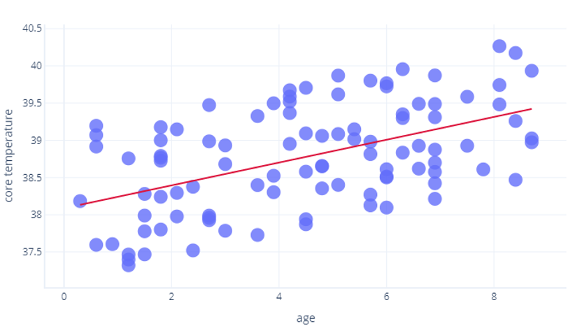

In this unit, we contrast multiple linear regression with _simple linear regression_. We'll also look at a metric called R2, which is commonly used to evaluate the quality of a linear regression model.

## Multiple linear regression

_Multiple linear regression_ models the relationship between several features and a single label. Mathematically, it's the same as simple linear regression, and is usually fit using the same cost function, but with more features.

Rather than modeling a single relationship this technique simultaneously models multiple relationships, which it treats as independent of one another. For example, if we're predicting how ill a dog becomes based on their age and body_fat_percentage, two relationships are found:

* How age increases or decreases illness
* How body_fat_percentage increases or decreases illness

If we're only working with two features, we can visualize our model as a plane-flat 2D surface-just like we can model simple linear regression as a line. We'll explore this in the next exercise.

### Multiple linear regression has assumptions

The fact that the model expects features to be _independent_ is called a model assumption. When model assumptions aren't true, the model can make predictions that are misleading.

For example, age probably predicts how sick dogs become, as older dogs get more sick, along with whether dogs have been taught how to play frisbee: older dogs probably all know how to play frisbee. If we included age and knows_frisbee to our model as features, it would likely tell us knows_frisbee is a good predictor of an illness and underestimate the importance of age. This is a tad absurd because knowing frisbee isn't likely to cause disease. By contrast, dog_breed might also be a good predictor of illness but there's no reason to believe age predicts dog_breed, so it would be safe to include both in a model.

## Goodness of fit: R2

We know that cost functions can be used to assess how well a model fits the data it's trained on. Linear regression models have a special related measure called R2 (“R-squared”). R2 is a value between 0 and 1 that tells us how well a linear regression model fits the data. When people talk about correlations being strong, they often mean that the R2 value was large.

R2 uses mathematics beyond what we intend to cover in this course, but we can think of it intuitively. Let’s consider the previous exercise where we looked at the relationship between age and core_temperature. An R2 of 1 would mean years could be used to perfectly predict who had a high and who had a low temperature. By contrast a 0 would mean there was simply no relationship between years and temperature.

The reality is somewhere in between. Our model could predict temperature to some degree (so it's better than R2 = 0), but points varied from this prediction somewhat (so it less than R2=1).

R2 is only half the story

R2 values are widely accepted but aren't a perfect measure we can use in isolation. They suffer four limitations:

- Because of how R2 is calculated, the more samples we have, the higher the R2. This can lead us to thinking that one model is better than another (identical) model, simply because R2 values were calculated using different amounts of data.
- R2 values don't tell us how well a model will work with new, previously unseen data. Statisticians overcome this by calculating a supplementary measure, called a p-value, which we'll not cover here. In machine learning, we often explicitly test our model on another dataset instead.
- R2 values don't tell us the direction of the relationship. For example, an R2 value of 0.8 doesn't tell us whether the line is sloped upwards or downwards. It also doesn’t tell us how sloped the line is.

It's also worth keeping in mind that there’s no universal criteria for what makes an R2 value “good enough”. For example, in most of physics, correlations that aren't very close to 1 are unlikely to be considered useful, but when modeling complex systems R2 values as low as 0.3 might be considered to be excellent.
