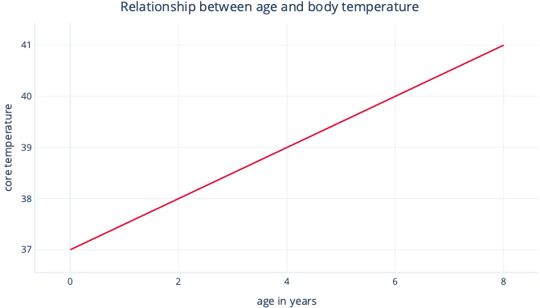
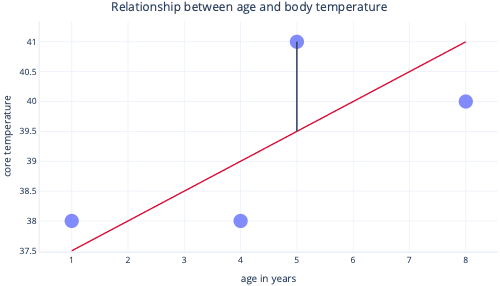
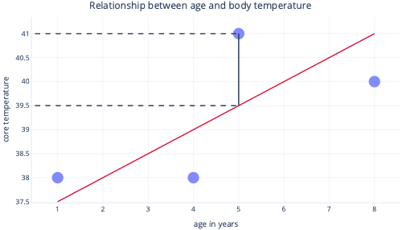

Regression is a simple, common, and highly useful data analysis technique, often colloquially referred to as “fitting a line”. In its simplest form, regression fits a straight line between a one variable (feature) and another (label). In more complicated forms, regression can find non-linear relationships between a single label and multiple features.

## Simple linear regression

Simple linear regression models a linear relationship between a single feature and a (usually continuous) label, allowing the label to be predicted by the feature. Visually, it might look something like this:

Simple linear regression has two parameters: an intercept (c) which indicates the value that the label is when the feature is set to zero, and a slope (m) which indicates how much the label will increase for each 1-point increase in the feature.

If you like to think mathematically, this is simply:

y=mx+c

Where y is your label and x is your feature.

For example, in our scenario, if we were to try to predict which patients will have fever (elevated body temperature) based on their age, we would have the model:

temperature=m*age+c

And need to find the values of m and c during the fitting procedure. If we found m = 0.5 and c = 37, we might visualize it like this:

This would mean that every year of age is associated with body temperature increase of 0.5°C, with a starting point of 37°C.

## Fitting linear regression

We normally use existing libraries to fit regression models for us. Regression typically aims to find the line that produces the least amount of error, where error here means the difference between the actual data point value, and the predicted value. For example, in the image below, the black line indicates the error between the prediction (red line) and one actual value (dot).

By looking at the these two points on a y-axis, we can see that the prediction was 39.5, but the actual value was 41.

So, the model was wrong by 1.5 for this datapoint.

Most commonly, we fit a model by minimising the residual sum of squares. This means that the cost function is calculated like so:

1. Calculate the difference between the actual and predicted values (like above) for each data point
2. Square these values
3. Sum (or average) these squared values

This squaring step means that not all points contribute evenly to the line: outliers (points that do not fall in the expected pattern) have disproportionately larger error, which can influence the position of the line.

## Strengths of regression

Regression techniques have numerous strengths that more complex models do not.

### Predictable and easy to interpret

Regressions are easy to interpret because they describe simple mathematical equations which we can often graph. More complex models often are often referred to as “black box” solutions, because it is difficult to understand how they make predictions or how they will behave with certain inputs.

### Easy to extrapolate

Regressions make it easy to extrapolate (I.E. make predictions for values outside the range of our dataset). For example, it is simple to estimate in our previous example that that a 9 year old will have a temperature of 40.5°C. Caution should always be applied to extrapolation, of course: this model would predict that a 90 year old would have a temperature nearly hot enough to boil water.

### Optimal fitting is usually guaranteed

Most machine learning models use gradient descent to fit models, which involves tuning the gradient descent algorithm and provides no guarantee that an optimal solution will be found. By contrast, linear regression that uses the sum of squares as a cost function does not actually need an iterative gradient descent procedure. Instead, clever mathematics can be used to calculate the optimal location for the line to be placed. The mathematics are outside the scope of this module, but it is useful to know that (so long as the sample size is not too large) Linear Regression does not need special attention to be paid to the fitting process, and the optimal solution is guaranteed.