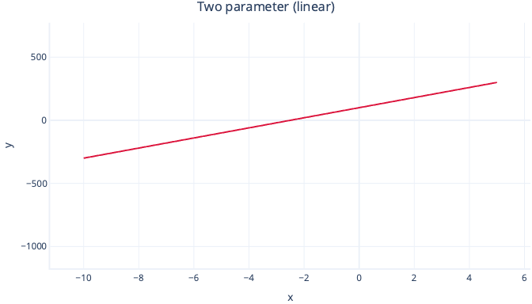
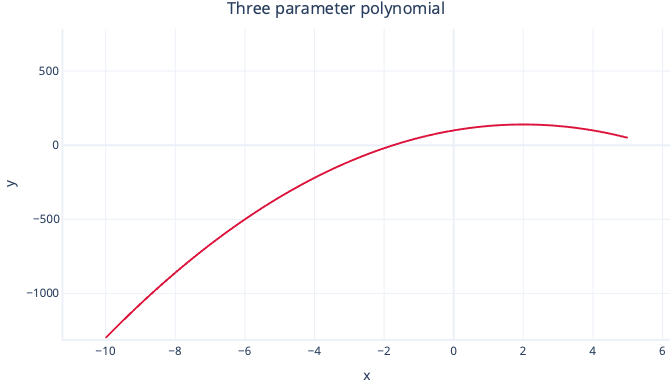
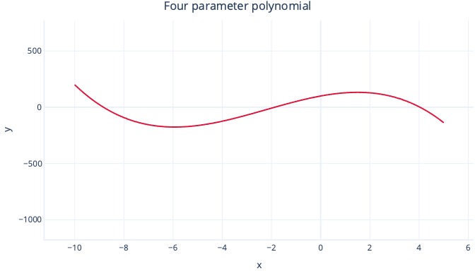
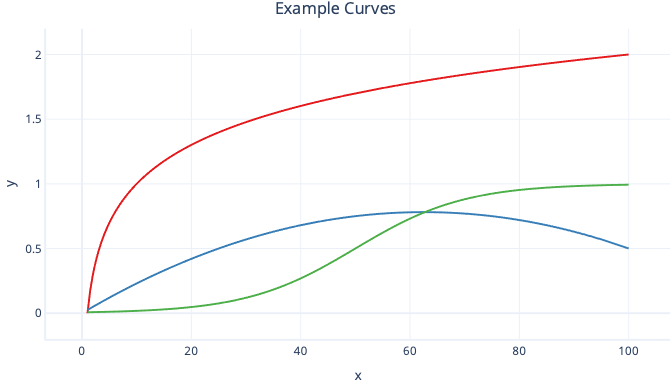
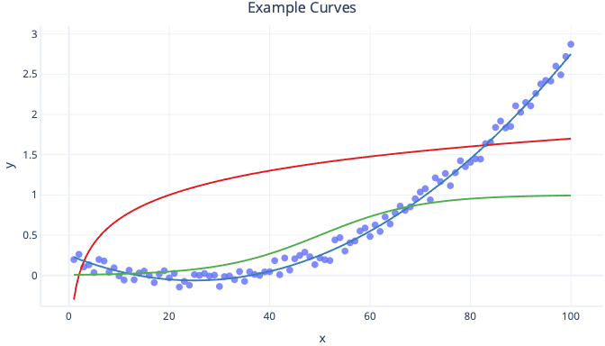

So far, we’ve only looked at linear regression models–models that can be modeled as straight lines. Regression models can work with virtually any other kind of relationship, though.

## What is polynomial regression?

Polynomial regression models relationships as a particular type of curve. Polynomials are a family of curves – ranging from simple to complex shapes. The more parameters in the equation (model), the more complex the curve can be.

For example, a two-parameter polynomial is simply a straight line:

y = intercept + B1*x

While a three-parameter polynomial has a single bend in it:

y = intercept + B1*x + B2 * x2

And a four-parameter polynomial can have two bends:

y = intercept + B1*x + B2 * x2 + B3 * x3

### Polynomial versus other curves

There are many kinds of curves, such as log curves, and logistic (s-shaped) curves, all of which can be used with regression.

A major advantage of polynomial regression is that it can be used to look at all sorts of relationships. For example, polynomial regression it can be used for relationships that a negative within a certain range of feature values, but positive within others. It can also be used where the label (y value) has no theoretical upper limit.

The major disadvantage to polynomial curves is that they often extrapolate poorly. In other words, if we try to predict values that are larger or smaller than our training data, polynomials can predict unrealistically extreme values. Another disadvantage is that polynomial curves are easy to overfit. This means that noise in the data can change the shape of the curve much more than simpler models, such as simple linear regression.

## Can curves be used with multiple features?

We've seen how multiple regression can fit several linear relationships at the same time. There's no need for these to be limited to linear relationships, though. Curves of all kinds can be used for these relationships where appropriate. Although, care should be taken not to use curves-such as polynomials-in with multiple features where they're not necessary. This is because the relationships can end up very complex, which makes it harder to understand the models, and assess whether they'll make predictions that don't make sense, from a real-world standpoint.