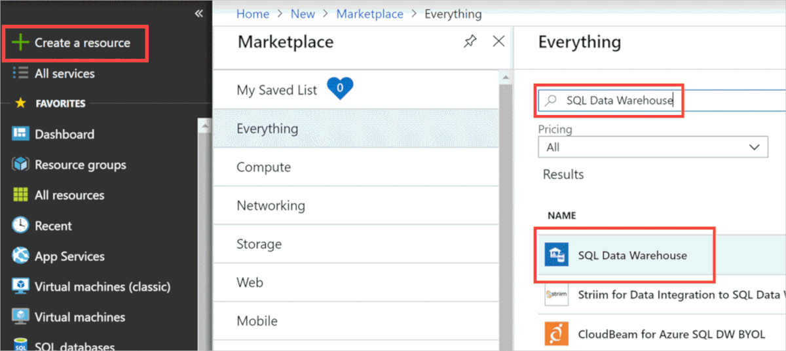
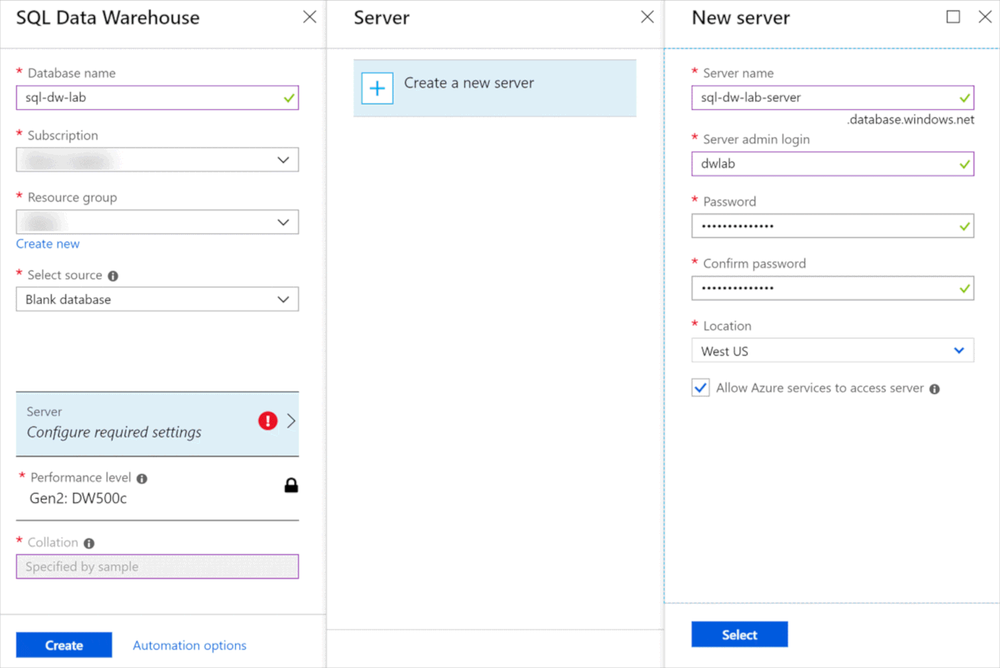
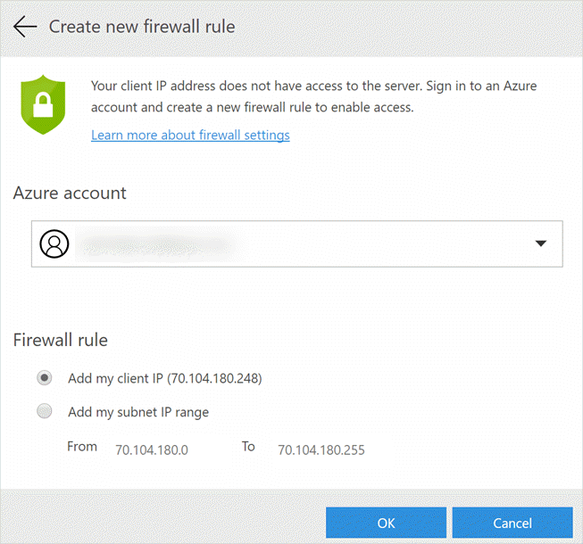
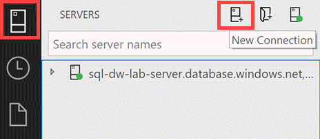
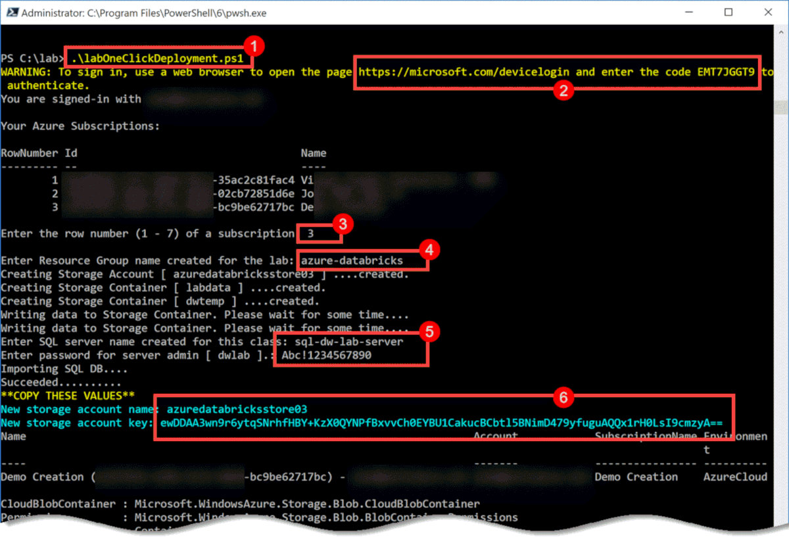

You understand that using Azure Databricks to connect to your SQL Data Warehouse is the best way forward. Now you would like to try establishing this connection on a sample database so that you completely understand all the required steps. In this module you are provided with sample exercises to perfrom end-to-end connectivity procedures.

Let's start by setting up the environment, that includes provisioning a sample SQL Data Warehouse, creating new Azure Data Studio connections, and setting up resources for our exercise.

## Provision SQL Data Warehouse

1. In the [Azure portal](https://portal.azure.com), select **+ Create a resource**, enter "SQL Data Warehouse" into the Search the Marketplace box, select **SQL Data Warehouse** from the results, and select **Create**.

    

1. In the Create SQL Data Warehouse blade, enter the following:

   - _Database name_: Enter a unique name (make sure you see a green checkbox)
   - _Subscription_: Select the subscription you are using for this exercise
   - _Resource group_: Choose your exercise resource group
   - _Select source_: Select **Blank database** from the list
1. Select **Server (Configure required settings)**, then select **Create new server**. In the New server blade, enter the following:
   - _Server name_: Enter a unique name (make sure you see a green checkbox)
   - _Server admin login_: Enter **dwlab**
   - _Password_: Enter a valid password, then **confirm password**
   - _Location_: Select the location you are using for resources in this exercise
   - _Allow Azure services to access server_: Check the checkbox
   - Click **Select**
   - _Performance level_: Select Gen2: DW500c

    

> ![Note]
> Record Username and Password of SQL server which will be used in later steps to connect to SQL Server.

1. Select **Create**

## Add your client IP address

You need to add your computer's IP address to the SQL Server instance associated with SQL Data Warehouse in order to connect to your database.

1. After the SQL Data Warehouse has been provisioned, open it by selecting **Go to resource** under notifications in Azure.

    

1. On top of the Overview blade, select the **Server name**. This will navigate you to the associated SQL Server instance.

    

1. Select **Firewalls and virtual networks** on the left-hand menu.

    

1. In the Firewalls and virtual networks blade, select **Add client IP**. This will automatically add your detected IP address to the allowed IP addresses list. This is required for you to be able to connect to SQL Data Warehouse from your computer. Next, select **Save** to save your changes.

   

## Download and install Azure Data Studio

[Azure Data Studio](https://docs.microsoft.com/sql/azure-data-studio/what-is?view=sql-server-2017) is a cross-platform database tool that you can run on Windows, MacOS, and Linux. You will use this to connect to SQL Data warehouse and SQL Database.

1. Follow [this link](https://docs.microsoft.com/sql/azure-data-studio/download?view=sql-server-2017) to install Azure Data Studio for your operating system.

1. Start the Azure Data Studio app.

## Create new connections in Azure Data Studio

1. To connect to your data warehouse, you need to connect through the logical SQL server you created when you provisioned SQL Data Warehouse earlier.
1. Visit Azure Portal and Select your data warehouse from resource group created for this exercise.
1. Find the full name of the logical SQL server on top of the Overview blade, as you did in step 2 of the previous section.

    

1. Switch back to the Azure Data Studio app.
1. Add a new connection. This will be displayed by default if it is your first time running Azure Data Studio.
1. Fill in the fields in the Connection window.

    
1. Enter the **Server** name previously identified in step 3.
1. Select **SQL Login** for the authentication type.
1. Enter user name and password provided while provisioning SQL Server in earlier steps above. Check **Remember password**.

    1. **Note:** If you are prompted to add your IP address to the SQL Server firewall, add your Azure account in the **Create new firewall rule** dialog, then select the option to add your client IP.

    

1. Select the SQL Data Warehouse database created under the SQL Server for this exercise.
1. Click **Connect** at the bottom of window to connect to SQL Data Warehouse.
1. Now, you need to create a new connection to the **master** database on the same server.
1. Select **Servers** in the left-hand menu.
1. Select the **New Connection** icon on top of the blade.

    
1. Repeat steps 6 - 9 above. You should see the SQL Data Warehouse connection you created earlier, listed under Recent history. If you select this, the Server and User name fields will be populated for you.
1. Select the **master** database from the list.

    
1. Click **Connect** at the bottom of window to connect to SQL Data Warehouse master database.

## Install and configure PowerShell Core and Azure PowerShell module

Follow the steps in this section to verify and install the AzureRM module.

This step is mandatory for successful execution of further steps.

If you do **not** have PowerShell Core v6.1.1 or greater installed on your machine (Windows, macOS, or Linux), please follow the [instructions here](https://docs.microsoft.com/powershell/scripting/install/installing-powershell?view=powershell-6) for your platform.

Azure PowerShell works with PowerShell 5.x on Windows 7 or higher, or PowerShell 6.x (PowerShell Core) on any platform.
To check your PowerShell version, run the command:

```powershell
$PSVersionTable.PSVersion
```

If you have an outdated version or need to install PowerShell, see [Installing various versions of PowerShell](https://docs.microsoft.com/powershell/scripting/setup/installing-powershell). Install
information for your platform is linked from that page.

If you are using PowerShell 5.x on Windows, you also need .NET Framework 4.7.2 installed. For instructions
on updating or installing a new version of .NET Framework, see the [.NET Framework installation guide](https://docs.microsoft.com/dotnet/framework/install).

### Install Azure PowerShell

1. Select and open **PowerShell** from the start menu with **elevated privileges ("Run as Administrator" on Windows, or with superuser privileges on macOS or Linux)**.
1. Install Azure PowerShell:

```powershell
Install-Module -Name Az -AllowClobber
```

If you don't have access to administrator privileges, you can install for the current user by adding the `-Scope` argument.

```powershell
Install-Module -Name Az -AllowClobber -Scope CurrentUser
```

By default, the PowerShell gallery isn't configured as a trusted repository for PowerShellGet. The first time you use the PSGallery you see the following prompt:

```output
Untrusted repository

You are installing the modules from an untrusted repository. If you trust this repository, change
its InstallationPolicy value by running the Set-PSRepository cmdlet.

Are you sure you want to install the modules from 'PSGallery'?
[Y] Yes  [A] Yes to All  [N] No  [L] No to All  [S] Suspend  [?] Help (default is "N"):
```

Enter **A** to select Yes to all.

## Provision exercise resources

Perform steps in this section to provision some additional Azure resources required to complete this exercise.

In this section, you will execute a PowerShell script. This script creates following Azure Resources:

- **Azure Storage Account:** Stores datasets required for this exercise.

- **Azure Database:** This database will be used as source data store in the exercise to load data into SQL Data Warehouse using Data Factory where data will be transferred from this Azure Database to SQL Data Warehouse.

### Initiate PowerShell execution

The PowerShell script for the exercise will create additional resources and copy files into a new storage account that are needed for the exercise. Also, the Azure storage account will be used as the intermediary for the exchange of data between SQL Data Warehouse and Azure Databricks. Below is a screenshot of the PowerShell console and steps you need to take when you run the script. Each step that follows are highlighted on the screenshot for easy reference.



1. Download the PowerShell script, making note of your download location: https://github.com/solliancenet/proj-learning-paths-public/blob/master/modern-data-warehouse/labOneClickDeployment.ps1?raw=true

- Navigate to the script location in your PowerShell window. To run the script, execute the following command:

```powershell
.\labOneClickDeployment.ps1
```

1. As the script starts execution, you will be asked to provide Azure Account Credentials by navigating to <https://microsoft.com/devicelogin> in a web browser and entering the supplied code.

    

1. After successful login you will be asked to select your desired Azure subscription from a list of all linked subscriptions.

    - Enter RowNumber against subscription in list which is used for this
      class.

1. Now you will be prompted to provide the Resource Group Name you created for this exercise. Enter the name of Resource Group created in **Deploy an Azure Databricks Workspace**. After this step, a storage account is provisioned with two containers (`labdata` and `dwtemp`) and files are copied to them from a public storage account.
1. Next, supply the name of the SQL Server you created earlier, and supply the password for the **dwlab** user account when prompted. This will create a new Azure SQL database instance on that server by importing an existing **retaildb** database, which will take some time.
1. Finally, you will see a console output of **\*\*COPY THESE VALUES\*\***. Copy the **New storage account name** and **New storage account key** values and save them for later. These values will be used when copy files to SQL DW using PolyBase, and when you mount the storage account in Azure Databricks later on in the exercise.