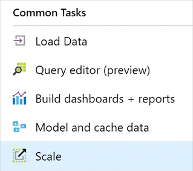
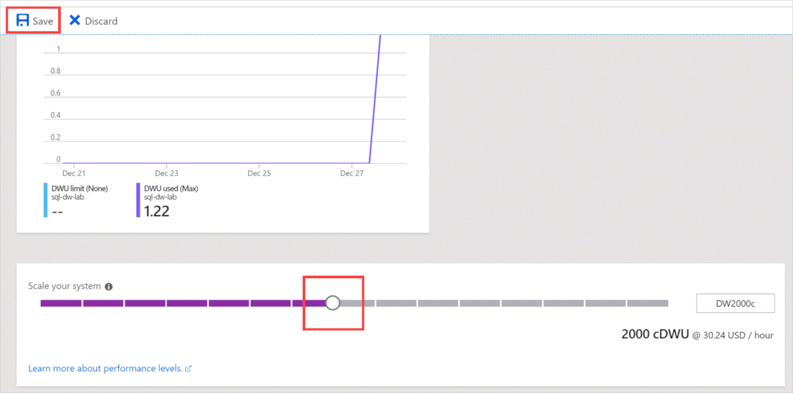
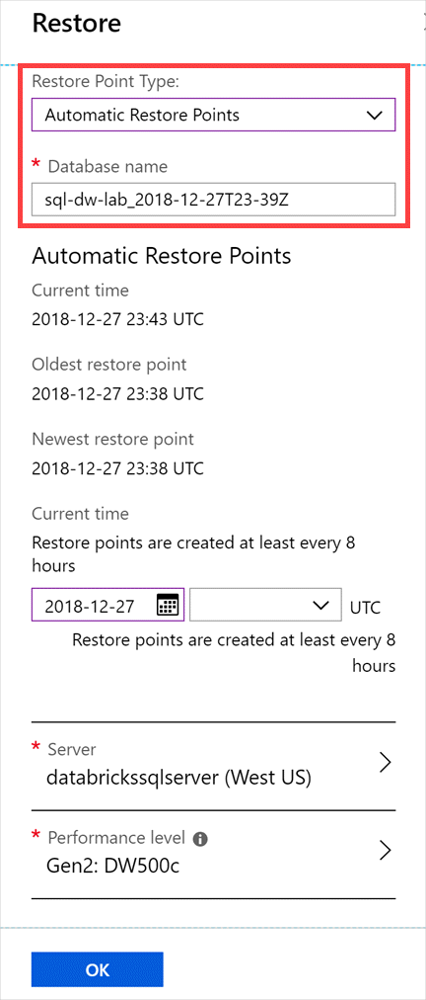
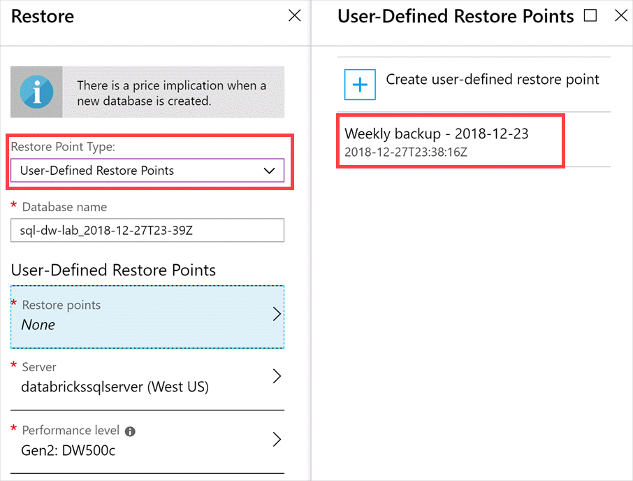
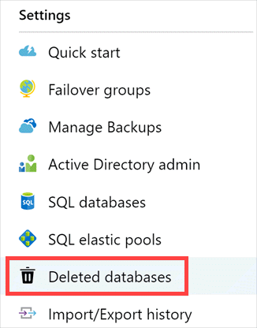
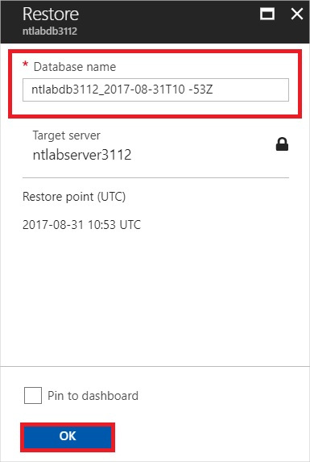

SQL Data Warehouse provides simple controls that allow you to scale, pause, and resume your data warehouse. The architecture of SQL Data Warehouse separates storage and compute, allowing each to scale independently. As a result, you can scale compute to meet performance demands independent of data storage. You can also pause and resume compute resources. A natural consequence of this architecture is that billing for compute and storage is separate. If you don't need to use your data warehouse for a while, you can save compute costs by pausing compute. You can scale out or scale back compute by adjusting the data warehouse units setting for your data warehouse. Loading and query performance can increase linearly as you add more data warehouse units.

## Scale SQL DW in the Azure portal

To perform a scale operation, SQL Data Warehouse first kills all incoming queries and then rolls back transactions to ensure a consistent state. Scaling only occurs once the transaction rollback is complete. For a scale operation, the system detaches the storage layer from the Compute nodes, adds Compute nodes, and then reattaches the storage layer to the Compute layer. Each data warehouse is stored as 60 distributions, which are evenly distributed to the Compute nodes. Adding more Compute nodes adds more compute power. As the number of Compute nodes increases, the number of distributions per compute node decreases, providing more compute power for your queries. Similarly, decreasing data warehouse units reduces the number of Compute nodes, which reduces the compute resources for queries.

To scale your SQL DW instance, perform the following steps:

1. Go to your Data Warehouse in the Azure portal.
1. Under the **COMMON TASKS** section in the left-hand menu, select **Scale**.

    
1. In the Scale blade, move the slider left or right to change the DWU setting.

    
1. Select **Save** to change Performance Units. A confirmation message appears. Click **yes** to confirm or **no** to cancel.

## Pause and resume SQL DW in the Azure portal

You can pause your data warehouse instance if you don't need to use it for a while. This can help you save money by paying only for the compute that you need.

1. Go to your Data Warehouse in the [Azure portal](http://portal.azure.com/) and select **Overview**. Notice that the Status is **Online**.
1. To suspend compute and memory resources, select **Pause**. When the confirmation message appears, click **Yes** to confirm or **No** to cancel.

    
1. To resume SQL DW in Azure portal, go to your Data Warehouse in the [Azure portal](http://portal.azure.com/) and select **Overview**. Notice that the Status is **Paused**.

1. To resume the database select **Start**. When a confirmation message appears, click **Yes** to confirm or **No** to cancel.

    

## Restore data warehouse

There are steps you can perform to restore a database, depending on whether the data warehouse is active or paused, or if the database has been deleted.

## Restore an active or paused database in the Azure portal

1. Go to your Data Warehouse in the [Azure portal](http://portal.azure.com/).
1. At the top of the Data Warehouse **Overview** blade, select **Restore**.

    
1. Select **Automatic Restore Points** as the Restore Point Type. Selecting te restore point type will allow you to select restore points that are automatically created for you every 8 hours.
1. Specify a new **Database name**.
1. Select the latest **Restore point** by selecting the date and time.
1. Select the destination server and performance level. By default, the database's current server and performance level are selected for you.

    
1. Alternatively, select **User-Defined Restore Points** as the Restore Point Type to select a user-defined restore point. You then select the **Restore points** option to browse the available user-defined restore points.

    

1. Select the **OK** button at the bottom of blade to start the restore process.
1. The database restore process will begin, and you can use **NOTIFICATIONS** to monitor the process.

## Restore a deleted database in the Azure portal

1. Go to your data warehouse in the [Azure portal](http://portal.azure.com/). Select the SQL Server associated with your data warehouse by selecting it in the Overview pane. You are redirected to the SQL Server in which the database should be restored.
1. In navigation pane of SQL Server, select **Deleted Databases** in the left-hand menu under the **Settings** sub section.

    
1. Select the database that you want to restore.

    
1. In the **Restore** blade, enter the new name of the database to be
    restored.

    
1. Select the **Ok** button at the bottom of blade.