In this unit, you will learn how to use Data Factory to load data into SQL Data warehouse.

[Azure Data Factory](https://docs.microsoft.com/azure/data-factory/introduction) is a cloud-based data integration service that allows you to create data-driven workflows in the cloud for orchestrating and automating data movement and data transformation. Azure Data Factory supports various data stores, however for this exercise we will use Azure SQL Database as data source.

The steps in this unit guide you on how to load data from a table inside a Azure SQL Database to a table in SQL Data Warehouse.

## Access data warehouse

1. Sign in to the [**Azure portal**](https://portal.azure.com/).

1. Locate your Azure Data Warehouse instance created in earlier steps and click to open it.

    

## Open data factory

1. On the left-hand menu of the Data Warehouse instance, select **Load Data** underneath the Common Tasks section.

    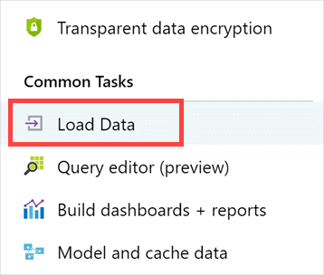

1  On Load Data blade, select Azure Data Factory. (Fig. 10.2.2)

    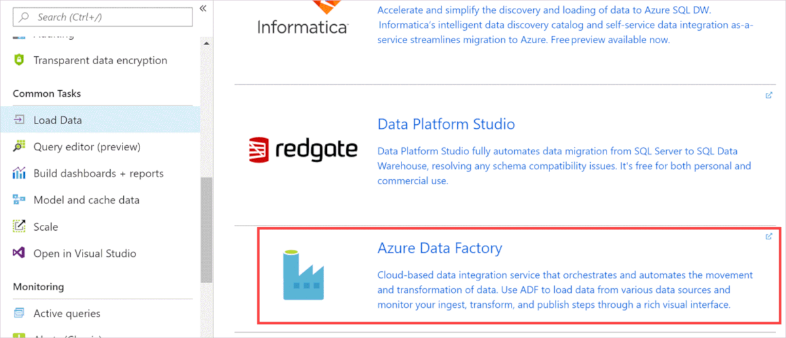

## Create new data factory

1. On **Select Data Factory** page, select the **Create new data factory** link to create a new instance.

    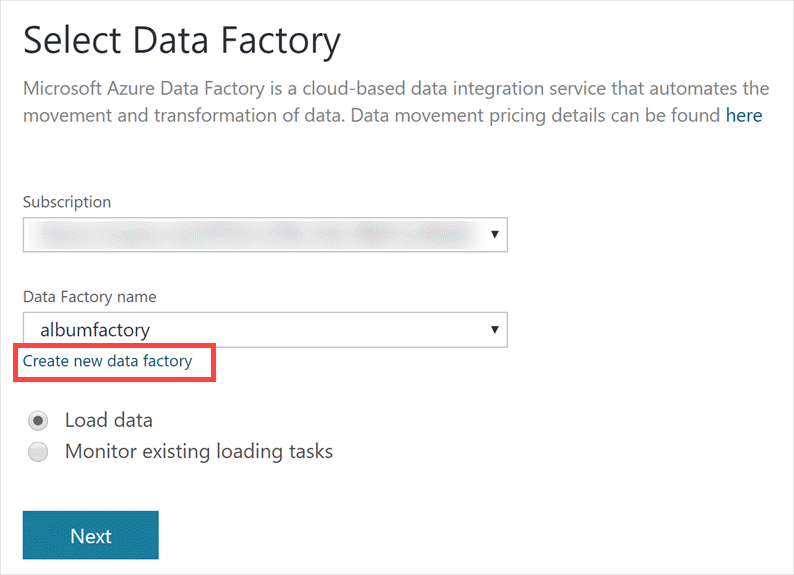

1. This step will open a new window to create a new data factory. On the **New Data Factory** window, provide the following properties and click the **Create** button at the bottom of window:

    - _Data Factory Name_: Enter desired name for the data factory or keep the default name.
    - _Subscription_: Select the subscription you used for creating resources for this exercise.
    - _Select resource group_: Select the resource group created for this exercise in earlier steps.
    - _Select region_: Select appropriate region for deployment of the new data factory.

    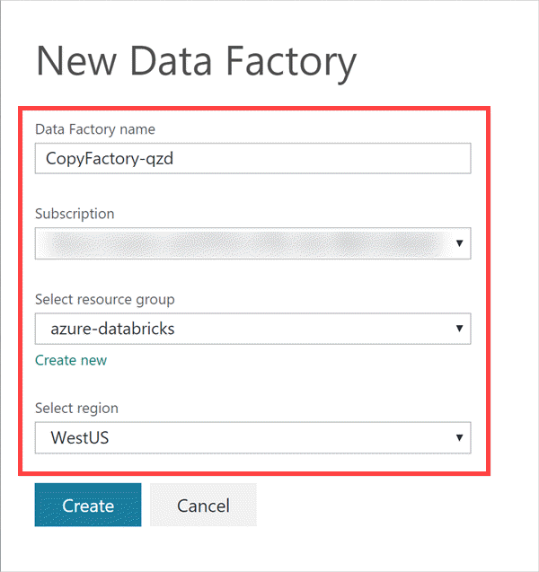

1. Wait until the new data factory gets created and you are navigated back to the **Select Data Factory** window.

1. On the **Select Data Factory** window, select the **Load Data** option and press the **Next** button at the bottom.

    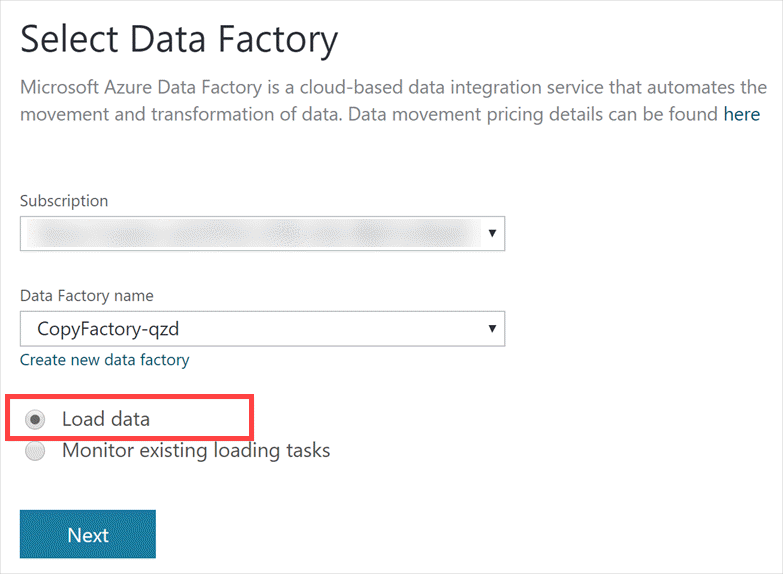

## Configure the data factory properties

On data factory configuration page you will be asked to provide details for source and destination.

1. On **Properties** tab, provide following details and click the **Next** button to move on to next tab:

    - _Task name_ : Enter desired name for the task or keep the default value.
    - _Task description_: This is an optional field, you can provide a description for the task.
    - _Task cadence or Task Schedule_: Select option **Run once now**.
    - _Expiration time_: Keep the default value.

1. Click the **Next** button.

    

## Select source

1. On source tab, select **Azure SQL Database** as the source and click the **Next** button at the bottom.

    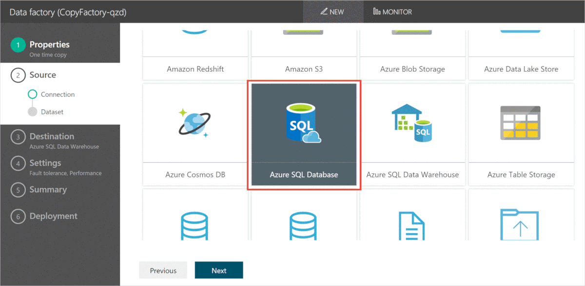

1. On **Specify the Azure SQL database** page, enter following properties to setup the source database and click the **Next** button at the bottom:

    - _Connection name_: Enter desired connection name for Azure SQL Database connection or keep the default name.
    - _Server/database selection method_: Select the **From Azure subscriptions** option from dropdown list.
    - _Azure subscription_: Select the Azure subscription used for creating resources for this exercise.
    - _Server Name_: Select the SQL Server name created in earlier steps of this exercise.
    - _Database name_: Select database **retaildb** from the dropdown list.
    - _User name_: Enter the user name supplied while creating SQL server (`dwlab`).
    - _Password_: Enter the password provided while creating SQL Server.

    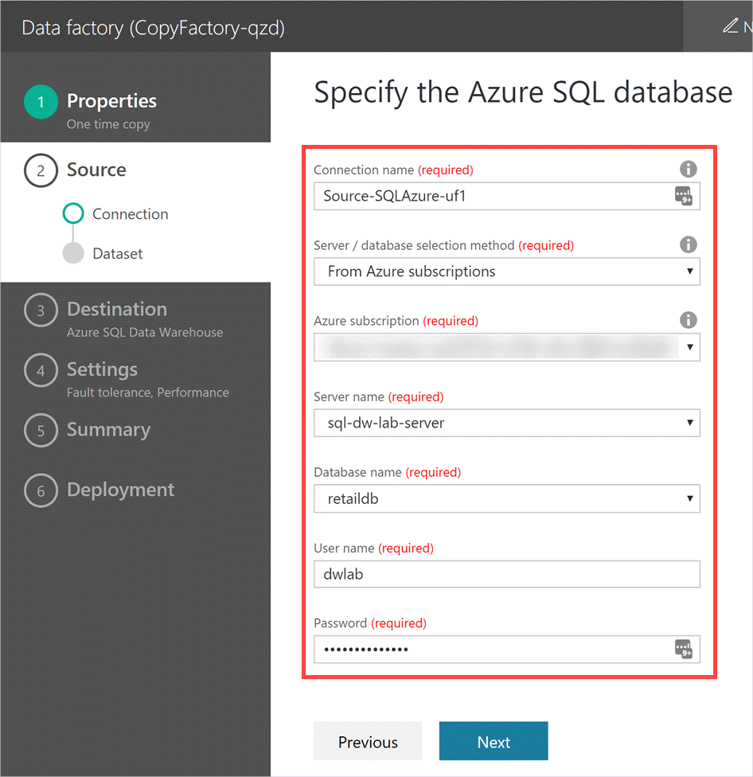

1. On the **Dataset** tab, you will be asked to select tables to be copied. Select the **\[dbo\].\[AnalyzeCampaigns\]** table from the list of **Existing Tables** and click the **Next** button.

    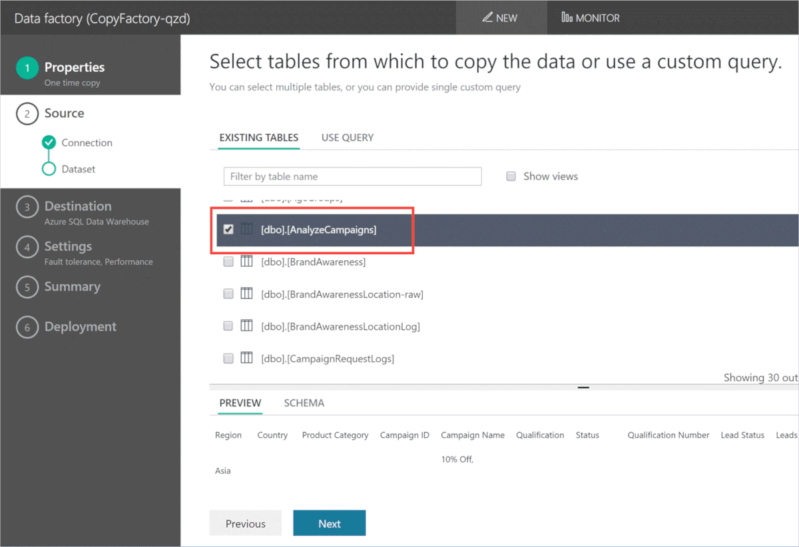

## Set destination

On the Destination tab, you will be asked to provide details of SQL Data Warehouse.

1. Enter values for following properties and click the **Next** button:

    - _Connection name_: Enter desired name for the connection to SQL DW or keep default name.
    - _Server / database selection method_: Select option **From Azure subscriptions**.
    - _Azure subscription_: Select the Azure Subscription used for creating the resources of this exercise.
    - _Server Name_: Select the SQL Server name created in earlier steps of this exercise.
    - _Database name_: Select the SQL Data Warehouse created in earlier steps of this exercise.
    - _User name_: Enter the user name supplied while creating SQL server (`dwlab`).
    - _Password_: Enter the password provided while creating SQL Server.

    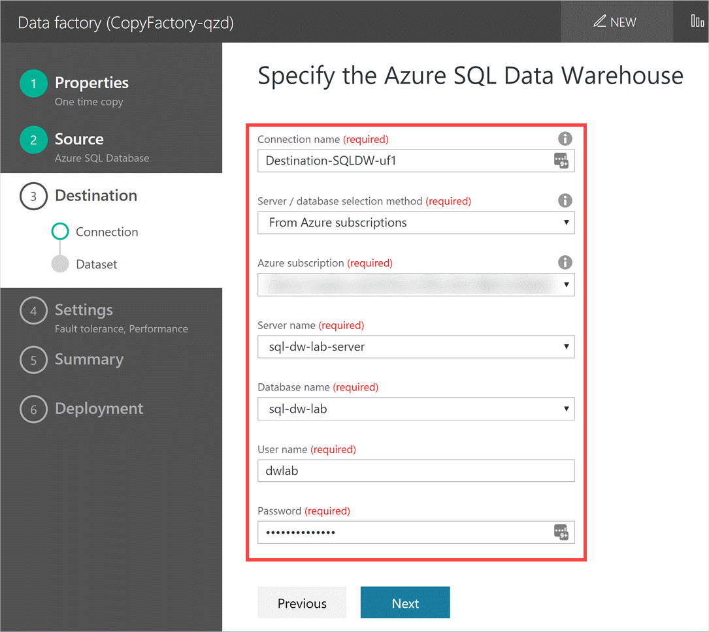

1. On **Table Mapping** tab, you will be asked to set mapping between the source and destination table. You can map the source table to an existing destination table, or you can create a new destination table. For this exercise, we will create a new destination table and load data to same the table. Therefore, **keep the default mapping** as it is as shown in the image below, then click the **Next** button at the bottom to continue.

    This step will create the new table `[dbo].[AnalyzeCampaigns]` in the newly created SQL Data Warehouse.

    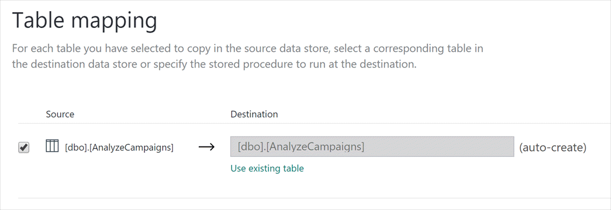

1. On **Schema mapping** tab, you will be asked to set mapping between source and destination columns.

    As we are creating new a destination table in SQL Data Warehouse, the destination table will be created with the source schema.

    You can manage whether a column from the source table is included in the destination table by checking the box in the **Include this column** field. Make sure **all columns are selected**, then click the **Next** button on the bottom.

    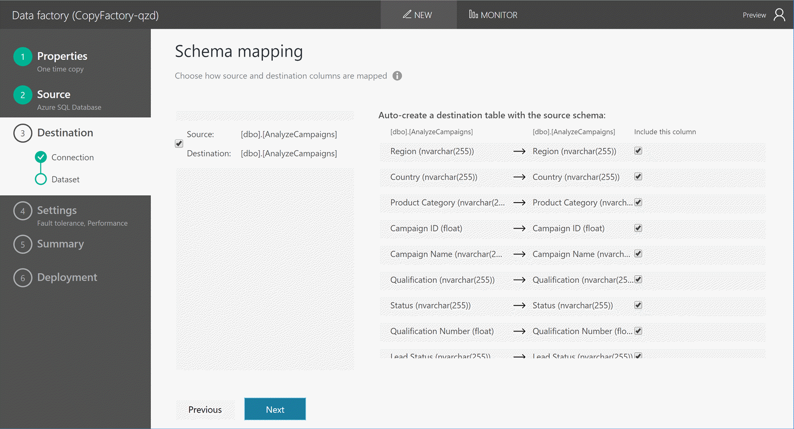

## Configure Settings

On the **Settings** tab, you will be asked to specify action to be taken for incompatible rows between source and destination as well as to provide details of storage account required for staging.

1. Select the action **Abort copy activity on first incompatible row** for the Fault tolerance settings.

1. In the **Performance settings** section, enter following values for the properties:

    - _Use staging account_: New connection
    - _Connection Name_: Enter desired name for the connection or keep default.
    - _Account selection method_: Select **From Azure subscriptions** option.
    - _Azure subscription_: Select the Azure subscription used for creating resources for this exercise.
    - _Storage account name_: Select the storage account name created inside resource group created for this exercise. This is the one created when you ran the PowerShell script at the beginning of the exercise.

    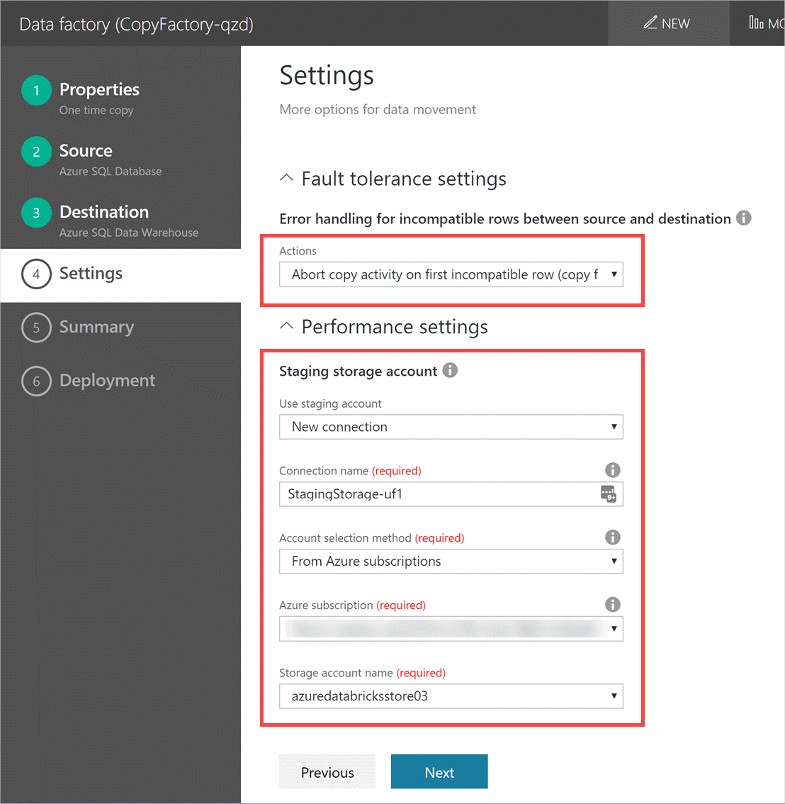

1. Click the **Next** button to move on to next tab.

## Verify details

The Summary tab summarizes all the details provided in earlier tabs and allows you to modify those details.

Select the **Runtime Region** that matches the region of the exercise resources you have created. This will help ensure all data transferred stays in the same region in order to cut down on costs and transfer lag.

You can modify each section by selecting the **Edit** link provided near each section.

If all details are correct, click the **Next** button located at the bottom of the page to start deployment.

     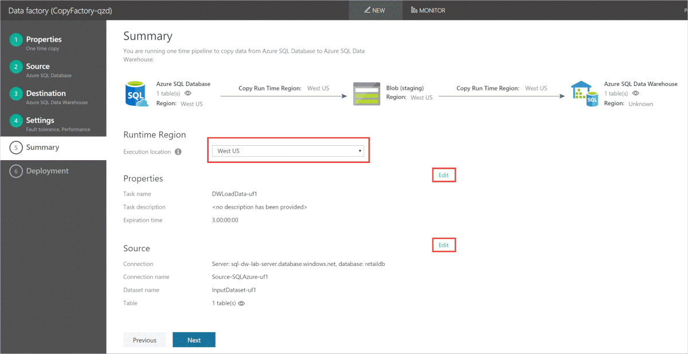

## Monitor deployment

The Deployment tab helps you retrieve the status of various deployment activities. You will see the status update for each of the configured steps for the new pipeline as it deploys.

    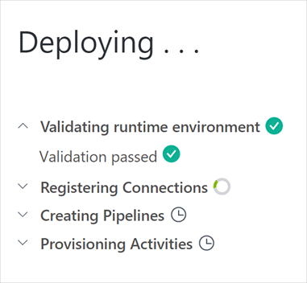

1. After validation passes, select the **Monitor** link on top of the page. This displays the Data Factory pipeline monitoring page for the new OneTime pipeline you created.

    

1. Wait until data factory pipeline status becomes **Ready**.

    

## Verify copy activity

We can verify this copy activity by checking that the table was created in SQL Data Warehouse.

1. Access SQL Data Warehouse in Azure Data Studio.

1. Expand the SQL Data Warehouse node under Servers to connect, then expand the **Tables** node. You will see the new **dbo.AnalyzeCampaigns** table.

1. Right click on the **dbo.AnalyzeCampaigns** table, then select the **Select Top 1000** menu option.

    

1. The new query window will automatically execute the select statement. You should see results from the newly created table.

    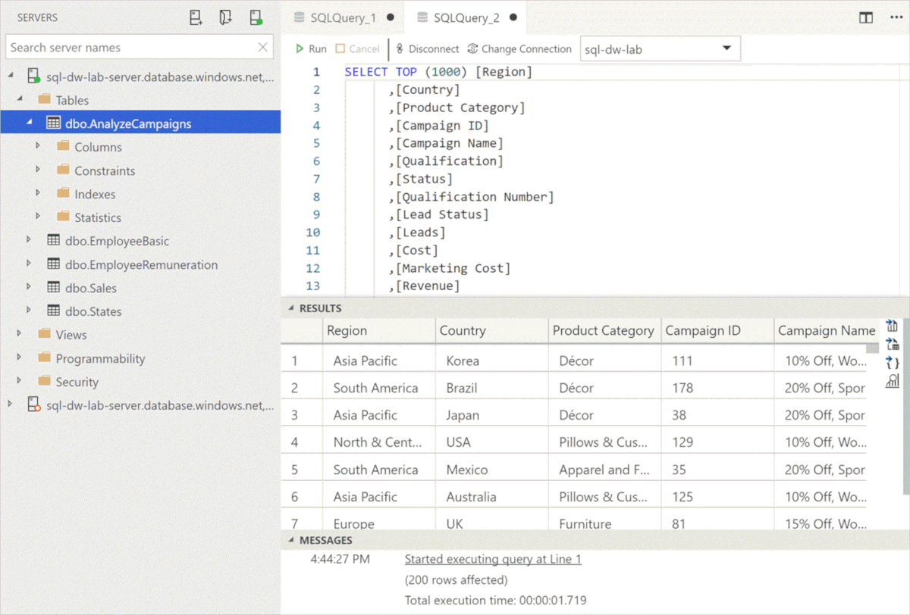

Alternately, you may execute the following query in a new query window:

    ```sql
    SELECT * FROM [dbo].[AnalyzeCampaigns]
    ```