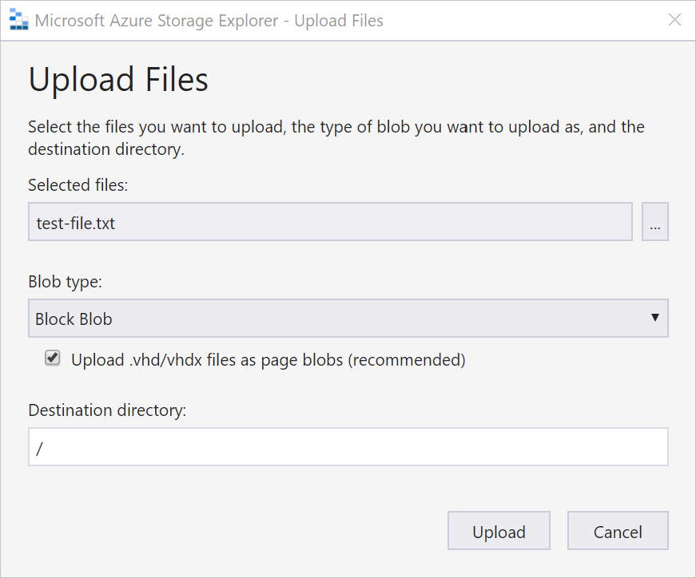
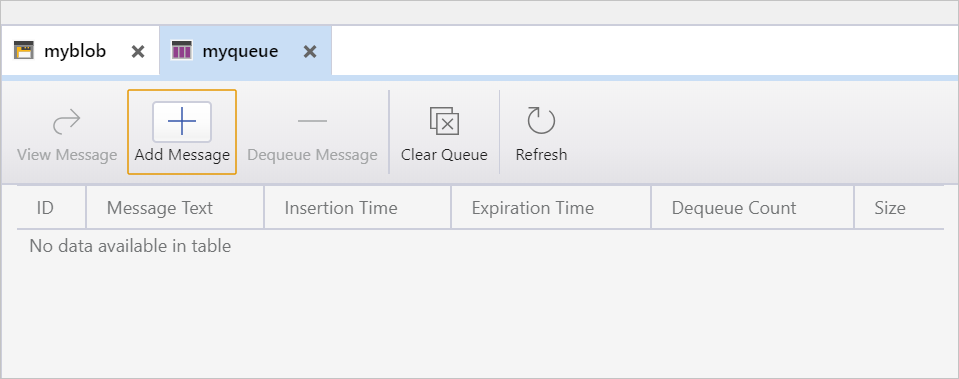

It's easy to navigate the contents of an Azure Storage account by using Azure Storage Explorer.

Now that you have a better understanding of the features and capabilities of Azure Storage Explorer, you can try it for yourself. Use Azure Storage Explorer to explore some of the files your customer relationship management system stores in Azure Storage.

Here, you'll try Azure Storage Explorer for yourself by downloading, installing, and connecting to an Azure Storage account. You'll create a blob and a queue in your Azure Storage account.

## Download and install Azure Storage Explorer

First, you'll need to download and install Azure Storage Explorer.  

1. Browse to the [Microsoft Azure Storage Explorer website](https://azure.microsoft.com/features/storage-explorer/?azure-sandbox=true).

1. Select your preferred **Operating system**. The following steps will go through the Windows version of the application. Your steps will be different if you're using a different OS.

1. When you've chosen your operating system, select the **Download now** button to download the Storage Explorer installer application to your local computer.

1. Locate the downloaded file and run it. For the Windows version, use the **StorageExplorer.exe** file.

1. Accept the licensing agreement, and select **Install**.

1. You can either browse to the location where you want to install Storage Explorer or accept the default location. When you've selected the installation destination, select **Next**.

1. For Windows installations, select the start menu folder. Accept the default and select **Next**.

1. When the installation is complete, select **Finish**.

Azure Storage Explorer automatically launches after installation.

## Connect to an Azure account

When you first launch Azure Storage Explorer, it displays the Connect to Azure Storage wizard.

1. First, you'll connect to Azure. There are several **Azure environment** options to select from. Select **Azure** and select **Next**.

    

1. An Azure sign-in page is displayed. Use your Azure credentials to sign in.

    

1. When you've signed in to your Azure instance, the associated Azure account and Azure subscription are displayed in the Account Management section.

    

   Confirm that the subscription and account details are correct, then select the **Apply** option.

You've now connected Storage Explorer to your Azure Subscription. Don't close the Storage Explorer application.

## Create storage account and add a blob

1. In the Azure Cloud Shell, use the following command to create a storage account.

    ```azurecli
    az storage account create \
    --name  mslearn$RANDOM\
    --resource-group <rgn>[sandbox resource group name]</rgn> \
    --sku Standard_GRS \
    --kind StorageV2 \
    ```

    In the output, note the name of the storage account. Once the storage account is created, switch back to Storage Explorer.

1. Using your Storage Explorer application, toggle the **EXPLORER** view so that the Explorer pane is shown.

    

1. In the **EXPLORER** pane, locate and expand **Concierge Subscription**.

1. Locate and expand the storage account that you created earlier. It should be named something similar to **mslearn12345** and will end with a different set of numbers. You'll see it has four virtual folders: Blob Containers, File Shares, Queues, and Tables.

1. Right-click the **Blob Containers** virtual folder to access the context menu, and select **Create Blob Container**.

    

1. Name the container **myblobcontainer** and select **Enter**.

    Each created container appears in a tab to the right of the resource tree.

   

1. Now, upload a blob to the container. In the **myblobcontainer** pane, select **Upload**, then select **Upload Files**.

1. For **Selected files:** select the **...***. Browse to a small file on you device and select **Open**. Then, select **Upload** to upload the file.

    

    You should now see your file stored in your storage account.

    

From here, we could upload additional files, download files, make copies, and other administrative tasks.

## Create a queue in your Azure Storage account

To create a queue in your storage account:

1. In the resource tree, find the **Concierge Subscription**, and expand the options.

1. Select the **cloudshell** storage account.

1. Right-click on the **Queues** virtual folder to access the context menu, and select **Create Queue**.


1. An empty and unnamed queue is created inside the Queues folder. The queue won't be created until you give it a name.

    > NOTE:
    > Containers have specific rules governing how they can be named: they must begin and end in either a letter or number, must be all lowercase, and can have numbers and hyphens. The name can't contain a double hyphen.

    Name this new queue **myqueue**, and press **Enter** to create the queue. Each created queue appears in a tab to the right of the resource tree.

    

    From this view, you can manage the content of the queue. If our application were using this queue and was experiencing an issue processing a message, you could connect to the queue and view the contents of a message to determine the issue.
