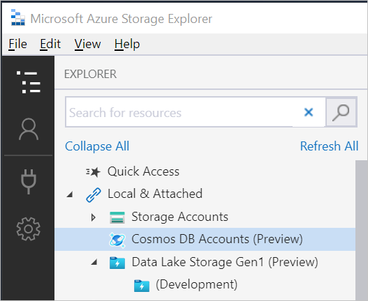
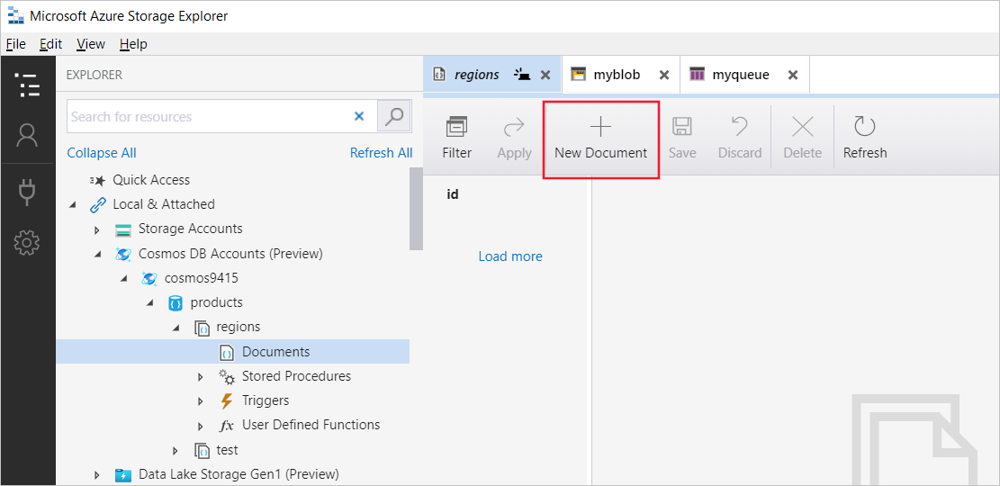
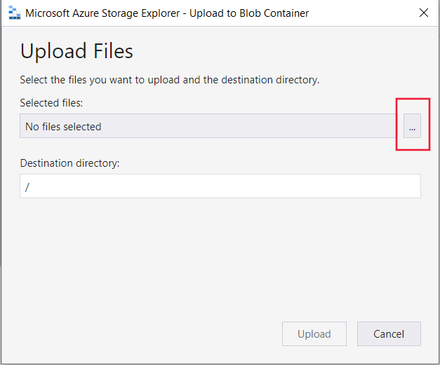

Azure Storage Explorer is not just about Azure Storage Accounts. You can also use it to investigate and download data from Cosmos DB or Azure Data Lake.

You've seen how simple it is to create and manage blob and queue resources in your Azure Storage account. Now you want to push your understanding further and see how it connects to your developers' Cosmos DB and Azure Data Lakes, which they use to store infrastructure data for the Customer Relationship Management (CRM) system.

Here, you'll learn how to create a new Storage Explorer connection to a Cosmos DB, create a database, and populate it with content. Finally, you'll see how to connect to a Data Lake Storage Gen 2 account, create a container, and upload data into it. 

## Create a Cosmos DB

Before you can use Storage Explorer to connect to a Cosmos DB with a connection string, you'll need to create a Cosmos DB.

1. From the Azure Cloud Shell, use these commands to create a Cosmos DB.

   ```CLI
   export NAME=cosmos$RANDOM
   az cosmosdb create --name $NAME \
    --kind GlobalDocumentDB \
    --resource-group <rgn>[sandbox resource group name]</rgn>
   ```

   This command takes a few minutes to run, while it creates a new Cosmos DB for you.

1. When it has completed, you'll see something similar to this JSON response. These details also tell you the name of the cosmos DB. The database name has been marked so that you can find it more easily.

   ```JSON
   {
     "capabilities": [],
     "connectorOffer": null,
     "consistencyPolicy": {
       "defaultConsistencyLevel": "Session",
       "maxIntervalInSeconds": 5,
       "maxStalenessPrefix": 100
     },
     "databaseAccountOfferType": "Standard",
     "documentEndpoint": "https://cosmos26829.documents.azure.com:443/",
     "enableAutomaticFailover": false,
     "enableCassandraConnector": null,
     "enableMultipleWriteLocations": false,
     "failoverPolicies": [
       {
         "failoverPriority": 0,
         "id": "cosmos26829-westus",
         "locationName": "West US"
       }
     ],
     "id": "/subscriptions/74910ed8-22d4-4e40-9f22-ac5d5b3ffb34/resourceGroups/learn-16287428-fa2d-44b0-8291-cfeb1ce093aa/providers/Microsoft.DocumentDB/databaseAccounts/cosmos26829",
     "ipRangeFilter": "",
     "isVirtualNetworkFilterEnabled": false,
     "kind": "Parse",
     "location": "West US",
     "name": "cosmos26829",   <!-- This is the name of your cosmos database -->
     "provisioningState": "Succeeded",
     "readLocations": [
       {
         "documentEndpoint": "https://cosmos26829-westus.documents.azure.com:443/",
         "failoverPriority": 0,
         "id": "cosmos26829-westus",
         "isZoneRedundant": false,
         "locationName": "West US",
         "provisioningState": "Succeeded"
       }
     ],
     "resourceGroup": "learn-16287428-fa2d-44b0-8291-cfeb1ce093aa",
     "tags": {},
     "type": "Microsoft.DocumentDB/databaseAccounts",
     "virtualNetworkRules": [],
     "writeLocations": [
       {
         "documentEndpoint": "https://cosmos26829-westus.documents.azure.com:443/",
         "failoverPriority": 0,
         "id": "cosmos26829-westus",
         "isZoneRedundant": false,
         "locationName": "West US",
         "provisioningState": "Succeeded"
       }
     ]
   }
   ```

   Make a note of your Cosmos DB name. You'll need it later. In this example, the cosmos DB name is **cosmos26829**.

## Obtain your Cosmos DB connection String

Now, obtain the primary master key for your Cosmos DB. 

1. In Azure Cloud Shell, use the following command.

    ```BASH
    az cosmosdb keys list --name cosmos26829 \
     --resource-group <rgn>[Sandbox resource group]</rgn> \
     --subscription "Concierge Subscription" \
     --type keys
   ```

   > [!NOTE]
   > Replace **cosmos26829** with the name of the database.

   This command returns a response similar to this JSON:

   ```JSON
   {
     "primaryMasterKey": "9xuqPVI9AlJgSnOtJKspKGWtKxJRNZgXk5JLoXiaoMJJCGRBmxrspjmJv577W9eSPOQDuniBvgCwogWmr7z6vw==",
     "primaryReadonlyMasterKey": "NzllFVsC64Z9EPxAIIdb9gIDtUoGaIoI2rolLKRf62CgdOjQIKUt33va1YfByju1oYFMyBpQeumJt6TyiwM2TA==",  
     "secondaryMasterKey": "RsALCKV6YbAASu8ZdNPoYXVJYhU9bZsOdZhOKxkgDaEjYcsNEu4XXLPc02CwgMzlx8R6768Oy2Bx8bGK37dYAA==",
     "secondaryReadonlyMasterKey": "9OZNISEi1CW5VYW2viVZ8S0PbQQyHNWw1vBFwCqGrfqO81SN56CscmovqCH8MdXTO5zhp08xp8Y2VNH9bK1Aaw"
   }
   ```

   Make a not of the primary master key as you'll need it next.

1. You can now build your connection string. It requires the name of the Cosmos DB. In our example, that is **cosmos26829**. Replace the actual name you got when you created the database. It also needs the Primary Master Key that you've just acquired. Add these items to this template.

    ```TXT
    AccountEndpoint=https://<YOUR-COSMOS-DB-NAME>.documents.azure.com:443/;AccountKey=<PRIMARY-MASTER-KEY>;
    ```

   So, if we persist with our example, the connection string becomes:

   ```TXT
   AccountEndpoint=https://cosmos26829.documents.azure.com:443/;AccountKey=9xuqPVI9AlJgSnOtJKspKGWtKxJRNZgXk5JLoXiaoMJJCGRBmxrspjmJv577W9eSPOQDuniBvgCwogWmr7z6vw==;
   ```

1. Store the connection string in notepad or a similar text editor, as you'll need it in the next section.

### Connect to a Cosmos DB with a connection string

One of the ways you can connect Storage Explorer to your Cosmos DB is through a connection string. Previously, you learned how to build your connection string. Now, you'll use it to connect to your Cosmos DB.

1. If necessary, launch Azure Store Explorer and connect to your Azure account.
1. In the resource tree, expand the **Local & Attached** branch.

    

1. You'll see a **Cosmos DB Accounts** folder. Right-click it and select **Connect to Cosmos DB...**.

    

1. The connection wizard needs the connection string to the Cosmos DB.

    

    Paste your connection string into the **Connection string** field. The Account label field displays the name of the Cosmos DB. Select **Next**.
1. You'll now see a **Summary** view, that shows the **Account** label and name, the account endpoint, and the account key. Verify that they're correct, and then select **Connect**.
1. The Cosmos DB connection appears in the Cosmos DB Accounts folder, with the view displayed to the right.

    

You're now connected to your Cosmos DB instance.

### Create a Cosmos DB database

So far, you've created a Cosmos DB instance, and connected to it using Storage Explorer. Now, you'll use Storage Explorer to create a Cosmos DB database.

1. Select the Cosmos instance you created previously. Right-click it and select **Create Database**.

   

1. Give your database the name **products** and press **Enter**.

   

You've now created a database called **products** in your Cosmos DB.

### Create a collection in Cosmos DB database

Now that you've got a Cosmos DB database, it's time to create a collection. When you create a collection, you'll need to know the collection ID or name, and the maximum storage capacity for your collection.


1. Let's give this collection the name, **regions**.
1. Next, specify whether this collection has a finite amount of storage space or whether it will grow to match the size of the collection. A fixed option gives you a maximum collection size of 10 GB. 
1. The last field is **Throughput**. Accept the default of 400.
1. Select **OK**.

You'll now see that the region's collection added under the production database. You can add as many collections as you want.

### Create documents in a Cosmos DB database collection

The collection can contain many items. You can use Storage Explorer to manage these, including creating new documents in your collection.

1. Select the **regions** collection you created earlier.
1. In the right-hand panel is the collection panel. From here, you can manage the data in your collection.

   

1. To add a document, select **New Document**. A new empty document is available in the window below.
1. Replace the content of the document with this JSON:

   ```JSON
   {
       "id": "66",
       "title": "How to create a new document",
       "rtime": "30 minutes",
       "_etag": "WFFta1FHgQEtttIE1aaa"
   }
   ```

1. Select **Save** when you're ready.

   

The new document shows in the ID panel. 

## Connect to a Data Lake Storage Gen2 account

Before you can use Storage Explorer to manage your Data Lake Storage Gen2 account, you'll first need to create the storage account in Azure. There are two ways to create an account. The first is through the Azure portal, using the GUI to create the storage account. The other also uses the Azure portal but instead makes use of the Azure Cloud Shell. For this exercise, you'll make use of the CLI.

### Create a V2 Storage account

Start by creating a Storage account to support the Data Lake:

1. Sign in to the Sandbox Azure Cloud Shell.
1. If you haven't already done so, install the preview extension. Use the **az extensions** CLI command.

   ```BASH
   az extension add --name storage-preview
   ```

1. To create the V2 Storage account, use the **az storage account create** command.

   ```BASH
   az storage account create \
       --name dlstoragetest001 \
       --resource-group <rgn>[Sandbox resource group]</rgn> \
       --location westus2 \
       --sku Standard_LRS \
       --kind StorageV2 \
       --hierarchical-namespace true
   ```

1. When the account is created, you'll see something similar to this JSON.

   ```JSON
   {
     "accessTier": "Hot",
     "creationTime": "2019-12-02T11:45:42.395621+00:00",
     "customDomain": null,
     "enableAzureFilesAadIntegration": null,
     "enableHttpsTrafficOnly": false,
     "encryption": {
       "keySource": "Microsoft.Storage",
       "keyVaultProperties": null,
       "services": {
         "blob": {
           "enabled": true,
           "lastEnabledTime": "2019-12-02T11:45:42.458088+00:00"
         },
         "file": {
           "enabled": true,
           "lastEnabledTime": "2019-12-02T11:45:42.458088+00:00"
         },
         "queue": null,
         "table": null
       }
     },
     "failoverInProgress": null,
     "geoReplicationStats": null,
     "id": "/subscriptions/601d2f24-5767-4e46-ae20-f72192cc4cc8/resourceGroups/consierge/providers/Microsoft.Storage/storageAccounts/dlstoragetest001",
     "identity": null,
     "isHnsEnabled": true,
     "kind": "StorageV2",
     "lastGeoFailoverTime": null,
     "location": "westus2",
     "name": "dlstoragetest001",
     "networkRuleSet": {
       "bypass": "AzureServices",
       "defaultAction": "Allow",
       "ipRules": [],
       "virtualNetworkRules": []
     },
     "primaryEndpoints": {
       "blob": "https://dlstoragetest001.blob.core.windows.net/",
       "dfs": "https://dlstoragetest001.dfs.core.windows.net/",
       "file": "https://dlstoragetest001.file.core.windows.net/",
       "queue": "https://dlstoragetest001.queue.core.windows.net/",
       "table": "https://dlstoragetest001.table.core.windows.net/",
       "web": "https://dlstoragetest001.z5.web.core.windows.net/"
     },
     "primaryLocation": "westus2",
     "provisioningState": "Succeeded",
     "resourceGroup": "consierge",
     "secondaryEndpoints": null,
     "secondaryLocation": null,
     "sku": {
       "capabilities": null,
       "kind": null,
       "locations": null,
       "name": "Standard_LRS",
       "resourceType": null,
       "restrictions": null,
       "tier": "Standard"
     },
     "statusOfPrimary": "available",
     "statusOfSecondary": null,
     "tags": {},
     "type": "Microsoft.Storage/storageAccounts"
   }
   ```

### Connect to your Azure Data Lake Gen2 Storage account

Now that you've created a V2 Storage account, you can reconnect to your Azure Storage area.

1. Launch Storage Explorer if you haven't already got it running.
1. Find the **Concierge Subscription** in the resource tree and expand it to show all the Storage accounts. 
1. Right-click on **Storage Accounts** and select **Connect to Azure Storage...**

   

1. If prompted, sign in with your Azure subscription details.
1. When successful, you'll see the **dlsstoragetest001 (ADLS Gen2)** Storage account displayed under the Storage accounts.

   

### Create a container

All containers in an Azure Data Lake Gen2 Storage account are blobs. To create a new container:

1. Right-click on the **dlsstoragetest001** Storage account and select the **Create Blob Container** from the context menu.

    

1. Give the new container the name **myfilesystem**.
1. When the container has is created, you'll see the interface panel appear, where you can manage the container contents.

    

## Upload and view blob data

With the new **myfilesystem** container created, you can now upload files or folders to it. 


1. To upload a file, select the **Upload** option, and choose **Upload Files...**
1. The upload dialogue is displayed.

   

1. Use the **ellipses** (**...**) to select the file you want to upload.
1. When you have found the file you want to upload, select the **Upload** button.
1. The file is available to the **myfilesystem** container.

    

1. You can upload as many files as you want to this folder.
1. You can create an unlimited number of folders. Which allows you to organize and manage the content in your folders in the same way you would with your file system.
