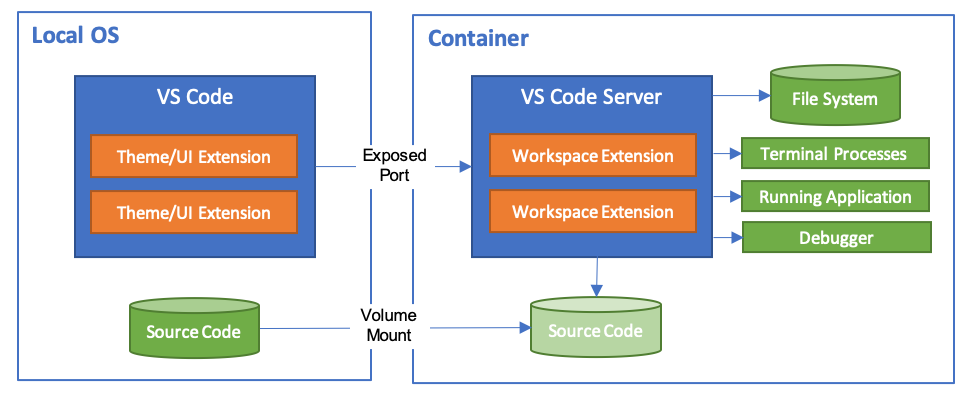

To get a consistent environment set up for everyone in your agency, you can create a development (dev) container and share it with all your teammates. You can do this in Visual Studio Code through the [Remote - Containers](https://marketplace.visualstudio.com/items?itemName=ms-vscode-remote.remote-containers) extension.

## What is the Remote - Containers extension?

VS Code's Remote - Containers extension lets you use a Docker container as a full-featured development environment. You can use this extension to open any folder or repository in a container and take advantage of Visual Studio Code's full feature set, like full IntelliSense (completions), code navigation, and debugging.

## Why would I use Remote - Containers?

As you've noticed during your time at the agency, it can be a major hassle for developers to get started with new projects, such as having to install and manage very specific or complicated sets of dependencies and tech stacks unique to specific projects. Using a dev container removes the need to download a new set of dependencies for each project, letting developers to get up to speed much faster.

## What are features of Remote - Containers?

Remote - Containers lets you grab a dev container with the specific tech stack or dependencies already set up for you, open a project, and your code will just work - you don't need to actually download anything on your local machine.

This container can be used to run an application or to sandbox tools, libraries, or runtimes needed for working with a codebase.

Workspace files are mounted from the local file system or copied or cloned into the container. Extensions are installed and run inside the container, where they have full access to the tools, platform, and file system. This means that you can seamlessly switch your entire development environment just by connecting to a different container.

With Remote - Containers, you get features and benefits such as:
- Add a dev container to an existing project through a series of simple commands
- Open an existing GitHub repo or local project in a dev container
- Try a sample container, with the dev container already configured and some simple source code, such as (vscode-remote-try-python)[https://github.com/microsoft/vscode-remote-try-python]
- Set up a coding experience specific to each dev container, including VS Code extensions, settings, and port forwarding