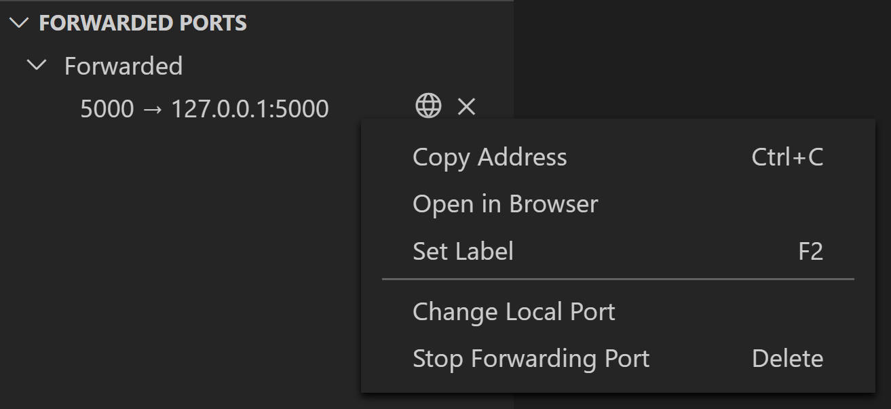

Now that you've gotten a web app running on your machine using a dev container, let's understand how you were able to access that app through port forwarding.

## What is port forwarding?

Containers are isolated environments, so if you want to access a server, service, or other resource inside your container, you'll need to forward the port to your host.

## How do we forward ports in containers?

In the last exercise, VS Code forwarded the port for you container automatically. The notification read, "127.0.0.1:5000 on remote is now forwarded to 127.0.0.1:5000 locally," meaning your web app was running at port 5000 in the dev container and was sent to port 5000 of your host machine.

### Varying port numbers

While both the remote and local ports matched here (port 5000), that may not always be the case. For example, a remote server listening on port 3000 may be mapped to port 4123 on localhost if 3000 was already in use on localhost. You could then connect to this remote server using http://localhost:4123. Accessing http://localhost:4123 will feel just like you're accessing a local server, which is the power of port forwarding!

## View or modify forwarded ports

You can forward a new port for the duration of the session by running the **Forward a Port** command from the Command Palette (F1).

You can work with your forwarded ports by navigating to the "Forwarded Ports" section of the Remote Explorer. There you can view what ports are currently forwarded, add a new port, or right-click -> and modify your port or open it in a browser, as shown below.

