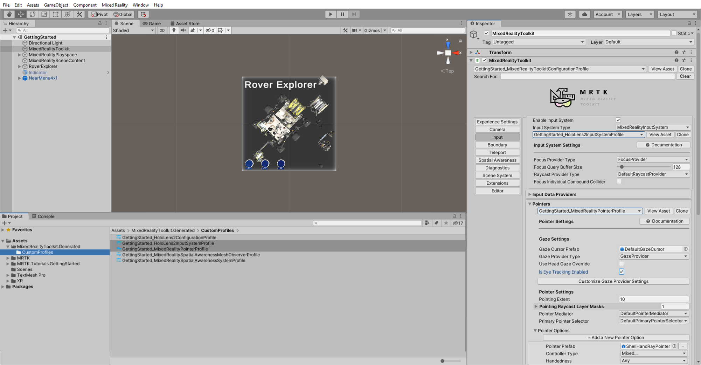
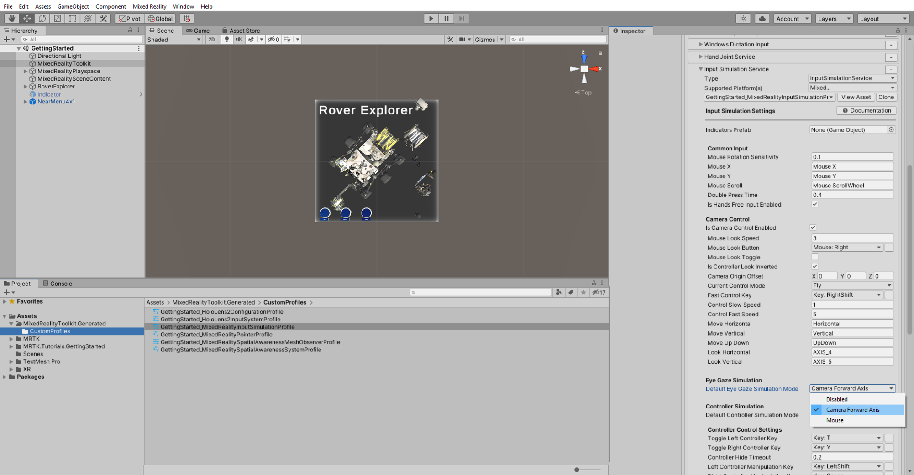
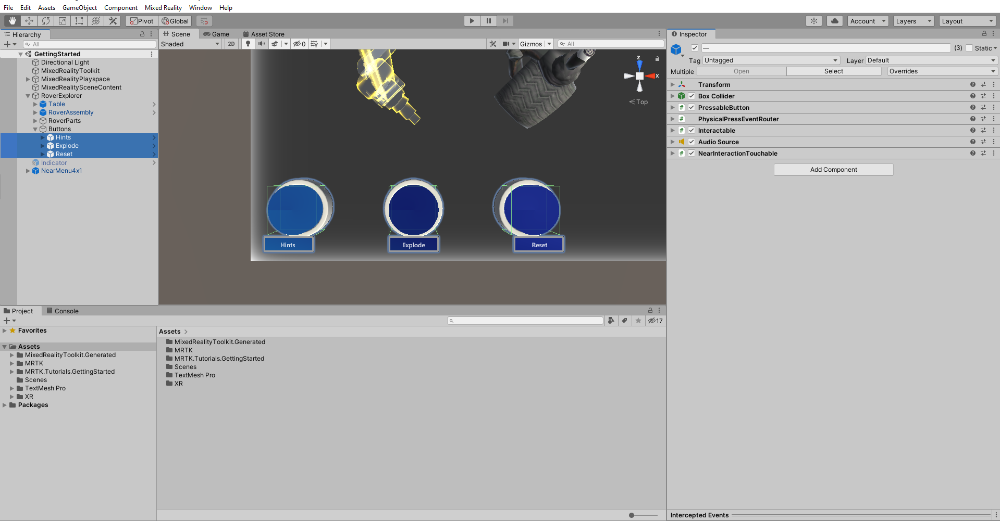
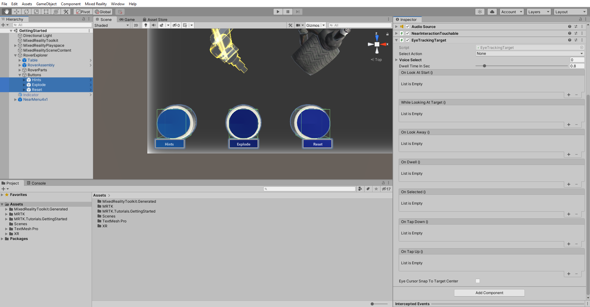
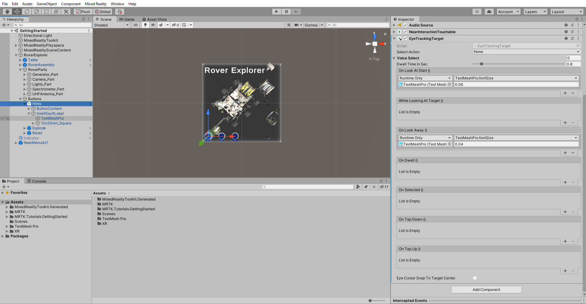

In this exercise, you'll learn how to enable eye-tracking for HoloLens 2 and add eye-tracking to objects to trigger actions when the user looks at the objects.

## Ensure the Eye Gaze Input capability is enabled

* In the Unity menu, select Mixed Reality > Toolkit > Utilities > **Configure Project for MRTK** to open the **MRTK Project Configurator** window, and then in the **UWP Capabilities** section, verify that **Enable Eye Gaze Input Capability** is greyed out:

    

## Enable eye based gaze in the gaze provider

1. In the Hierarchy window, select the **MixedRealityToolkit** object, then in the Inspector window, select the MixedRealityToolkit > **Input** tab and take the following steps:

    * Clone the **DefaultHoloLens2InputSystemProfile** and give it a suitable name for example, GettingStarted_HoloLens2InputSystemProfile.
    * Expand the **Pointers** section
    * Clone the **DefaultMixedRealityPointerProfile** and give it a suitable name for example, GettingStarted_MixedRealityPointerProfile
    * Locate the **Gaze Settings** section and check the **Is Eye Tracking Enabled** checkbox

    

## Enable simulated eye-tracking for the Unity editor

1. In the Hierarchy window, select the MixedRealityToolkit object, then in the Inspector window, navigate to the Input tab, and then:

    * Expand the **Input Data Providers** > **Input Simulation Service** section
    * Clone the **DefaultMixedRealityInputSimulationProfile** and give it a suitable name for example, GettingStarted_MixedRealityInputSimulationProfile
    * Locate **Eye Gaze Simulation** and set the **Default Eye Gaze Simulation Mode** to **Camera Forward Axis**

    

## Add eye-tracking to objects

1. In the Hierarchy window, expand the **RoverExplorer** > **Buttons**, and then select all three of the child button objects:

    

2. With all three Button objects still selected, in the Inspector window use the **Add Component** button to add the **EyeTrackingTarget** component to all the selected objects:

    

3. In the Hierarchy window, expand **RoverExplorer** > **Buttons** > **Hints** > **SeeItSayItLabel** > **TextMeshPro**. Then in the Hierarchy window, select the Hints button object, and configure the **EyeTrackingTarget** component as follows:

    * In the **On Look At Start ()** event section
        * Click the small + icon to add another event
        * Assign the **TextMeshPro** object from the **Hints** button to the **None (Object)** field
        * From the **No Function** dropdown, select **TextMeshPro** > **float fontSize** to update this property value when the event is triggered
        * Set the argument to **0.06** to increase the current font size of 0.04 by 50%

    * In the **On Look Away ()** event section
        * Click the small + icon to add another event
        * Assign the **TextMeshPro** object from the **Hints** button to the **None (Object)** field
        * From the **No Function** dropdown, select **TextMeshPro** > **float fontSize** to update this property value when the event is triggered
        * Set the argument to **0.04** to reset the font size back to 0.04

    

4. Repeat this step for the **Explode** and **Reset** button object to configure eye tracking for remaining buttons. If you now enter Game mode and then press-and-hold the right mouse button while moving your mouse until the gaze hit's one of the buttons, you'll see the text font size increase by 50% and reset back to its original size when looking away:
