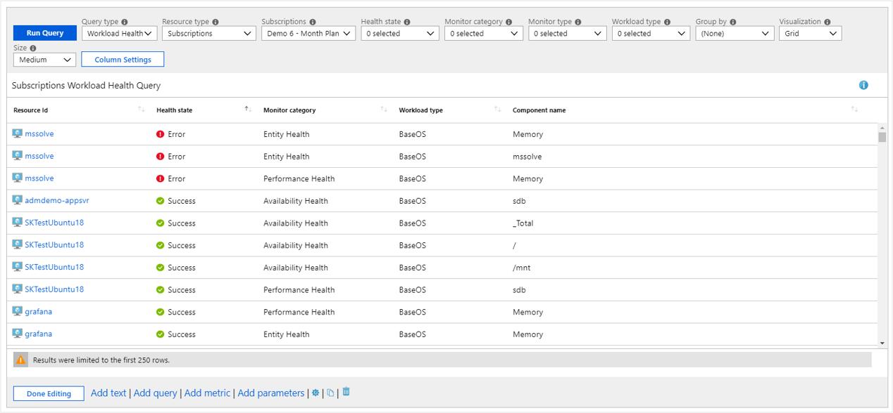

Use Workbooks to write queries that extract data from different types of data sources to create useful reports to help you monitor your resources. Each data source and result set support visualizations that are most useful for that data. Although different data sources return data sets with different structures, workbooks are able to interpret the data, and create charts and visualizations to help you analyze the data. You can create composite resource views or joins across resources to gain richer data and insights that would otherwise be impossible.

Workbooks can extract data from these data sources:

 - **Logs.** Use Kusto query language (KQL) queries to query logs from Azure Monitor Logs (Application Insights resources and Log Analytics workspaces) and resource-centric data (activity logs).

    

 - **Azure Monitor metrics.** Use the Workbooks metrics control, to specify the target resources, their metrics, and their aggregation. You can then plot the data in charts or grids. 

    :::image type="content" source="../media/4-metrics.png" alt-text="Screenshot that shows a workbook metrics interface.":::

    :::image type="content" source="../media/4-metrics-graph.png" alt-text="Screenshot that shows workbook metrics charts of CPU utilization.":::

- **Azure Resource Graph.** Query resources and their metadata using Azure Resource Graph. Use Azure Resource Graph to build custom query scopes for reports.

    

- **Azure Resource Manager.** Use Azure Resource Manager REST operations to query the `management.azure.com endpoint` without providing your own authorization header token.

- **Azure Data Explorer.** Use the Kusto query language (KQL) to query [Azure Data Explorer](/azure/data-explorer/) clusters.

    

- **JSON.** Create a query result from static JSON content. This functionality is commonly used to create dropdown lists of static parameter values. Simple JSON arrays or objects are automatically converted into grid rows and columns.

- **Merge.** Merge or join data to provide rich insights. There are several correlatable data sources that can be important to the triage and diagnostic workflow.
 For example, you can augment active alert information with related metric data. Merging data lets you see the active alert and also see potential causes, for example, high CPU usage. 

- **Custom endpoint.** Get data from any external source using custom endpoints.

- **Workload health.** Use a Workload Health query to proactively monitor the availability and performance of Windows or Linux guest operating systems.

    

- **Azure resource health**. Use an Azure resource health data source to utilize the health filter dropdowns to select the subset of resource issues for your analytic needs.

    :::image type="content" source="../media/4-resource-health.png" alt-text="Screenshot that shows an alerts query that shows the health filter lists.":::

- **Azure RBAC**. Check permissions on resources using the Azure role-based access control (RBAC) provider. The RBAC control is commonly used in parameters to check if the correct RBACs are set up, for example, to create a parameter to check deployment permission and notify the user if they don't have permissions.

- **Change Analysis (preview).** Use Change Analysis as the data source, to display changes for up to the last 14 days.

     
