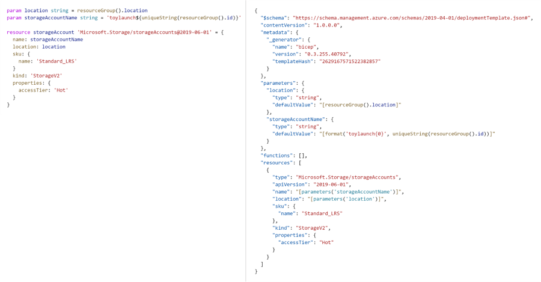

You've developed an understanding of the Bicep template language and the benefits it provides to template authoring. Before you begin the process of writing Bicep templates to provision your resources, you want to learn more about how Bicep works.

In this unit, you'll learn about how Bicep works with Azure Resource Manager.

## How does Bicep work?

In the previous unit, you learned that Bicep is a domain-specific language (DSL), which means it's designed for a specific scenario or "domain". Bicep is built to make it easy to deploy and configure Azure resources.

When you deploy a resource or series of resources to Azure, you submit the Bicep template to Resource Manager, which still requires JSON templates. The tooling built into Bicep converts your Bicep template into a JSON template. This process is known as _transpilation_, which essentially treats the ARM template as an Intermediate Language, or IL. This conversion happens automatically when you submit your deployment, or it can be done manually.

:::image type="content" source="../../shared/media/bicep-to-json.png" alt-text="Diagram that shows a template author, a Bicep template, an emitted JSON template, and a deployment to Azure." border="false":::

> [!NOTE]
> Transpilation is the process of taking the source code written in one language and converting it to another language.

The latest versions of the Azure CLI and the Az PowerShell module have built-in Bicep support. You can use the same deployment commands for deploying both Bicep and JSON templates. For example, the command below is used to deploy a Bicep template to a resource group named `storage-resource-group`.

```azurecli
az deployment group create --template-file ./main.bicep --resource-group storage-resource-group
```

Once this deployment is submitted, Resource Manager looks at what is already deployed in Azure. It then looks at what you're trying to deploy, and sets up a sequence of steps to achieve this state. All of these activities involve invoking the ARM API on your behalf.

You can view the JSON template submitted to Resource Manager, by using the `bicep build` command. Take a look at the example below of how to convert a Bicep template into its corresponding JSON template.

```bash
bicep build ./main.bicep
```

## Comparing JSON and Bicep

Bicep provides a simpler syntax when writing templates. Look at the two templates below. The template on the left is a Bicep template, and the template on the right is a JSON template.

[ ](../media/bicep-json-comparison-expanded.png#lightbox)

You'll notice that in the Bicep template, the code is smaller in size. The syntax is easier to read and comprehend, and there are no complex expressions like the JSON template on the right.

> [!NOTE]
> To view equivalent JSON and Bicep files side by side, see the [Bicep Playground.](https://bicepdemo.z22.web.core.windows.net)
