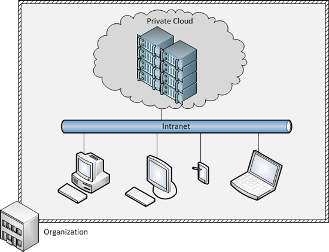

There are three well-known types of clouds: public clouds, private clouds, and hybrid clouds. A public cloud is owned by a cloud provider such as Amazon or Microsoft but is made available to the public. A private cloud is typically owned by an organization, which also controls the access to the cloud. A hybrid cloud is a combination of public and private clouds. We discuss the different types in terms of ownership, infrastructure, end-user availability, cost, security, and data location.

# Public Cloud

In a public cloud, the cloud infrastructure is owned by a cloud provider and is accessible to the public over the Internet (Figure 1.7). The cloud provider hosts the cloud infrastructure, and end users can access it remotely without the need to purchase and set up hardware and software. Public cloud resources are shared among end users. Public-cloud users are typically charged for the duration for which these services are used. However, public-cloud charge models vary across providers and by individual cloud services. The security and terms of use are defined by the provider. Consequently, end users must work within the constraints of the provider when consuming their services.

_Figure 1.7: Public cloud._

A variation on public clouds is *sovereign clouds* -- public clouds that are physically isolated from other public clouds and to which access is restricted to specific organizations (particularly governments) or countries that place strict requirements on how and where data is stored. Amazon, Microsoft, and Google run sovereign clouds for the U.S. government. They also offer sovereign clouds in places such as Germany and China.

# Private Cloud

In a private cloud, the cloud infrastructure is owned by an organization (Figure 1.8). The infrastructure is accessible to specific users via the organization\'s intranet. The cloud environment is procured, set up, operated, and maintained by the organization itself. The private cloud resources are typically shared among an organization's end users. Unlike the public cloud, security and terms of use of a private cloud are defined by the organization. Because the entire infrastructure is located in the organization, security can be compliant with the organization\'s policies.

_Figure 1.8: Private cloud._

# Hybrid Cloud

In a hybrid cloud, the infrastructure includes an owned private cloud and a leased public cloud (Figure 1.9). Hybrid clouds enable the idea of \"cloud bursting,\" in which an organization uses its private cloud for most of its needs and dynamically provisions resources in the public cloud when utilization exceeds the capacity of its private cloud. If regulatory requirements prevent certain data from being stored off-premises, hybrid clouds provide a solution to that, too.

_Figure 1.9: Hybrid cloud._

Other types of clouds continue to emerge. One example is *community clouds*, which share infrastructure among different organizations that have common security or other concerns. Various non-profit organizations that work closely with government might build and share a community cloud. Another type is *distributed clouds*, which provide cloud users with access to machines at different geographical locations. An example is Cloud\@Home, which leverages volunteered resources as a shared resource.
