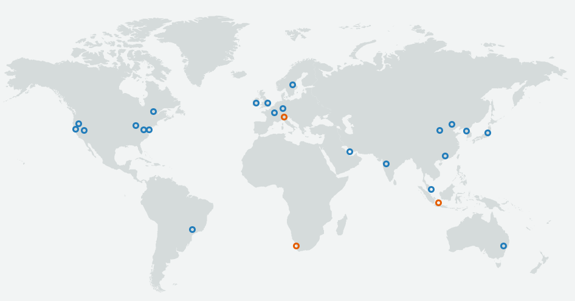
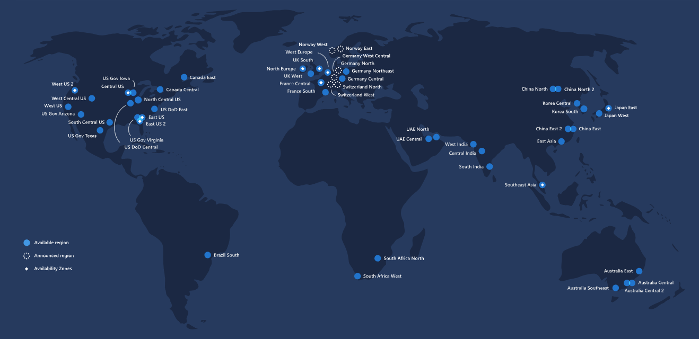
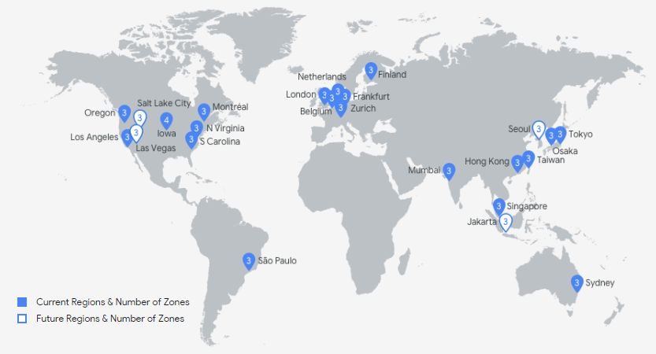

We will now do a quick run-down of cloud stacks that are currently popular in the market. We will quickly glance over the services offered by the major cloud providers, including Amazon Web Services, Microsoft Azure, and Google Cloud Platform.

# Amazon Web Services (AWS)

AWS is a market leader in several cloud-computing segments, particularly in the IaaS space. Amazon Web Services started by commoditizing and leasing out services that were developed in-house by Amazon's engineering team to the wider public. AWS initially offered S3, the object storage service, and then went on to provide EC2, the elastic compute cloud. AWS is currently the largest cloud-computing platform, bringing in more than \$25 billion in revenue in 2018[1][^1]. It is also growing at a rate of nearly 50% each year.

AWS has data centers all over the world. It divides the world into 69 availability zones and 22 geographic regions (Figure 1.10). Each region provides full redundancy and connectivity to the network. Each availability zone constitutes a fully isolated partition of the AWS infrastructure consisting of discrete data centers with redundant power, networking, and connectivity.

_Figure 1.10: Amazon Web Services regions[2][^2]._

AWS comprises more than 100 services spread between IaaS, PaaS, and SaaS. Some of its primary components include:

**Compute**: Amazon's primary compute solution is Elastic Compute Cloud (EC2), which provides users with virtual machines, or instances of various capacities for hourly or longer-term rentals. EC2 forms the backbone of the AWS cloud stack in terms of compute infrastructure. EC2 instances can be managed directly through the AWS EC2 APIs, or through other services such as AWS Auto Scaling.

**Storage**: AWS offers multiple products in this space. Block storage is provided by Elastic Block Storage (EBS) volumes, which can be attached and detached from EC2 instances. Object storage is provided by the Simple Storage Service (S3), which allows for binary large objects (BLOBs) to be stored and retrieved using simple HTTP APIs. AWS also offers a rich assortment of database services, including RDS, which offers a managed SQL service; DynamoDB, which offers a highly scalable, low-latency key-value store; and ElastiCache, an in-memory database store.

**Networking**: Amazon's Virtual Private Cloud (VPC), Elastic Load Balancer (ELB), and Route 53 are networking services that can be used to manage the connectivity between your instances and services deployed in AWS and the outside world.

**PaaS products**: AWS's platforms are large and varied to cater to different application needs. AWS provides a suite of analytics platforms such as Elastic MapReduce (EMR), Amazon Kinesis, and Redshift. Rapid web application development and hosting is possible through AWS Elastic Beanstalk. Amazon also offers many products to manage and control cloud deployments, including CloudFormation, OpsWorks, and CodeDeploy.

**SaaS products**: AWS includes a broad range of SaaS products, many of which target the evolving fields of machine learning and artificial intelligence. Examples include Amazon Polly for turning text into speech, Amazon Recommendations for enhancing retailing applications with the same recommendations engine used by Amazon.com, and Amazon Forecast for building sophisticated forecasting models backed by machine learning.

# Microsoft Azure

Microsoft Azure is the fastest growing cloud platform in the market, with impressive revenue numbers and an ever-expanding portfolio of services. As of this writing, Azure is available in 140 countries and has data centers in more than 50 locations around the world (Figure 1.11). Subsets of Azure are available through Azure Stack, which allows an organization to build a private cloud that can seamlessly connect to and interact with the Azure public cloud. These allow internal data centers to be highly automated, using shared resources that can respond to sudden spurts in demand.

_Figure 1.11: Microsoft Azure regions[3][^3]._

Azure features more than 100 IaaS, PaaS, and SaaS services, including:

**Compute**: Microsoft offers Azure Virtual Machines, which can be configured to run Windows or various flavors of Linux. Azure also supports Virtual Machine Scale Sets, which support auto-scaling by creating and deleting VMs automatically in response to changing demand or on a predefined schedule.

**Storage**: The family of services known as Azure Storage offers several storage solutions, including:

- Azure Blobs for storing binary large objects
- Azure Tables for storing NoSQL data
- Azure Queues for connecting services and microservices with persistent storage queues
- Azure Files, which offer SMB-based storage endpoints (Windows-compatible file servers) to mount and store files in the cloud

Azure also offers managed relational database services through Azure SQL Database; a managed, multi-model NoSQL database service known as Cosmos DB; and high-performance key-value caching through Azure Redis Cache. Microsoft also offers a unique storage appliance called StorSimple, which is a local SSD/HDD storage array that integrates with Azure to provide a hybrid storage solution, and that connects to Azure for backup, analytics, and cloud deployment.

**Networking**: Microsoft also offers virtual private networking services through Azure Virtual Network. Another unique feature of Microsoft's Azure cloud is the ability to purchase dedicated fiber connectivity to Microsoft's data centers through ExpressRoute. Azure Traffic Manager can be used to route traffic to Azure Virtual Machines based on location, performance, and other criteria, as well as to perform DNS-based load balancing. A recent addition to the Azure family of services, Azure Front Door, expands on Traffic Manager's capabilities to let you define, manage, and monitor global routing for web traffic by optimizing for best performance and instant global failover.

**PaaS products**: Azure offers several PaaS products, including Azure App Service, Azure SQL Database, and Azure Cosmos DB. In the analytics space, Azure offers several products including HDInsight, which is a managed Hadoop cluster service similar to Amazon's EMR; Azure Databricks, which is a managed Spark implementation; and Data Lake Analytics, which offers per-job pricing for analyzing and transforming massive quantities of data.

**SaaS products**: Microsoft offers a range of SaaS services, two of which are Microsoft 365 and OneDrive. Other SaaS services include Azure Cognitive Services, which is a set of services and APIs for incorporating artificial intelligence into apps; Azure Machine Learning Services for building, deploying, and versioning machine-learning models; and Azure Machine Learning Studio, which provides a browser-based, drag-and-drop interface for building, training, and testing machine-learning models.

# Google Cloud Platform (GCP)

Google's Cloud Platform initially offered only PaaS products and APIs into Google's most powerful products such as the Translate API. GCP has since diversified into multiple services in response to the offerings of its competitors. It has approximately 60 data centers around the world grouped into 20 regions (Figure 1.12).

_Figure 1.12: Google Cloud Platform regions[4][^4]._

**Compute**: Google's primary IaaS platform is the Google Compute Engine (GCE), which supports Linux virtual machines of various sizes. Google also offers Preemptible Virtual Machines, which provide highly affordable, short-lived compute instances to handle spikes in demand, batch jobs, and fault-tolerant workloads.

**Storage**: Google offers three primary storage services, one of which is Google Cloud Storage, an object storage service similar to AWS S3 and Azure Blobs. Google's Cloud Datastore is a managed NoSQL data-store service that allows users to store non-relational data with high scalability, but optionally supports transactions and SQL queries on your data. In addition, Google offers a traditional managed SQL database service called Cloud SQL.

**Networking**: Google offers several networking products to manage the connections between Google's cloud services and the outside world, namely Load Balancing, Interconnect, and DNS services. Google boasts that its entire infrastructure is carbon-neutral, with its data centers consuming 50% less energy than typical data centers.

**PaaS products**: Google's primary PaaS offering is Google App Engine (GAE), which provides a fully managed serverless platform for hosting applications similar to AWS Elastic Beanstalk and Azure App Service. In addition, Google offers data analytics platforms such as BigQuery, which allows users to run SQL-like queries against multi-terabyte datasets. Cloud Endpoints allows developers to deploy RESTful APIs that provide services to other applications.

**SaaS products**: Google offers some of the world's most popular SaaS services, including Gmail and Google Drive. In addition, Google services such as Prediction and Translate are available as APIs, enabling developers to integrate these services their own applications. AI Hub provides a hosted repository of plug-and-play AI components, while AI Platform offers Jupyter notebooks as a service, special VMs outfitted optimized for building and training deep-learning models, and Kubeflow, a machine-learning toolkit for Kubernetes. Kubernetes is a popular open-source container-orchestration tool that was originally developed by Google and is now maintained by the Cloud Native Computing Foundation.

### References

1. _Quartz (2019). *Amazon Web Services brought in more money than McDonald's in 2018*. <https://qz.com/1539546/amazon-web-services-brought-in-more-money-than-mcdonalds-in-2018/>_

2. _Amazon (2019). *AWS Global Infrastructure Map*. <https://aws.amazon.com/about-aws/global-infrastructure/?p=ngi&loc=1>_

3. _Microsoft (2019). *Azure regions*. <https://azure.microsoft.com/global-infrastructure/regions/>_

4. _Google (2019). *Meet our network*. <https://cloud.google.com/about/locations/>_

[^1]: <https://qz.com/1539546/amazon-web-services-brought-in-more-money-than-mcdonalds-in-2018/>  "Quartz (2019). *Amazon Web Services brought in more money than McDonald's in 2018*."

[^2]: <https://aws.amazon.com/about-aws/global-infrastructure/?p=ngi&loc=1>  "Amazon (2019). *AWS Global Infrastructure Map*."

[^3]: <https://azure.microsoft.com/global-infrastructure/regions/>  "Microsoft (2019). *Azure regions*."

[^4]: <https://cloud.google.com/about/locations/>  "Google (2019). *Meet our network*."
