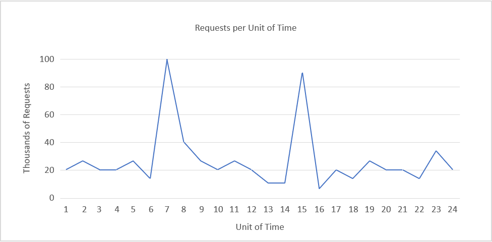
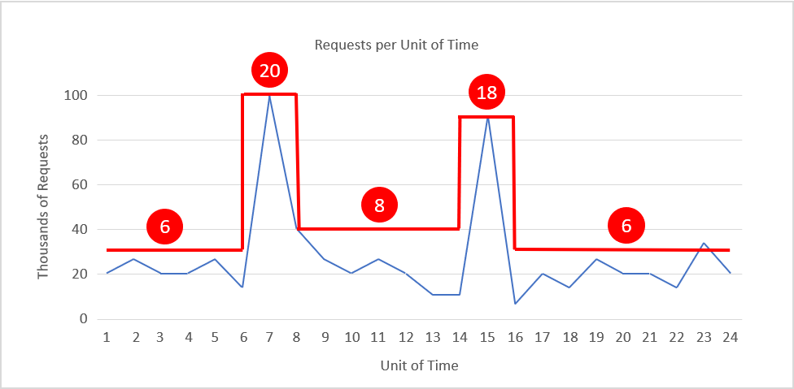

One of the important advantages of the cloud is the ability to scale resources into a system on-demand. Scaling up (provisioning larger resources) or scaling out (provisioning additional resources) can help in reducing the load on a system by decreasing utilization as a result of increased capacity or broader distribution of the workload.

Scaling can help improve responsiveness (and perceived performance from the user's perspective) by increasing the throughput since a larger number of requests can now be served. This can also help in decreasing latency during peak loads since a reduced number of requests are queued during peak loads on a single resource. In addition, scaling can improve the reliability of the system by reducing resource utilization and preventing it from nearing the breaking point.

It is important to note that although the cloud enables us to easily provision newer or better resources, cost is always an opposing factor that needs to be considered. Therefore, even though it is beneficial to scale up or out, it is also important to recognize when to scale in or down in order to conserve costs. In an *n*-tier application, it is also essential to pinpoint where the bottlenecks are and which tier to scale, whether it is the data tier or the server tier.

## Horizontal scaling (scaling in and out)

Horizontal scaling is a strategy whereby additional resources are added to the system or extraneous resources are removed from the system over time. This type of scaling is beneficial for the server tier when the load on the system fluctuates inconsistently or in an unpredictable manner. The nature of the fluctuating load makes it essential to provision the correct amount of resources to handle the load at all times.

A few considerations that make this a challenging task is the spin-up time of an instance (for example, a virtual machine), the pricing model of the cloud service provider, and the potential loss in revenue from degrading Quality of Service (QoS) by not scaling out in time. As an example, consider the load pattern in Figure 5:

_Figure 5: Sample load pattern._

Suppose we are using Amazon Web Services, that each unit of time is equivalent to 1 hour of actual time, and that we require one server to serve 5,000 requests. Demand peaks between units 6 and 8 and units 14 and 16. Let's take the latter as an example. We can detect a fall in demand around time unit 16 and start to reduce the number of allocated resources. Since we are going from roughly 90,000 requests to 10,000 in the space of 3 hours, academically we can save the cost of a dozen or more additional instances that would have been online at time 15.

Figure 6 shows a scaling pattern that adjusts the instance count on the fly to match the load pattern, with instance counts shown in red. During times of peak demand, the number of instances is scaled out to 20 and 18, respectively, to provide the resources needed to handle the traffic. At other times, the instance count is reduced (scaled in) to keep resource utilization relatively constant. If we assume that each instance costs 20 cents an hour, then the cost of keeping 20 instances running for 24 hours is \$96. Scaling the instance count as shown reduces the cost to about \$42 for an annualized savings of more than \$15,000 per year. That's a substantial amount of money for almost any IT budget.

_Figure 6: Scaling in and out with demand._

Scaling depends on the characteristics of the traffic and its ensuing load generated at a web service. If the traffic follows a predictable pattern -- for example, based on human behavior such as streaming movies from a web service in the evening -- then the scaling can be ***predictive*** in order to maintain the QoS. However, in many instances, the traffic cannot be predicted, and the scaling systems need to be ***reactive*** based on different criteria.

It is worth noting that scaling in and out can be performed with container instances as well as VM instances. Workloads have traditionally run in the cloud in VMs, but it is becoming increasingly common for them to run in containers. Scaling is achieved with VM-based workloads by increasing and decreasing the VM count. Similarly, container-based workloads may be scaled by varying the number of containers. Because containers tend to start more quickly than VMs, elasticity is slightly greater since new container instances can be brought online in less time than VM instances.

## Vertical scaling (scaling up and down)

Horizontal scaling is one way to achieve elasticity, but it's not the only way. Suppose the traffic to your web site rarely exceeds 15,000 requests per unit of time and you provision a single large instance that can handle 20,000 -- enough to serve normal traffic rather well and account for minor peaks, too. If the load on the web site grows, you could reasonably accommodate the increase in traffic by replacing the server instance with one that has twice as many CPU cores and twice as much RAM. This is known as *scaling up*.

The primary challenge in vertical scaling is that there is generally some switch-over time that can be considered as down time. This is because in order to move all operations from the smaller instance to a larger instance, even if the switch-over time is mere minutes, the Quality of Service degrades during that interval.

Another limitation of vertical scaling is reduced granularity. If you have 10 server instances online and need to temporarily increase capacity by 10%, you can scale out from 10 instances to 11 and achieve the desired result. With vertical scaling, however, the next larger instance size typically has about twice the capacity of the previous one, which would be the equivalent of horizontally scaling from 10 instances to 20 just to accommodate a 10% increase in traffic. This is less cost-effective than scaling horizontally.

A final consideration to take into account regarding vertical scaling is availability. If you have one large instance serving all of a web site's customers and that instance goes down, the web site goes down, too. By contrast, if you provision 10 small instances to handle the same load and one of them goes down, users might notice a slight decrease in performance, but they will still be able to access the site. Consequently, even if the load is predictable and steadily increasing as the popularity of the service increases, many cloud administrators choose to scale horizontally rather than vertically.

## Scaling the server tier

Scalability is sometimes more nuanced than simply provisioning more resources (scaling out) or larger resources (scaling up). On the server tier, increased demand can increase contention for specific types of resources such as CPU, memory, and network bandwidth. Cloud service providers typically offer VMs that are optimized for compute-heavy workloads, memory-intensive workloads, and network-intensive workloads. Knowing your workload and picking the right type of VM is as essential as throwing more or larger VMs at the problem. It is better to have five VMs handling compute-heavy workloads than 10, even if VMs optimized for CPU-intensive workloads cost 20% than more generic VMs.

Increasing hardware resources isn't always the best solution for increasing the performance of a service. Increasing the efficiency of the algorithms used by the service can also reduce resource contention and improve utilization, removing the need to scale physical resources.

An important consideration when it comes to scaling is statefulness (or lack thereof). A stateless service design lends itself to a scalable architecture. A stateless service essentially means that the client request contains all the information necessary to serve a request by the server. The server does not store any client-related information in the instance and does store any session-related information in the server instance.

Having a stateless service helps in switching resources at will, without any configuration required to maintain the context (state) of the client connection for subsequent requests. If the service is stateful, then resource scaling requires a strategy to transfer the context from the existing node configuration to the new node configuration. Note that there are techniques for implementing stateful services -- for example, maintaining a network cache so the context can be shared across servers.

## Scaling the data tier

In data-oriented applications, where there are a high number of reads and writes (or both) to a database or storage system, the round-trip time for each request is often limited by hard-disk read and write times. Larger instances allow for higher I/O performance, which can improve seek times on the hard disk and in turn reduce the latency of the service. Whereas having multiple data instances in the data tier can improve the reliability and availability of the application by providing failover redundancies, replicating data across multiple instances has additional advantages in reducing network latency if the client is served by a data center physically closer to it. *Sharding*, or partitioning of the data across multiple resources, is another horizontal data-scaling strategy where instead of simply replicating the data across multiple instances, data is partitioned into segments and stored across multiple data servers.

An additional challenge when it comes to scaling the data tier is that of maintaining consistency (a read operation on all replicas is the same), availability (reads and writes always succeed), and partition tolerance (guaranteed properties in the system are maintained when failures prevent communication across nodes). This is often referred to as the *CAP theorem*, which states that in a distributed database system, it is very difficult to obtain all three properties completely and thus may at most exhibit a combination of two of the properties[1][^1].

### References

1. _Wikipedia. *CAP Theorem*. <https://en.wikipedia.org/wiki/CAP_theorem>._

[^1]: <https://en.wikipedia.org/wiki/CAP_theorem>  "Wikipedia. *CAP Theorem*."
