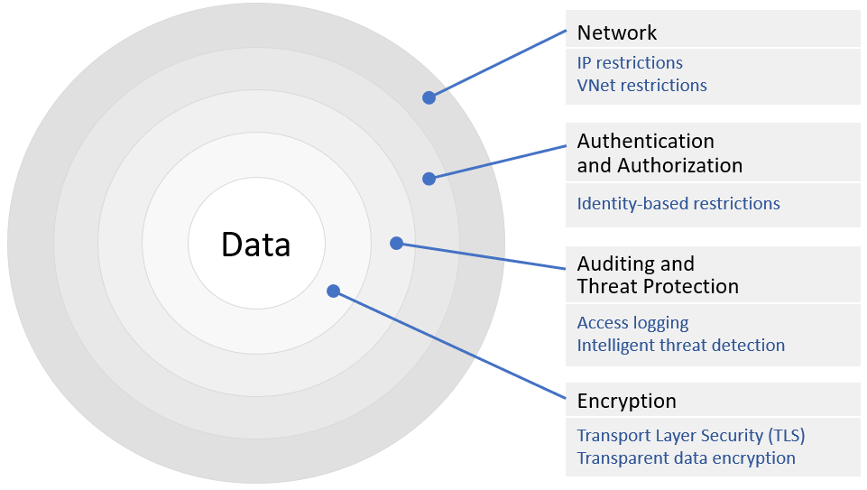
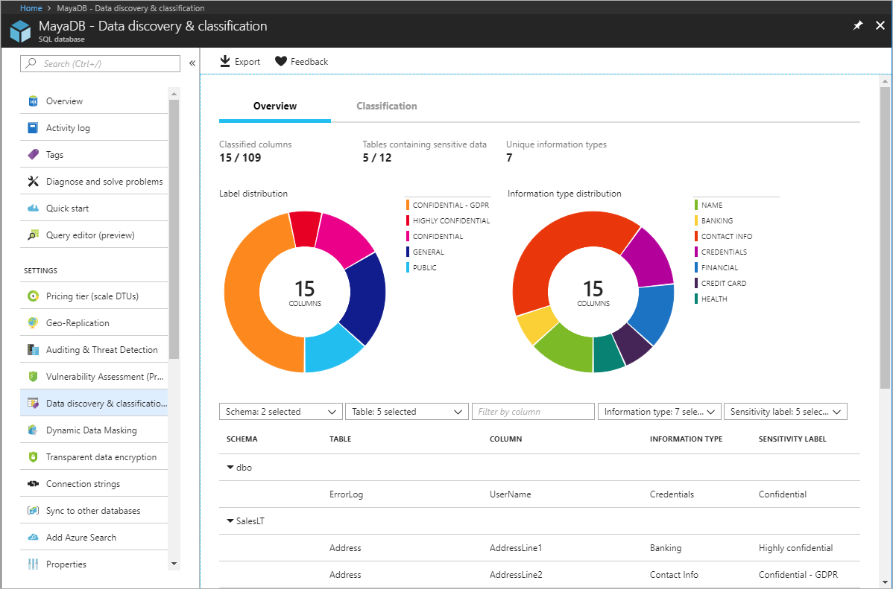

For data to be truly secure, it must only be accessible to people or entities who are entitled to it. The reasons why lead to further revelations about what data security actually entails. A data breach occurs when an unentitled party accesses data. But a breach can be as simple as the accidental revelation of a record, which the user may not have asked for and may not have had to "hack" into the system to retrieve. Access to a database, data stream, data warehouse, or data lake by means other than the tools ordinarily used to access the data may provide a malicious user the opportunity to read or alter the data's contents.

Data stored in the cloud must only be accessible through legitimate sources that result in verifiable, auditable queries. Applications must be vetted to rule out the possibility that they may be used as attack vectors - for example, to ensure that they don't contain SQL-injection vulnerabilities that permit attackers to retrieve data that wouldn't ordinarily be divulged. In addition, the data itself must be protected so that it can't be accessed by unauthorized users. The best way to achieve this is to erect multiple barriers to unauthorized access, and to employ tools and services that monitor data sources in real time, log accesses to the data, and respond to suspicious or obviously illicit behavior.

## Multilayered security

Because absolute security is never ensured, most organizations safeguard data stored in the cloud using a multilayered security strategy sometimes referred to as *defense in depth*. The core principle is that if an attacker penetrates one of your defenses, the next defense may be the one that stops them. A multilayered security strategy also provides protection against different and potentially unrelated attack vectors. For example, protecting a database with IAM so that only designated users can access it through a cloud portal does nothing to protect the database if an attacker gains access to the server that hosts the database and makes a copy of the database files. Going the extra step of encrypting those files, however, would.

Figure 4 illustrates how multilayered security for a cloud database might be structured. The data itself is encrypted in place ("encrypted at rest") and encrypted with TLS when it travels over the wire ("encrypted in motion"). Outside that is a layer that logs all accesses to the data so that an audit trail is maintained. This layer may also host an active threat-detection agent that continually monitors accesses to the database and alerts administrators to suspicious activity. The next layer uses IAM to make sure only authorized users and applications can connect to the database. Finally, the outermost layer restricts accesses to the database over the network. For example, it might specify that the database can only be accessed from a certain VNet or set of VNets, and it may restrict connections from the outside to a white-listed set of IP addresses.

_Figure 4: Multilayered data security (defense in depth)._

Encrypting data at rest in the cloud is a crucial component of securing that data. Most public cloud platforms support the transparent encryption of data stored in their storage services. In this context, "transparent" means that the data is automatically encrypted when it is written to storage and automatically decrypted when it is read back. Consequently, applications don't have to encrypt or decrypt the data themselves (they may not even be aware that it is encrypted), but if the data is stolen - if for example, someone gains illicit access to the server where the data is stored - it is useless unless the decryption key can also be retrieved. Keys are typically stored separately in highly secure locations managed by services such as Azure Key Vault or AWS Key Management Service.

As an example, Azure Storage automatically and transparently encrypts all the data that it stores using AES-256 encryption. The keys used for encryption and decryption can be provided by Azure or supplied by the customer (through Azure Key Vault). Similarly, Azure SQL Database supports real-time encryption and decryption of databases, associated backups, and transaction log files, and does so transparently without requiring changes to applications that use it. Similar encryption options are offered by Amazon and Google.

Encryption-at-rest isn't limited to storage services and databases; it applies to the virtual hard disks that serve virtual machines, too. In Azure, for example, VMs can be protected by Azure Disk Encryption, which uses Windows BitLocker technology for Windows VMs and Linux DM-Crypt for Linux VMs to fully encrypt operating system disks as well as data disks. AWS offers equivalent options through EC2 Instance Store Encryption.

## Data security platforms

Security can be supplemented by using data security platforms (DSPs) to oversee data storage and use. A complete DSP is a class of tool which should, when implemented properly, give an organization these benefits:

- Ensure isolation of each cloud or network tenant along with the data sources to which that tenant has been granted access, to the extent that the network from the tenant's perspective does not include addresses for data sources for which access has not been granted or for which it has been prohibited

- Log all data-related administrator activity for auditing and compliance purposes

- Automatically discover and classify sensitive and confidential data based on established access-control privileges

- Log changes to infrastructure that may affect the integrity of data storage

In a modern data centers, true data security cannot be achieved using the simplistic "fortress wall" model, where data is safeguarded behind a password or by the exchange of tokens. A true data security platform establishes access policies in all conditions, based on the sensitivity of the data being requested and the authorization level of the individual or service making the request.

### Tenant isolation

One of the key purposes of any cloud platform, including a private cloud, is to provide multiple tenants (any certified organization with a registered, billable account) with virtualized access to shared infrastructure. In the simplest of such platforms, isolation between co-tenants is made possible by the *hypervisor* software component that hosts virtual machines. This is the layer of abstraction that mediates access between virtual machines and the physical servers that host them. On a single server, each hypervisor partitions access to underlying system services. Meanwhile, on a server cluster, multiple hypervisors provide pools of virtual functionality that completely obscure the configurations of the hardware supporting them, usually with the aid of a *network hypervisor* that virtualizes network addresses.

In a containerized environment (for example, Docker or Kubernetes) there may be many virtualized entities, or containers, in a server cluster. Each container runs its processes in isolation from other containers. It has its own separate *namespace*, so it cannot enumerate its neighbor's resources, let alone access them. However, containers do share a host operating system, or a proxy that acts on the operating system's behalf. Theoretically, the potential exists for that route to be exploited, and for code in one container to access resources belonging to another hosted by the same OS.

In a containerized or VM namespace, a data source or volume may have multiple concurrent users. The locations for these users in the network lay outside this namespace, and their access is granted through authentication. The owner of this namespace is the tenant. It's relatively easy to enable tenant isolation on a cloud network so that one tenant cannot access infrastructure resources such as memory or databases used by another tenant. A DSP may include tools to ensure that such attempts are not being made.

What's more difficult is facilitating user isolation, ensuring that the breadth of the logical network that's visible to each single user is limited to only those resources to which the user is entitled and access has been granted. VMware's vSphere virtualization environment enables isolation at this level using a technique called *microsegmentation*[1][^1]. Like an army of firewalls unleashed inside a server cluster or namespace, microsegmentation systems enforce network and security policies on a per-user basis. As a result, unauthorized resources become invisible within the network of servers with which the user communicates.

A network virtualization platform such as VMware's NSX implements microsegmentation for physical workloads, including "big data" facilities such as Hadoop and Apache Spark, by using logical routers (which are virtual, not physical, appliances) to present VMs with a limited view of the components that comprise those workloads. Figure 5 depicts this process in action. From the VM's perspective, the network is limited to only those routes in the virtual namespace that comprise the workload.

![Figure 5: How microsegmentation affects the addressability of physical workloads. \[Courtesy VMware\]](../media/fig8-5.png)

_Figure 5: How microsegmentation affects the addressability of physical workloads. \[Courtesy VMware\]_

A modern data security platform can tie into microsegmentation services so that the databases accessible to any user may be limited to only those records to which that user has access. The visible database thus becomes a view of the physical database that serves as its proxy on the network. A user cannot accidentally or intentionally access records that do not exist on that user's network.

### Data discovery and classification

Remote agents may be injected into distributed applications and Web apps in order to make observations about the intervals of time in between critical milestones. Data discovery platforms such as IBM Smart Data Discovery, Veronis, and Netwrix perform a similar analysis of the patterns in which data is accessed throughout an enterprise network. Frequently, this analysis involves the introduction of a metadata-based *fingerprint* into records as they are accessed so the platform can tag and track these records.

Through a careful behavioral analysis of tagged records, the platform can ascertain whether certain records are more sensitive or more deserving of confidentiality protections than others. Some records or data sources may be accessed by a limited number of user accounts, which is as it should be. However, if that data truly is sensitive, it may be exposed to unauthorized or malicious access if it is not protected.

### Environment change auditing

Most cloud-based resources today are hosted within a virtual network, which is an overlay atop either the physical network or another such overlay. Its purpose is to make resources more directly addressable to resources in the user's namespace by assigning them IP addresses that are intrinsic and exclusive to the local namespace.

A virtual network overlay has a tendency to mask changes in the underlying physical network to which its addresses are mapped. These physical changes are often the result of the evolution of a solution, and therefore the physical network that connects its components. Performance degradation, as well as alterations to the network's threat profile, may be evidence of discrepancies in the virtual network overlay that could lead to vulnerability and, in the worst case, exploitability.

Coupled with performance activity logs, the time-series records generated by a change-auditing platform such as Netwrix can help an IT administrator correlate aberrations or degradations in performance to specific infrastructure-alteration events. In the case of cloud-based infrastructure, where information about the CSP's buildouts and configurations are not publicly known, this class of tool can help organizations detect when cloud infrastructure has been altered. This evidence can help them to decide when and where to make adjustments to their own configurations to compensate.

## Integrated security tools

DSPs may be used to protect data stored in public clouds but are particularly useful with on-premises data stores. Cloud service providers offer integrated data-security tools that perform many of the same functions as DSPs. For example, persons who administer an Azure SQL Database instance can use the data-discovery-and-classification feature in the Azure Portal to scan the database for columns containing potentially sensitive data such as credit-card numbers, social-security numbers, and login credentials (Figure 6). Azure also offers a free vulnerability-assessment service that scans a database for potential vulnerabilities and provides actionable steps for resolving them.

_Figure 6: Data discovery and classification in Azure SQL Database._

Today, virtually all cloud storage services create audit trails documenting data accesses, and many - especially database services - support active threat detection as well. In addition, major cloud service providers such as Microsoft, Amazon, and Google offer comprehensive threat-detection services capable of monitoring a wide range of cloud resources not limited to data stores. In AWS, for example, Amazon GuardDuty can continuously monitor for malicious activity and unauthorized behavior to protect AWS accounts, workloads, and data. It combines managed rule sets with machine learning based on billions of events occurring across AWS to detect threats in real time, and it integrates with other services such as Amazon CloudWatch to trigger alerts and even perform remedial actions (via AWS Lambda) when threats are detected.

### References

1. _The New Stack. *Microsegmentation: How VMware Addresses the Container Security Issue*. <https://thenewstack.io/microsegmentation-how-vmware-addresses-the-container-security-issue/>._

[^1]:  <https://thenewstack.io/microsegmentation-how-vmware-addresses-the-container-security-issue/>  "The New Stack. *Microsegmentation: How VMware Addresses the Container Security Issue*."
