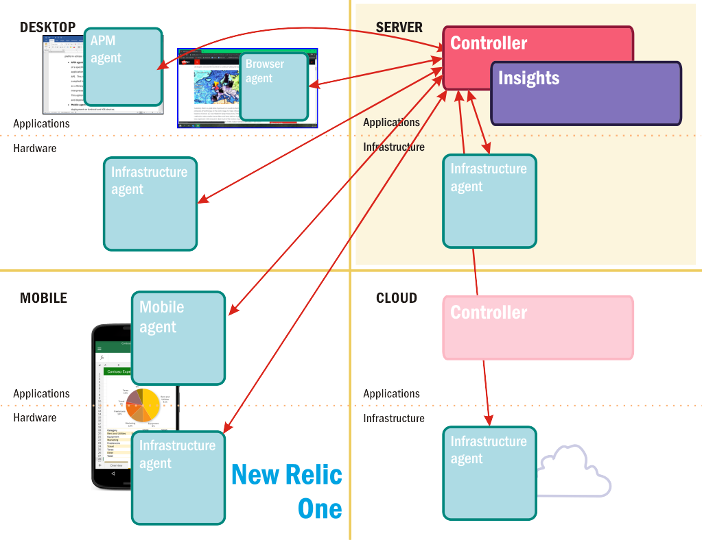
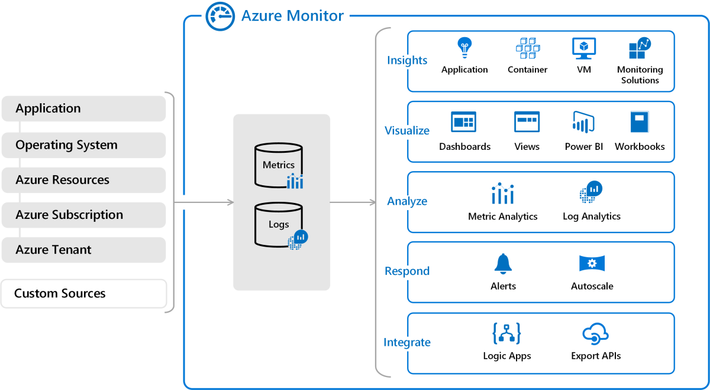

Monitoring platforms generally fall into two categories: those that are agent-based, and those that are not. An *agent* is a remote component that signals back to an application performance monitor's (APM) central controller or hub, or a daemon that serves as that controller's proxy. With a basic APM, the agent would simply ping a server or application periodically to make sure it's still available. Even the variations between successful pings can be informative by indicating where connections are likely to be encumbered by distance or traffic congestion. Most modern APM agents are more sophisticated, sending telemetry to central hubs distributed throughout the cloud. Some agents may be attached to client-side applications or Web apps, reporting performance and connectivity data from JavaScript agents running in users' browsers.

## Agent-Based APM platforms

From the beginning, the purpose of APM was to gather information about the operating status of an application, along with data pinpointing the times in which observable events took place. The first APM agents were attachments to a Web page that ran in users' browsers and reported back this time-oriented data - for example, when page rendering began, when rendering ended, and how long the user remained on the page before navigating away.

Modern APM platform vendors utilize agents in a variety of ways. For example:

- An agent may inject JavaScript code into the HTML content of Web pages, enabling functions on the client side to communicate performance data with APM platform servers

- An agent may gather or "scrape" records from the performance logs generated by applications, by services running on the client, or from the client itself, indicating the events pertinent to the operation of the system

- In some cases, an agent may partake in the compilation of a central database of system events for analysis by or from the APM controller

The most basic automated function of a performance-monitoring platform is an *alert*. It's a warning that the central controller can raise when it ascertains that one or more of the resources being monitored have attained a specified, usually negative, condition, such as one of the following:

- The value of a metric being monitored that represents a performance level has descended below a static *baseline* amount set in advance

- The value of a metric representing an operating parameter (such as CPU utilization) or representing a midrange of tolerance levels (such as network traffic) rises above or falls below a static *threshold* set in advance

- The controller observes one or more operating parameters that collectively indicate a behavior has fallen outside the tolerance range for "normal"

- The controller detects that an application has crashed or is no longer responding to input

While an APM platform may host hundreds of agents simultaneously sending messages back and forth to their controller or hub, an alert is a message intended to be delivered to a person. In the early days of APM, the platform would interface with pocket paging systems so operators and admins could be notified of error conditions. Today such messages may be routed through e-mail or SMS.

It typically is not the job of an agent to send alerts. Rather, it gathers the data for processing and analysis by another APM component, from which alerts may then be generated.

An agent-based APM platform is in many ways a network messaging hub. Machine data (the kind generated by machines, for machines) constitutes a majority of the data presently in use. One reason there's so much of it is the same reason telephone directories consumed so much paper, back before the invention of smartphones: Publishing and distributing everything to everyone seemed like the most efficient way to process it, until it suddenly wasn't. By establishing an effective network among server nodes dedicated to the task of maintaining service levels, the proper use of agent-based APMs may reduce the volume of machine data over time.

### New Relic

The New Relic monitoring platform, now dubbed New Relic One, is one of many agent-based monitoring tools available on the market. It is the result of an extensive effort to make every conceivable manageable component in a solution visible, observable, and manageable. As depicted in Figure 7.2, this platform utilizes the following classes of agents:

- **APM agent** - Gathers relevant data concerning the performance of a specific application. It may be installed alongside the application itself as a separate component and contacted via API. This is the preferred option for a program written in a compiled language such as C++. Optionally, it may be installed as a library or dependent code inside an application written in an interpreted language such as Java, Node.js, Python, or Ruby. This option has the virtue of more direct access to the functions and dependencies specified by the source code.

- **Mobile agent** - A variant of the APM agent optimized for deployment on Android and iOS devices.

- **Browser agent** - A segment or "snippet" of JavaScript code attached to a Web page by way of an HTML tag. This code contains instructions enabling a background client-side app to collect performance data generated by the browser, and periodically publish that data to the New Relic collector.

- **Infrastructure agent** - Installed on a remote machine, or on the home server itself (either of which may be a VM) so that it's launched at startup. From there, this agent runs unattended and reports on the overall state of the processor, memory, network connectivity, and local storage. The infrastructure agent gathers metrics samples over relatively non-intrusive intervals such as 5, 10, or 20 seconds.

A New Relic agent periodically (by default, each second) sends packages of metrics and performance data to a central hub called the *collector*, which is located inside New Relic's own private domain. An organization subscribing to New Relic One may use either their own Web browser or New Relic's own browser to communicate with New Relic's servers, where data compiled by the collector has been stored for distribution to subscribers. The platform's reports, charts, and dashboards are all browser-based.

_Figure 2: Networked monitoring components in New Relic One._

Insights is New Relic's brand for the component that analyzes collected data, generates reports and alerts, and projects dashboards. One of its more distinguishing features is its *service map* - an updated graph that maps the active components of a Web application based on a composite view assembled from the last half-hour's worth of snapshots taken by all the APM agents remotely monitoring the application.

Figure 3 shows one example of a New Relic service map. The green, yellow, and red color codes for the applications and services (which New Relic calls *entities*) provide vital and easily consumable information about the present state of the solution. Each entity is given a color code based on the number and level of outstanding traffic violations it's racked up, with red reserved for the most critical violators.

![Figure 3: Part of a service map in New Relic One APM. \[Courtesy New Relic\]](../media/fig7-3.png)

_Figure 3: Part of a service map in New Relic One APM. \[Courtesy New Relic\]_

## Agentless Monitoring platforms

The typical agentless monitoring tool or platform relies on the current state of a server, including the system services that support its hardware, to provide the information the platform needs to ascertain its operating status, and to determine whether an event regarding that status should be actionable. The most prominent of these services is logging.

For a log to be certified by standards organizations as *auditable* - providing the necessary information for a thorough analysis of an operation - each of its records must include the following:

- The identity and/or type of each activity performed that is relevant to the category of the log

- The identity of the *owner* of that activity, or the authenticated source responsible for launching it

- The names of components or objects in the environment affected by the activity

- The time in which the activity took place

- The result of the activity (what changed, if anything)

Each record needs to be presentable to a human operator in an intelligible manner. Some logs are stored in plain text, which is the most human-legible form, in which case a record may appear as one row in a multi-column table. Alternately, a record may be stored within a database in a compressed or abbreviated fashion, or with exclusive tags that represent objects such as identities. In any event, either the record needs to be legible in its native form, or a log management platform should be capable of rendering that record intelligibly for human analysis.

### Sumo Logic

Sumo Logic is one example of an agentless monitoring platform. It is based on a concept it calls *machine data analytics*, which is centered on log management. Because most services and applications in a Linux-based server know to use Linux' `syslog` utility for generating logs in a proper format, Sumo Logic can simply be pointed to the right directory, and from there it can populate dashboards and generate reports. With common services such as Apache Web Server, Sumo Logic already knows what factors to look for and can generate a suitable dashboard in just a few seconds. Figure 4 shows one example.

![Figure 4: A Sumo Logic dashboard for Azure Web Apps. \[Courtesy Sumo Logic\]](../media/fig7-4.png)

_Figure 4: A Sumo Logic dashboard for Azure Web Apps. \[Courtesy Sumo Logic\]_

The traditional Sumo Logic architecture incorporates a component called the *collector* which gathers data from logs and incorporates it into a database. Technically, the collector is an agent. However, Sumo Logic has been moving away from the agent-driven system, now offering instead a cloud-based service called the *hosted collector*. This is a SaaS service that interacts with the on-premises collector through the network.

The analysis performed by the Sumo Logic platform begins with database queries conducted through its Web-based console. Inspired by Hadoop and its MapReduce algorithm, Sumo Logic uses proprietary algorithms that it calls *LogReduce* to look for ways to logically join related data together from separate log tables. A custom query language enables an IT operator to retrieve records from the database curated by the collector, based on criteria that can be expressed symbolically. For example, a query can retrieve records from multiple logs that all contain the word "SECURITY," expressed as **\*SECURITY\*** (with leading and trailing asterisks), and then group those records together according to a common field category. The result is a custom table containing events that might be flagged for later review by security personnel.

## Tracing in microservice environments

A traditional application incorporates all of its code in a single, contiguous unit. Even if it utilizes portable libraries that were formally included in the code's declarations, they still exist inside the walls of the proverbial monolith. A monitoring platform observing an application from the outside usually waits for it to do something noticeable, like accept a query or produce a result, and then measures the service levels of these actions. When an enterprise network needs to improve the service levels for this network, it simply replicates these servers and places a load balancer in front of them to even out the traffic flow. Even modern VM platforms merely automate this simple process.

With microservices, the code modules of an application become applications unto themselves, which interact with and pass control between one another through the network. To find one another, they may use raw IP addresses, but more likely they use a DNS server for service discovery, or they might make use of a *service mesh* to discover each other's identities and locations. An orchestrator such as Kubernetes improves service levels by replicating as many of the individual microservices as the cluster needs to account for fluctuating traffic volume, and can then delete these replicas when traffic subsides.

Supporting a microservices environment with a conventional monitoring platform that observes events from the outside is like equipping a metropolitan area with a population of more than a million people with a single party-line telephone circuit. Theoretically it would work, given an infinite time constraint, but communications over such a system would be unworkably slow. Consequently, specialized APM platforms are available for monitoring microservice-based solutions.

### Prometheus

One of the first monitoring tools to address the requirements of a microservices environment was Prometheus. In 2012, developers with the podcast and music hosting service SoundCloud came to the conclusion that their existing monolithic service model was insufficient for their rapidly growing customer base. So they set about to re-architect their platform for microservices architecture, putting key functions onto a scalable network and opening those functions up to observability. At the same time, they crafted their own monitoring for microservices, and adapted open-source *time series* *database* (TSDB) engines1 so that multiple microservices could utilize them in parallel.

After three years of work, the SoundCloud team had effectively welded their monitoring tools into a new and altogether different kind of monitoring platform that they dubbed Prometheus. The company opted to build support for their platform by releasing their project into the open-source community.[2][^2] It is now marshaled by the Cloud Native Computing Foundation, the home of Kubernetes.

As Figure 5 indicates, Prometheus's principal component is not a centralized controller. There is no rules-processing engine that independently generates alerts in the case of a behavioral or performance anomaly. Instead, rather than deploy app agents onto applications and portable functions like a clandestine surveillance mission, Prometheus relies on developers' abilities and willingness to build instrumentation into the source code of their containerized applications.

_Figure 5: Prometheus' modular architecture and service dependencies._

To that end, the team provides a portable code library that developers include with their code. Each instance of the library has its own local database, which serves as a kind of outbox for outgoing messages. Rather than wait for messages to be sent, or "pushed," in its direction, the Prometheus server pulls (or as some Prometheus engineers say, "scrapes") this local database for time-series updates.

The Prometheus server periodically determines whether alerts are warranted, relying upon alerting rules established by an administrator. Rather than publishing these alerts itself, it submits them to an independent *alert manager*. Since messaging queues on distributed systems can be constructed any number of different ways, Prometheus opts not to re-invent the wheel. Its alert manager is designed to be integrated with whatever queue or messaging service the organization already uses. It prepares alerts for delivery and dispenses them accordingly.

## Integrated APM platforms

Increasingly, cloud service providers such as Amazon and Microsoft offer native monitoring services that are integrated into their cloud platforms. Azure, for example, supports Azure Monitor (Figure 6), which comprises a set of services that developers and administrators can use to collect, analyze, and act upon telemetry regarding the performance of applications and the infrastructure that hosts them. Events emanating from applications, virtual machines, and other resources are logged and used to compute performance metrics. Various services such as Azure Log Analytics and Microsoft Power BI can be connected to the data sources where logs and metrics are stored to generate actionable insights and create visual dashboards. In addition, developers can instrument their applications with Azure Application Insights to generate custom telemetry. This provides an extra layer of monitoring that is application-specific and that can be extremely beneficial in diagnosing errors and their root causes -- often without having to dive into the source code.

_Figure 6: The Azure Monitor APM platform._

AWS offers similar capabilities in the form of Amazon CloudWatch, which is a comprehensive monitoring service for AWS cloud resources and applications that run on AWS. Among other things, CloudWatch can be used to monitor CPU utilization on EC2 instances, collect metrics regarding AWS databases and storage volumes, monitor existing system and application logs for signs of trouble, and raise alarms when metrics exceed a specified threshold. You can also build custom workflows that automatically take actions you define when changes occur to a solution's AWS resources.

AWS and Azure users are not required to use CloudWatch and Azure Monitor; third-party APM platforms such as Relic One and Sumo Logic may be used instead. But the fact that CloudWatch and Azure Monitor are integrated into their respective platforms offers certain advantages, one of which is the ability to automatically scale cloud resources in response to events emanating from the monitoring service. It is a relatively simple matter, for example, to scale the number of VM instances when average CPU utilization falls outside a specified range. Such scaling can also be accomplished by using custom connectors to make the cloud platform aware of notifications from external monitoring platforms, but integrated monitoring reduces complexity by eliminating the need for such customizations.

### References

1. _A TSDB stores sequences of values over time, recording their progressions and their history. Some consider this a form of logging, although Prometheus' own creators would disagree, arguing that a log is essentially a table while a TSDB is a series._

2. _The New Stack. *SoundCloud’s Prometheus: A Monitoring System and Time Series Database Suited for Containers*. <https://thenewstack.io/soundclouds-prometheus-monitoring-system-time-series-database-suited-containers/>._

[^2]: <https://thenewstack.io/soundclouds-prometheus-monitoring-system-time-series-database-suited-containers/>  "The New Stack. *SoundCloud’s Prometheus: A Monitoring System and Time Series Database Suited for Containers*."
