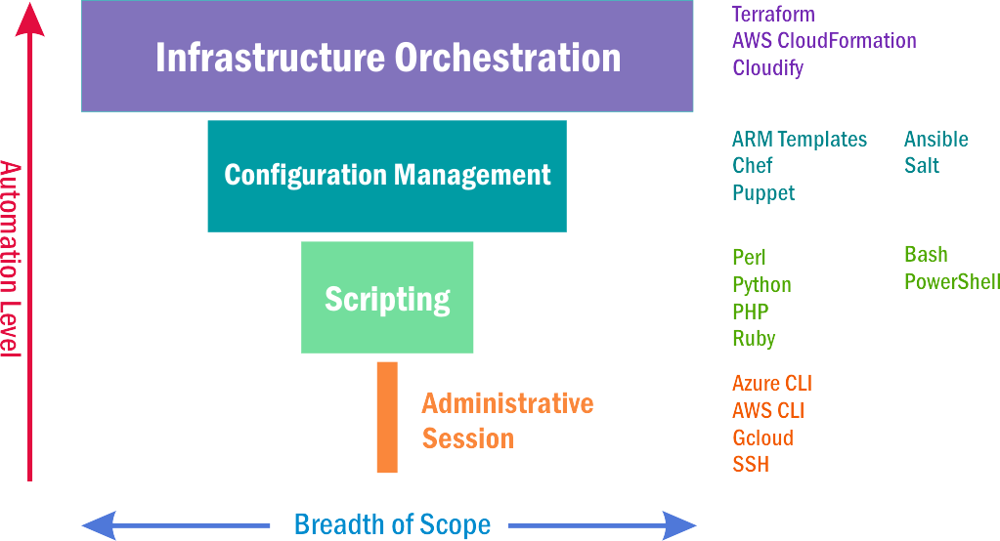

Solutions deployed to the cloud often include dozens of cloud resources
that work in concert to achieve a common goal. It's not difficult to
create a VM in Azure or an EC2 instance in AWS. But if that VM or EC2
instance is part of a larger solution that includes virtual networks,
databases, storage repositories, and other resources, creating the
solution and configuring all its resources to work together is a
multi-step process that can be challenging even for the most skilled
cloud administrators.

The challenge is exacerbated if a deployment has to be repeated many
times, which might be the case, for example, if you need to deploy
separate instances of a solution to different data centers for
resiliency. The fact that people are involved means human error is a
possibility. Add to that the fact that the solution might need to be
deployed in a repeatable manner to different cloud platforms -- for
example, to Azure *and* to AWS -- and might later need to be updated by
provisioning new resources or modifying existing ones, and suddenly
cloud administrators need something more sophisticated than cloud
portals and cloud CLIs. They need automation.

Automation takes place when a sequence of operations can be recorded,
repeated, and trusted to perform the same task the same way each time,
with a minimum of human intervention. For cloud administrators,
automation comes in three forms:

-   **Scripting** is the codification of the steps required to perform a
    task so that those steps can be made repeatable and free of error.
    Administrators, for example, can write Bash scripts that execute
    sequences of CLI commands reliably and repeatably.

-   **Configuration management** (CM) involves a greater effort to
    identify the resources that comprise a solution and define how those
    resources work together. In the broadest sense, a CM platform may
    specify the preferred or ideal state of a solution deployed to a
    cloud data center. Specifications might be stored in declarative
    form using languages such as XML or JavaScript Object Notation
    (JSON), or in imperative form using scripting languages. This is
    known as *Infrastructure-as-Code*, or IaC, and is as critical to
    deploying and managing groups of cloud resources effectively as
    cloud portals and CLIs are to deploying and managing individual
    resources.

-   **Infrastructure orchestration** automates the entire lifecycle of a
    solution and implements a strategy for delegating resources to each
    application and service comprising the solution based on its
    priority and its own resource-consumption profile. This is the
    platform level that Infrastructure-as-Code was originally engineered
    to address. It has evolved beyond mere configuration management to
    include activities such as versioning -- for example, allowing you
    to roll back to a previous version of a solution if an updated
    solution doesn't work as intended.

Figure 1 shows how these approaches to automation relate to one
another. Scripting is the most basic of the three and involves using
scripting languages such as Bash or programming languages such as Python
to automate repetitive tasks. Configuration management provides a layer
of abstraction over scripting and relies on tools such as Azure Resource
Manager (ARM) templates or platforms such as Chef and Puppet. With CM
and with IaC in particular, you can change the definition of a solution
and ask the system to update the corresponding cloud resources (or
provision them if they haven't been provisioned already). Orchestration
implies a higher level of coordination than either scripting or CM.
Here, the role each resource plays in a solution is specified in a
program, a manifest, a configuration file, or in some other form that is
legible to an administrator (a human being) and to an instruction
interpreter (a computer program). And the platform, be it Terraform, AWS
CloudFormation, or another prominent orchestration manager, takes
responsibility not only for configuration management, but for versioning
and other tasks as well.

Figure 1: Levels of automation.

This module examines the three levels of automation and introduces the
tools and techniques that administrators use to implement them. We begin
with a look at scripting tools such as Bash and PowerShell. Next, we
examine Infrastructure-as-Code and survey key IaC tools such as Azure
Resource Manager (ARM) templates and third-party products such as Chef
and Puppet. Then we discuss orchestration platforms that enable the
declaration and provisioning of cloud resources in a manner similar to
that of a computer program, effectively specifying a solution
architecture and the steps required to replicate it. Finally, we examine
one of these orchestration platforms up close: HashiCorp Terraform,
which coordinates resources distributed across multiple cloud service
providers at the highest level.
