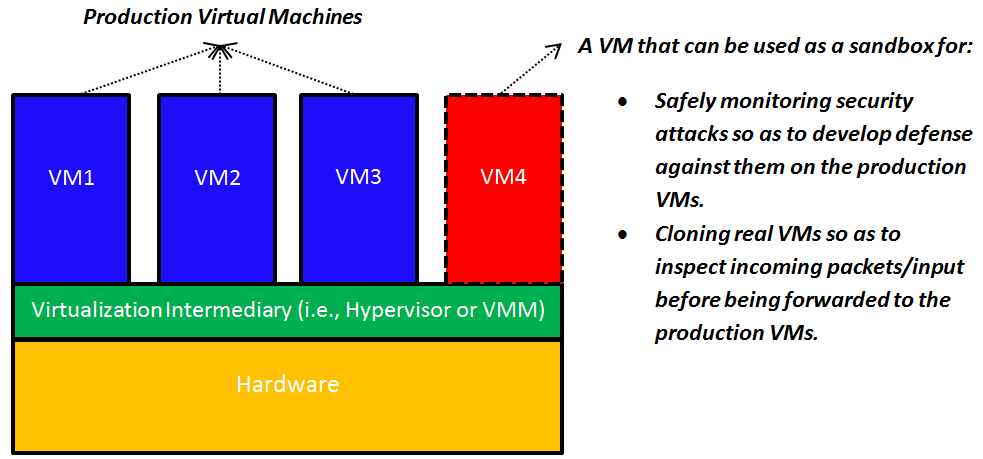
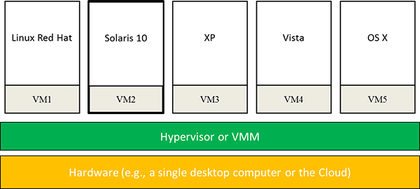

Virtualization is used by IT data centers to consolidate dedicated servers into more cost-effective hardware by using them as hosts for virtual machines. It is used by cloud service providers to isolate users sharing a single hardware layer by partitioning physical servers into virtual machines that can be leased to customers using a pay-as-you-go model. For example, when you provision an EC2 instance in AWS, Amazon provisions a virtual machine on a server in one of its data centers and begins metering time on it so you can be billed at the end of the month.

Let us examine the benefits of virtualization and understand why it is so important to cloud computing.

**Enabling the cloud computing system model:** A major use case for virtualization is cloud computing. As discussed earlier, cloud computing adopts a model whereby software, compute resources, and storage are offered as services. These services include full-blown applications such as Google Docs (Software-as-a-Service, or SaaS), platforms such as Azure App Service for running applications (Platform-as-a-Service, or PaaS), and virtual machines such as Amazon EC2 instances (Infrastructure-as-a-Service, or IaaS). Provisioning a VM entails creating virtual versions of every physical machine component, including CPU, memory, I/O, and storage, and is made possible by hypervisors, which rely on a combination of software and firmware. Examples of leading hypervisors include Xen, VMware, and Hyper-V. Amazon EC2 uses Xen to provision VMs for users. Azure uses a custom version of Hyper-V known as the Azure Hypervisor[1][^1].

**Elasticity:** A major benefit of the cloud is elasticity, or the ability to respond quickly to user demands by expanding and contracting resources dynamically. This applies to all cloud service models -- that is, SaaS, PaaS, and IaaS. As shown in Figure 4.4, virtualization enhances elasticity by allowing providers and users to dynamically increase or decrease the cloud resources devoted to a task. For instance, Google App Engine automatically expands servers during demand spikes and contracts them when demand diminishes. Amazon EC2 allows users to expand and contract virtual clusters manually or automatically, the latter by using Amazon Auto Scaling. Azure does the same with Virtual Machine Scale Sets. In short, virtualization is the key technology needed for elasticity in the cloud, and the fact that VMs can be quickly created and deleted is key to elasticity.

_Figure 4.4: Provisioning a VM on a physical system._

**Sandboxing:** A VM provides a sandbox that isolates one environment from others, ensuring a level of security that may not be applicable with conventional operating systems. First, a user running an application on a private machine might be reluctant to move her applications to the cloud unless guarantees are provided that her applications and activities cannot be accessed and monitored by other cloud users. Virtualization plays a vital role in creating a safe environment for every user by making it virtually impossible for one user to observe or alter the data or activity of another user. Second, if an application running in one VM fails, it can't affect applications running in other VMs, even if the VMs are running on the same host. This is known as **fault containment, and it** increases the robustness of the system. In a non-virtualized environment, by contrast, erratic behavior by one application can bring down the entire system.

As shown in Figure 4.5, sandboxing presents other interesting possibilities as well. A specific VM can be used as a sandbox whereby security attacks -- for example, denial-of-service attacks or malicious packets inserted into legitimate IP communication streams -- can be safely permitted and monitored. This allows researchers to inspect the effects of such attacks, gather information on their specific behaviors, and replay them if necessary to design defenses against future attacks without fear of compromising a physical server. Furthermore, suspicious network packets or input can be sent to a clone (a specific VM) before it is forwarded to the intended VM to preclude any potential ill effect. A VM can be thrown away after it has served its purpose, whereas reprovisioning a physical server is both expensive and time-consuming.

_Figure 4.5: Using virtual machines to isolate and analyze attacks._

**Improved system utilization and reduced costs and energy consumption:** It is well known that computer hardware resources are often underutilized. The concept of resource sharing has been successfully applied in multitasking operating systems to improve system utilization. Such resource sharing is based on the process abstraction -- that is, partitioning running applications into separate processes, each of which is logically isolated from other processes.

Virtualization takes this a step further by creating an illusion of a complete system whereby multiple VMs can be hosted simultaneously, each running its own system image (that is, operating system) and associated applications. For instance, in cloud services such as Amazon EC2, seven or more VMs can be provisioned on a single server, providing resource utilization of approximately 60% to 80%. In contrast, approximately 5% to 10% average resource utilization is typical in non-virtualized data centers2. By enabling multiple VMs to be hosted on a single physical server, virtualization allows consolidating physical servers into virtual servers that run on many fewer physical servers, a concept called *server consolidation*. Consolidation leads to improved system utilization and reduced costs. VMs can also be migrated from one server to another to balance loads on the servers within a data center.

Another benefit of server consolidation is reduced energy consumption in cloud data centers. Data centers hosting cloud applications consume tremendous amounts of energy, resulting in high operational costs and carbon dioxide emissions3. Server consolidation is an effective way to improve the energy efficiency of data centers by reducing the number of physical servers required to handle a given workload. (One physical server utilized 80% of the time consumes less energy than eight servers utilized 10% of the time.) Studies show that server consolidation can save up to 20% on data-center energy consumption4, 5.

Reducing energy consumption in cloud data centers is currently deemed as one of the key challenges in cloud computing. This has led to innovations such as locating data centers underwater in order to utilize green energy sources and reduce cooling costs[6][^6],[7][^7]. Up to 40% of a typical data center's electricity goes to the cooling system. (Thousands of running servers generate a lot of heat.) In 2012, Google reported that it saved \$1 billion on cooling costs simply by increasing the ambient temperature in its data centers from 68 to 80 degrees Fahrenheit[8][^8].

**Mixed-OS environment:** As shown in Figure 4.6, a single hardware platform hosting virtual machines can support multiple operating systems simultaneously. This provides tremendous flexibility for users by allowing them to install their own operating systems, libraries, and applications. For instance, a user can install one operating system for office productivity tools and another for application development and testing, all on a single desktop computer or in the cloud.

_Figure 4.6: Mixed-OS environment offered by system virtualization._

**Facilitating research:** Running an OS in a VM allows the hypervisor to instrument accesses to hardware resources and count specific event types such as page faults, or log detailed information regarding the nature and origin of each event and then record how each operation is satisfied. Moreover, execution traces and machine-state dumps at various points of interests can be taken at the VM level, an action that cannot be performed on native systems. Finally, system execution can be replayed on VMs from saved state for analyzing system behavior under various scenarios. Indeed, the complete state of a VM can be saved, cloned, encrypted, moved, and restored -- actions that are not so easy to perform with physical machines9. As such, it has become common for operating-system researchers to conduct most of their experiments using VMs rather than native hardware platforms10.

**Software testing:** Virtualization plays a role in software development by providing engineers with a means for testing software in an environment that is predictable, replicable, isolated, and platform-agnostic. With virtual machines, you can test software written for Linux on a Windows PC by hosting Linux in a VM (platform-agnostic). If the software crashes, it can't harm the underlying system (isolated), and the VM can quickly be deleted and started again (replicable). Upon restarting, the VM is in exactly the same state that it was in when last started, and it runs identically on every machine (predictable).

### References

1. _Microsoft (2019). *Design Principles Behind the Windows Azure Hypervisor.* <https://azure.microsoft.com/th-th/blog/design-principles-behind-the-windows-azure-hypervisor/>._

2. _Michelle Bailey (2009). \"The Economics of Virtualization: Moving Toward an Application-Based Cost Model.\" VMware Sponsored Whitepaper._

3. _A. Beloglazov and R. Buyya (2010). \"Energy Efficient Allocation of Virtual Machines in Cloud Data Centers.\" CCGrid._

4. _Silicon Valley Leadership Group (2008). \"Accenture, Data Centre Energy Forecast Report.\" Technical Report._

5. _Y. Jin, Y. Wen, and Q. Chen (2012). \"Energy Efficiency and Server Virtualization in Data Centers: An Empirical Investigation.\" Computer Communications Workshops (INFOCOM WKSHPS)._

6. _Microsoft (2018). *Under the sea, Microsoft tests a datacenter that's quick to deploy, could provide internet connectivity for years*. <https://news.microsoft.com/features/under-the-sea-microsoft-tests-a-datacenter-thats-quick-to-deploy-could-provide-internet-connectivity-for-years/>._

7. _Microsoft (2016). *Microsoft research project puts cloud in ocean for the first time*. <https://news.microsoft.com/features/microsoft-research-project-puts-cloud-in-ocean-for-the-first-time/>._

8. _AirPac (2012). *How Google Saved 1 Billion Dollars in Data Center Cooling Costs*. <http://www.airpacinc.com/blog/bid/83313/How-Google-Saved-1-Billion-Dollars-in-Data-Center-Cooling-Costs>._

9. _Chen and Noble (2001). \"When Virtual Is Better Than Real.\" IEEE Computer Society, Washington, DC, USA_

10. _JE Smith and Nair (2005). \"Virtual Machines: Versatile Platforms for Systems and Processes.\" Morgan Kaufmann._

[^1]: <https://azure.microsoft.com/blog/design-principles-behind-the-windows-azure-hypervisor/>  "Microsoft (2019). *Design Principles Behind the Windows Azure Hypervisor*."

[^6]: <https://news.microsoft.com/features/under-the-sea-microsoft-tests-a-datacenter-thats-quick-to-deploy-could-provide-internet-connectivity-for-years/>  "Microsoft (2018). *Under the sea, Microsoft tests a datacenter that's quick to deploy, could provide internet connectivity for years*."

[^7]: <https://news.microsoft.com/features/microsoft-research-project-puts-cloud-in-ocean-for-the-first-time/>  "Microsoft (2016). *Microsoft research project puts cloud in ocean for the first time*."

[^8]: <http://www.airpacinc.com/blog/bid/83313/How-Google-Saved-1-Billion-Dollars-in-Data-Center-Cooling-Costs>  "AirPac (2012). *How Google Saved 1 Billion Dollars in Data Center Cooling Costs*."
