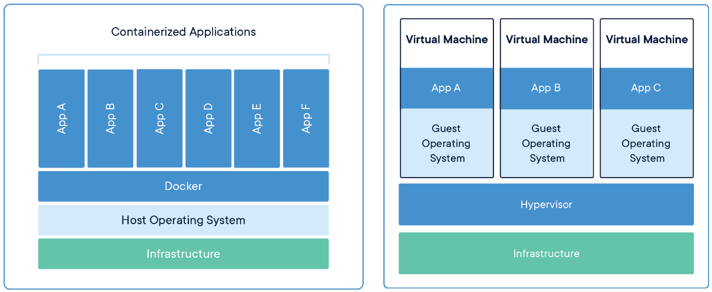
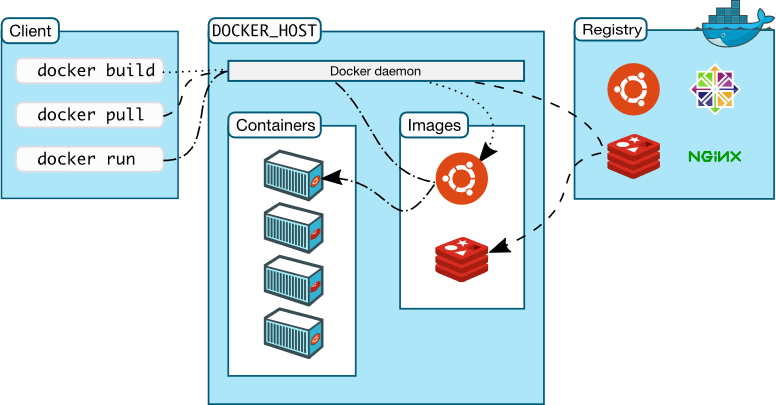

Virtualization using hypervisors such as Zen and Hyper-V partitions a physical server into several virtual servers and isolates the workloads running in each. But VMs are not without their drawbacks:

**Resource requirements**: VMs require a lot of RAM. If a Windows server hosts 10 Windows VMs, Windows is loaded into memory 11 times -- one copy for the server itself, and one copy for each of the virtual machines. VMs can't share a single in-memory instance of the operating system because the goal of virtualization is to create virtual servers that act identically to physical servers. Two VM can't share an operating system any more than two physical servers can. This is true regardless of whether the operating system is Windows, Linux, or something else (such as macOS).

**Transportability**: VM images tend to be rather large (often on the order of tens or hundreds of gigabytes), in part because they, too, store a complete copy of the operating system. This limits their transportability. A 1 MB image can be moved rather easily from one machine to another, even over a moderately slow connection. A 200 GB VM image, by contrast, is not easily moved using a typical network connection. It might be moved using physical media such as a USB stick or a hard disk, but this poses logistical challenges in cloud-computing scenarios where you don't have access to the physical servers in a data center.

**Startup time**: Booting a VM is like booting a physical computer. The virtualized hardware must be powered up and initialized, the operating system must be loaded and initialized, device drivers must be loaded and connected to the virtualized hardware, etc. Consequently, a VM, once created, can require a minute or more to start. While a startup time measured in minutes is inconsequential compared to the time required to procure, install, and configure a physical server, it is a significant limitation when creating VMs on the fly to meet increasing demand or continually creating and destroying VMs to serve changing workloads.

These are just some of the reason why *containers* are seeing widespread adoption, not only in cloud computing, but in on-premises data centers and individual computers as well. In this lesson, we discuss what containers are, how they work, and the benefits they offer. We also introduce Docker, the world's most popular containerization platform, and present some of the ways in which it has been integrated into popular cloud platforms.

## What is a Container?

Containers are revolutionizing IT and software development. They permit software and files to be bundled into self-contained packages known as *container images* that run on different computers (real or virtual) and do so in a consistent and predictable manner. The following description comes from the Docker web site:

*A container is a standard unit of software that packages up code and all its dependencies so the application runs quickly and reliably from one computing environment to another. A Docker container image is a lightweight, standalone, executable package of software that includes everything needed to run an application: code, runtime, system tools, system libraries and settings.*

Whereas hypervisors virtualize hardware, containers virtualize operating systems. Figure 4.7 illustrates the key differences between VMs and containers[^1]. On the left, a server hosts one copy of the operating system and one copy of the Docker runtime. It also hosts six applications in six containers, each of which utilizes the host's operating system. On the right, the same server host three VMs, each of which loads its own copy of the operating system. A given server can typically host several times more containers than it can VMs due to the containers' smaller resource requirements.

_Figure 4.7: Containers vs. virtual machines._

Containers are similar to virtual machines in that they provide a predictable and isolated environment in which software can run. But because containers are smaller than VMs, they require less RAM and are moved more easily from machine to machine. They also start more quickly -- often in just a second or two -- because they neither have to virtualize hardware nor load and initialize an operating system. Multiple containers running on a single machine share the same operating system kernel, even if the containers themselves are completely different -- that is, contain different software and are created from different container images.

Containers and virtual machines are not mutually exclusive. In fact, they are frequently used together. Windows users who run software packaged in Linux containers run Linux in a VM and host Docker and the containerized software in the VM. In the cloud, containers are hosted in VMs just like other cloud workloads.

Containers do not replace virtual machines, nor should they be regarded as a functional equivalent. Unlike virtual machines, containers do not allow multiple operating systems to run side by side on the same machine. For example, if the host machine runs Linux, all the containers on that machine must use Linux as well. (Windows users frequently run Linux containers on Windows, but it works because Docker runs a Linux VM on the Windows machine and hosts the containers in the VM.) In addition, because containers do not virtualize hardware, they are not appropriate for applications that perform system-level tasks involving direct hardware interaction. An easy way to think of it is that hypervisors virtualize an entire machine, including its hardware, while containers virtualize software and use the host's operating system as the operating-system platform.

## Docker

Docker is far and away the most popular container platform. It is free and open-source, and it runs on all major Linux distributions as well as on Windows Server 2016. In 2015, Docker donated the container-image specification and runtime code to the Open Container Initiative (OCI) to help standardize and grow the container ecosystem. In 2017, Docker donated an industry-standard container runtime to the Cloud Native Computing Foundation (CNCF). That runtime was created with an emphasis on simplicity, robustness, and portability.

Figure 4.8 shows how a system that runs applications in Docker containers is architected. It starts with the *Docker client*, which is a tool used to create, run, and manage containers and container images. (A container image constitutes a blueprint for a running container, just a VM image defines what's loaded into a running VM.) Various Docker clients exist, including Docker's own command-line interface, which runs on all popular operating systems, and Kitematic, which features a graphical user interface and runs on Windows and macOS. Docker acquired Kitematic in 2015 and made it part of the Docker Toolbox, which is available free of charge.

_Figure 4.8: Docker architecture._

Once a container image is built, it is uploaded to a repository in a container registry. The purpose of a container registry is to store container images and make them available either publicly or privately. Docker offers a cloud-based container registry of its own known as *Docker Hub*, which provides users with unlimited free public repositories and one free private repository. It also allows -- even encourages -- others to create registries of their own and offers the open-source *Docker Registry* to aid their efforts. This is one reason why major cloud service providers including Amazon, Microsoft, and Google have been able to offer Docker-compatible registries in their cloud platforms.

A container is started by using the Docker client to issue a command to the *Docker daemon* and specifying which image the container should be created from. (A daemon is a program that runs in the background on the host computer.) The daemon then creates a container and loads the image into it. Once running, a container can be started and stopped by issuing commands from the Docker client. The Docker client and Docker daemon don't have to reside on the same computer. In a typical scenario, the client runs on one machine while the daemon runs on a remote server, and the client uses the Secure Shell (SSH) protocol to transmit commands to the daemon.

## Container Services in Cloud Computing

While users are free to take an IaaS approach to containers by creating VMs and installing the Docker runtime in them, cloud service providers, in a nod to the importance of containers, offer PaaS services to support running containerized applications in the cloud. Azure offers Azure Container Instances, which provide a robust, scalable, and easy-to-use environment for hosting containerized applications, as well as the Azure Container Registry, which allows container images to be hosted in Azure rather than in Docker Hub or other external registries and loaded quickly into Azure Container Instances. Amazon offers the AWS Elastic Container Registry (ECR) and AWS Elastic Container Service (ECS), while Google offers Container Registry and Containers on Compute Engine.

Figure 4.9 illustrates how Amazon's ECR and ECS work together to provide a cloud-based Docker stack for hosting containers and container images[^2]. Container images are built and uploaded to ECR, which is a Docker-compatible container registry similar to Docker Hub. (Container images run in AWS don't have to be stored in ECR, but storing them there offers several advantages, including fine-grained access control using AWS Identity, automatic encryption, support for versioning container images, and faster loading, particularly if the container images are stored and run in the same data center.) From there, images are loaded into containers hosted in ECS or other cloud services.

_Figure 4.9: Containers in AWS._

Azure Container Registry and Azure Container Instances work in much the same way but use Azure Active Directory rather than AWS Identity to control access to container images. One difference between the container support in AWS and Azure is that AWS uses a combination of open-source software and proprietary technology, whereas Azure's container stack is 100% built from open-source. Consequently, any tool that works with Docker works with Azure, too. In addition, the Azure Cloud Shell and Azure CLI feature commands for building and managing Docker container images. These commands don't totally obviate the need for Docker clients, but they do cover the most common use cases and are optimized for Azure.

More recently, cloud service providers have begun adding container support to selected PaaS services. Azure, for example, offers Azure Web Apps for Containers, which is essentially Azure App Service with the added ability to load software from a container image. Amazon has taken similar steps to integrate Docker containers with Elastic Beanstalk.

## Container Orchestration

Docker provides the infrastructure for building and running containers, but a higher level of supervision is needed to orchestrate the actions of containers and scale containerized workloads the same way VMs are scaled. While an assortment of container-orchestration tools exists, the industry has largely settled on Kubernetes, which grew out of an open-source project by Google, as the orchestrator of choice. Today, major cloud service providers offer managed implementations of Kubernetes that make it easy to run containers on their platforms and manage them with Kubernetes. The "EKS" in Figure 4.9 stands for Elastic Kubernetes Service. Azure offers a complementary service called Azure Kubernetes Service (AKS), while the Google Cloud Platform offers the Kubernetes Engine.

### References

1. _Docker (2019). *What is a Container?* <https://www.docker.com/resources/what-container>._

_Amazon (2019). *How Amazon ECS Works*. <https://aws.amazon.com/ecs/>._

[^1]: <https://www.docker.com/resources/what-container>  "Docker (2019). *What is a Container?*"

[^2]: <https://aws.amazon.com/ecs/>  "Amazon (2019). *How Amazon ECS Works*."
