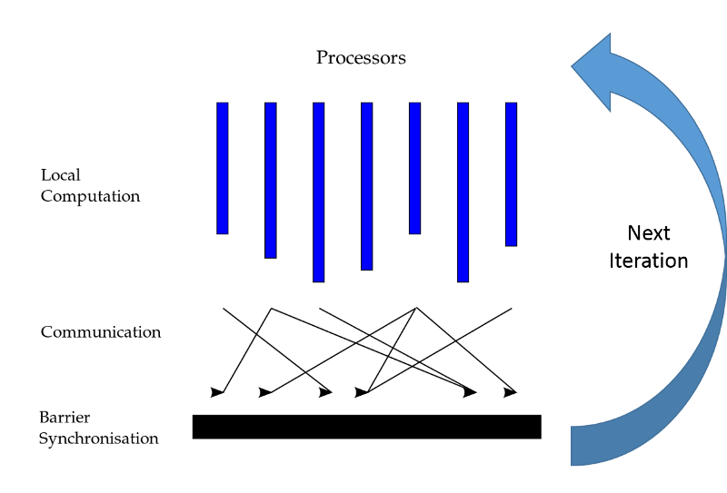
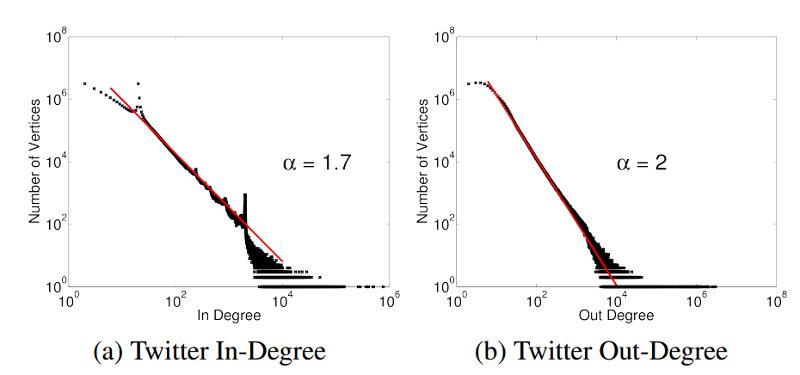

Machine-learning and data-mining (MLDM) problems are growing exponentially in scale today. Interest in analytics engines that can execute MLDM algorithms efficiently on distributed systems, such as clouds, is increasing correspondingly. Designing, implementing, and testing distributed MLDM applications can be challenging because they usually require experts who know how to address synchronization, deadlocks, communication, scheduling, distributed-state management, and fault-tolerance concerns effectively. Many recent advances in MLDM algorithmic designs have focused on modeling such algorithms as graphs. 

## Express data and computations with a graph abstraction

Let's take a look at a few examples of data modeled as graphs and how computation can be expressed in this model. Mathematically, a graph is modeled as a set: $G = \lbrace V, E \rbrace$, where $V$ is a set of vertices $v_{i}$ and $E$ is a set of edges $e_{i}$. Furthermore, every edge $e_{i}$ in $G$ represents an edge between exactly two vertices: $\lbrace v_{i}, v_{j} \rbrace \in V$. There are many types of graphs; they can be undirected, which means $e = \lbrace v_{i}, v_{j} \rbrace = \lbrace v_{j}, v_{i} \rbrace \forall e \in E$ (i.e., all edges are equivalent and bidirectional), or directed, where the edges are distinct and not equal. Graphs can also be weighted if an additional parameter, known as the weight ($w_{i}$), exists $\forall e \in E$. Furthermore, vertices may also be weighted. As we will see, this comes in handy in different applications. Typical graph computations include the calculation of the shortest path between two points, partitioning the graph into subgraphs based on some optimization metric (minimum number of edges cut, or maximum flow between the graphs), the calculation of maximum degree (the vertex with the most number of edges), and so on. 

_Figure 1: A webgraph where the vertices represent webpages and edges represent the links between pages. As a result of running PageRank on this graph, each vertex has an associated value, known as the rank, which is a representation of the importance of a page. The rank is calculated from the number of incoming and outgoing links to that page._

The figure illustrates an example of the webgraph. The vertices denote webpages, and the edges denote links between webpages. The canonical example of computation performed on a webgraph is PageRank, which calculates the importance of a webpage, based on the pages that are linked to it. Similarly, a social network graph illustrated in Figure 2 shows people represented as vertices and edges representing a relationship such as "is a friend" or "follows". Interesting computations here include calculation of the most popular people (calculating the vertices with the most number of edges), or finding strongly knit communities of people who all know each other (triangle counting). 

_Figure 2: Visualization of a Facebook social graph for a limited number of users._ ([Source](https://griffsgraphs.wordpress.com/2012/07/02/a-facebook-network/))

As you can imagine, some of the problems mentioned above are growing in scale and complexity. One of the largest publicly available [webgraphs](http://webdatacommons.org/hyperlinkgraph/) consists of 1.7 billion webpages and 64 billion hyperlinks. It is widely believed to be much smaller than the data handled by production systems of web services companies such as Google and Microsoft. It would be impossible to encapsulate all this data into the memory of a single computer, but we still need efficient systems that can handle the processing of such large-scale data.

_Figure 3: The Bulk-Synchronous Parallel (BSP) parallel paradigm_

An example of a system designed to process large graphs in a distributed manner is Google's **Pregel**. Pregel performs computations on Graphs in an iterative, lockstep manner (also known as the **Bulk-Synchronous Parallel** or BSP approach). A Pregel program runs in a series of globally synchronized iterations, which can result in some computation performed in the context of each vertex in a graph (Figure 3). The vertices can then exchange messages with their neighbors; typically this is done to update state or other variables. Pregel then runs the next iteration once all the vertices have completed processing the current execution. Messages exchanged between machines in iteration $i$ are delivered in iteration $i + 1$. The program will run subsequent iterations until either a convergence condition is met or it completes $N$ iterations, where $N$ is a user-defined number of maximum iterations to be executed. 

Although Pregel offers a promising option as a distributed, graph-parallel analytics engine, it suffers from a major deficiency: Pregel runs computations synchronously, which can impact performance as the runtime of each iteration is always dictated by the last thread to complete execution. One can also imagine the implications if a graph is unbalanced in terms of the degree of vertices. This is the case with a large number of graphs of interest to big data analytics. Social graphs, for example, show a power-law distribution, wherein a small number of vertices have a large number of edges. An example of this phenomenon is the Twitter followers graph (Figure 4), where celebrities and influential people have millions of followers, while most other users have a much smaller number of followers. 

_Figure 4: Power-law distribution in the Twitter follower graph. Notice how a small number of vertices (<100) have a very high in-degree and out-degree (>10,000)_[1][^1]

In this module, we present GraphLab, a variant graph-parallel distributed analytics engine that can efficiently and correctly execute both synchronous and asynchronous MLDM problems and others. GraphLab is also well suited to graphs that show power-law distribution.

In this module, we will:

- Discuss the data structure that should be used in storing input graphs for GraphLab to consume and process. 
- Show how input graphs flow through the GraphLab engine, from getting consumed to generating results.
- Identify the architectural model of GraphLab.
- Present the programming model employed by GraphLab and the consistency mechanisms supported for protecting shared data from read-write/write-write conflicts. 
- Discuss the asynchronous computation model that underlies GraphLab. 
- Examine GraphLab's fault-tolerance techniques.

## Learning objectives

In this module, you will:
- Describe the unique features in GraphLab and the application types that it targets
- Recall the features of a graph-parallel distributed programming framework
- Recall the three main parts in the GraphLab engine
- Describe the steps that are involved in the GraphLab execution engine
- Discuss the architectural model of GraphLab
- Recall the scheduling strategy of GraphLab
- Describe the programming model of GraphLab
- List and explain the consistency levels in GraphLab
- Describe the in-memory data placement strategy in GraphLab and its performance implications for certain types of graphs
- Discuss the computational model of GraphLab
- Discuss the fault-tolerance mechanisms in GraphLab
- Identify the steps that are involved in the execution of a GraphLab program
- Compare and contrast MapReduce, Spark, and GraphLab in terms of their programming, computation, parallelism, architectural, and scheduling models
- Identify a suitable analytics engine given an application's characteristics

## Prerequisites

- Understand what cloud computing is, including cloud service models and common cloud providers
- Know the technologies that enable cloud computing
- Understand how cloud service providers pay for and bill for the cloud
- Know what datacenters are and why they exist
- Know how datacenters are set up, powered, and provisioned
- Understand how cloud resources are provisioned and metered
- Be familiar with the concept of virtualization
- Know the different types of virtualization
- Understand CPU virtualization
- Understand memory virtualization
- Understand I/O virtualization
- Know about the different types of data and how they're stored
- Be familiar with distributed file systems and how they work
- Be familiar with NoSQL databases and object storage, and how they work
- Know what distributed programming is and why it's useful for the cloud
- Understand MapReduce and how it enables big data computing
- Understand Spark and how it differs from MapReduce
 

***
### References

1. _J. Gonzalez, Y. Low, H. Gu, D. Bickson, and C. Guestrin (October, 2012). [PowerGraph: Distributed Graph-Parallel Computation on Natural Graphs](https://www.usenix.org/node/170825) In Proceedings of the 10th USENIX Conference on Operating Systems Design and Implementation_

[^1]: <https://www.usenix.org/node/170825> "J. Gonzalez, Y. Low, H. Gu, D. Bickson, and C. Guestrin (October, 2012). *PowerGraph: Distributed Graph-Parallel Computation on Natural Graphs* In Proceedings of the 10th USENIX Conference on Operating Systems Design and Implementation"
