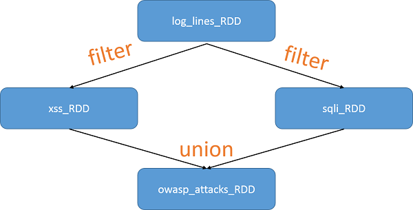
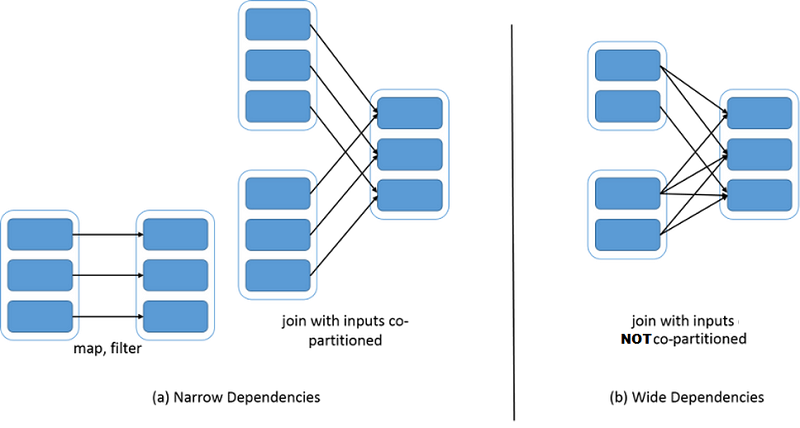

On large, distributed clusters running long jobs on commodity hardware, it is very important to have a fault-tolerant framework in case of any errors. Unlike Hadoop, which emphasizes quick fault recovery by replicating data stored on HDFS and straggler jobs, Spark relies on the abstract concept of a lineage to recover from errors. A lineage is a directed acyclic graph that defines the operations required to create an RDD.<sup>[1][^1]</sup>

Let's review a program from the previous unit that shows how to describe an RDD transformation:

``` python
log_lines_RDD = sc.textFile("server.logs")
xss_RDD = log_lines_RDD.filter(lambda x: "%3C%73%63%72%69%70%74%3E" in x)
sqli_RDD = log_lines_RDD.filter(lambda x: "bobby_tables" in x)
owasp_attacks_RDD = xss_RDD.union(sqli_RDD)
```

As RDDs are derived from each other using transformations, Spark keeps track of the dependencies using a lineage graph. This allows the RDDs to be computed lazily (as defined earlier) and provides fault recovery information to the framework. The lineage for the code snippet is shown in the following figure:



_Figure 4: RDD lineage graph_

Since RDDs are immutable, these graphs are extremely easy to define. Please note that at no point in the graph above has the RDD been materialized and computation been actually carried out. That occurs at the next line of code, which is the first action in the program: 

``` python
print "Number of attacks:" + owasp_lines_RDD.count()
```

Since none of the RDDs were persisted, only `owasp_lines_RDD` will be stored in memory at this point. By achieving fault tolerance using in-memory data structures, Spark focuses on reducing the overhead of fault tolerance due to duplicated writes on HDFS. By storing RDDs in memory and recomputing lost partitions, Spark can avoid the high cost of Hadoop fault-tolerance techniques, including replication and the consequent disk I/O. On the other hand, Hadoop has much faster fault recovery by simply switching to one of the other replicas. 

## Dependencies

One of the interesting challenges faced by the creators of Spark was to have a suitable way to represent dependencies between RDDs. They classified dependencies into two types: 

- **Narrow dependencies**: Each partition of the parent RDD is used by at most one partition of the child RDD.
- **Wide dependencies**: Multiple partitions of the child RDD use each one partition of the parent RDD.

Consider the `map(func)` transformation, which returns a new distributed dataset formed by passing each element of the source through the function `func`. Here the child has a narrow dependency on the parent, since each parent RDD partition returns a single child partition. Basically, when `map(func)` is called on an RDD, the transformation returns a `MappedRDD` object. This has the same partitions and `preferredLocations` as the original (parent) RDD, but additionally applies `func` to the parent's record in the iterator method. 

On the other hand, consider a `join()` transformation, which when called on RDDs of type `(K, V)` and `(K, W)`, returns an RDD of `(K, (V, W))` pairs with all pairs of elements for each key. If the parent RDDs are partitioned with the same range/hash partitioner, then this can be represented as two narrow dependencies. If neither RDD has a defined partition, then this is a wide dependency. Finally, if one parent has a partitioner and one does not, then it is categorized as a mixed dependency. In all three cases, the output RDD has a partitioner. This may be inherited from the parents, or it may be a default (hash) partitioner. 

Both of these dependencies are shown in the following figure:



_Figure 5: Narrow and wide dependencies in Spark_

## Checkpointing

In case a lineage chain grows extremely long or has very wide dependencies, it may be infeasible to re-run it on a failure. A solution is to checkpoint such RDDs. Unlike distributed shared memory (DSM) systems, however, the entire application state does not need to be checkpointed. Additionally, the immutable nature of RDDs makes it easy to do this as a background process without significantly impacting the performance of the running application or requiring a distributed snapshot scheme to deal with consistency. 

Checkpointing is done for tracking metadata (job configuration, job state) and saving some of the generated RDDs to reliable storage (HDFS). 

Using the techniques of lineage and checkpointing, Spark achieves fault tolerance and recovery. 
<br>

***
### References

1. _Zaharia, Matei and Chowdhury, Mosharaf and Das, Tathagata and Dave, Ankur and Ma, Justin and McCauley, Murphy and Franklin, Michael J and Shenker, Scott and Stoica, Ion (2012). [Resilient distributed datasets: A fault-tolerant abstraction for in-memory cluster computing](https://www.usenix.org/system/files/conference/nsdi12/nsdi12-final138.pdf) Proceedings of the 9th USENIX conference on Networked Systems Design and Implementation_

***

[^1]: <https://www.usenix.org/system/files/conference/nsdi12/nsdi12-final138.pdf> "Zaharia, Matei and Chowdhury, Mosharaf and Das, Tathagata and Dave, Ankur and Ma, Justin and McCauley, Murphy and Franklin, Michael J and Shenker, Scott and Stoica, Ion (2012). *Resilient distributed datasets: A fault-tolerant abstraction for in-memory cluster computing* Proceedings of the 9th USENIX conference on Networked Systems Design and Implementation"
