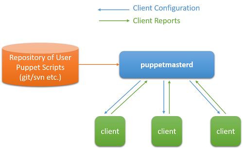

Cloud orchestration is the process by which all of the provisioning, middleware, and other complex systems in a cloud can be automatically arranged and coordinated. Today, cloud orchestration supports the specification and management of resources, including (but not limited to): 
- Compute servers (in the form of virtual machines) 
- Autoscaling 
- Load balancers 
- Databases 
- Block storage 
- DNS and virtual network (VLANs) 
- Software configuration and setup (typically in the form of bootstrapping scripts) 

## Benefits of orchestration

Cloud orchestration is a method to fully realize the dynamic potential of cloud infrastructure, by allowing users to specify and configure a complete application encompassing multiple resource types. One of the most important aspects of the cloud is rapid service delivery, which is made possible by cloud orchestration. It also saves cost by eliminating manual intervention and management of IT services. Benefits of cloud orchestration can be summarized as follows: 
- Integration, automation, and optimization of service deployment across heterogeneous environments. 
- Self-service portals for selection of cloud services, including storage and networking, from a predefined menu of offerings. 
- Reduction of the need for manual intervention, which lowers the ratio of administrators to physical and virtual servers. 
- Automation of high-scale provisioning and deprovisioning of resources, with policy-based tools to manage virtual machine sprawl by reclaiming resources automatically. 
- Ability to integrate workflows and approval chains across technology silos to improve collaboration and reduce delays. 
- Real-time monitoring of physical and virtual cloud resources, as well as usage and accounting chargeback capabilities to track and optimize system usage. 
- Making adoption of best practices easy by prepackaging automation templates and workflows for the most common resource types.

## Orchestrator tools

A variety of tools provide orchestration. Puppet and Chef are popular examples. 

### Puppet

Puppet is a tool that can be used to issue service commands to multiple client machines from a master machine. This allows developers and systems administrators to manage client machines from a single master machine, providing commands to individual clients based on code that describes the configuration actions that will be performed on each machine: 

_Figure 5: Puppet tool_

Puppet is typically (but not always) used in a client/server formation, with all of the clients talking to one or more central servers. Each client contacts the server periodically (every half hour, by default), downloads the latest configuration, and makes sure the server is in sync with that configuration. Once done, the client can send a report back to the server indicating if anything needs to change. Puppet's functionality is built as a stack of separate layers, each responsible for a fixed aspect of the system, with tight controls on how information passes between layers.

### Chef

Chef uses the same concepts as Puppet, but differs in deployment. Chef operates using user-specified recipes that describe the state of the resources in the system, such as the packages (and versions) to install, startup daemons or services to execute, or data to be downloaded/created. This ensures an identical operating environment with the same resources and configurations across all systems. Using Chef, it is possible to automate the creation of a complex distributed system, stitching together various components and workflows. 

