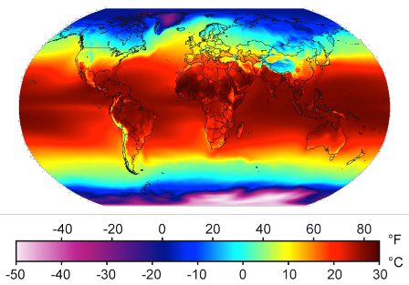
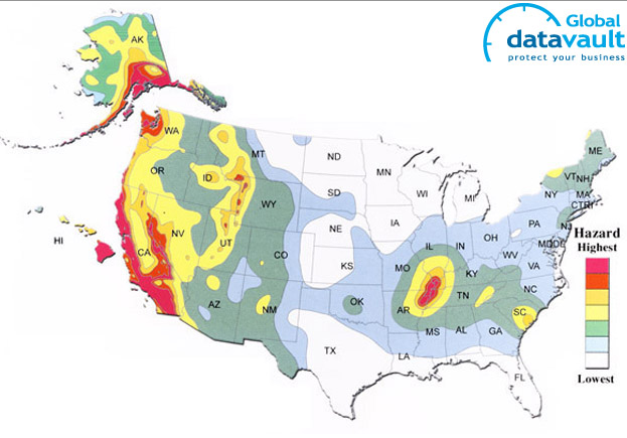
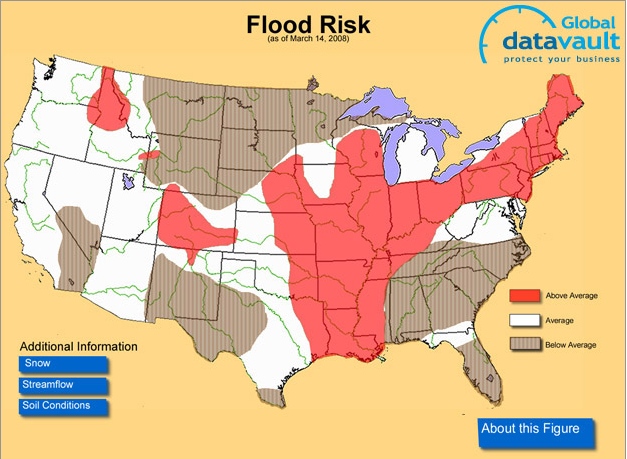
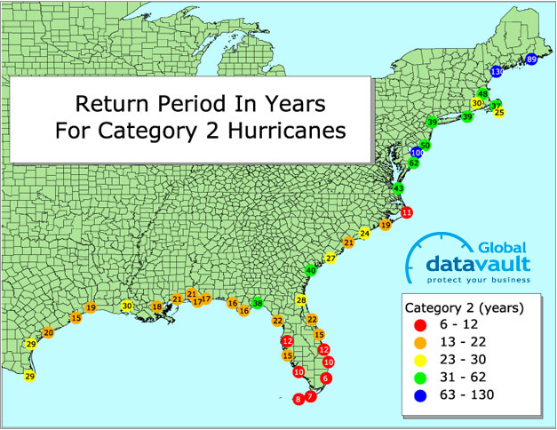
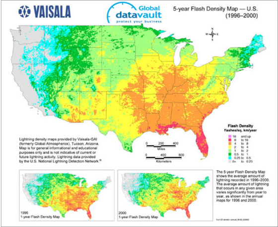
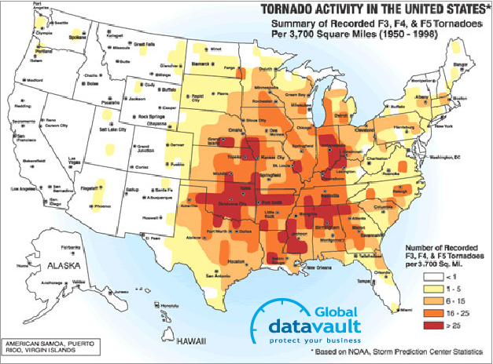
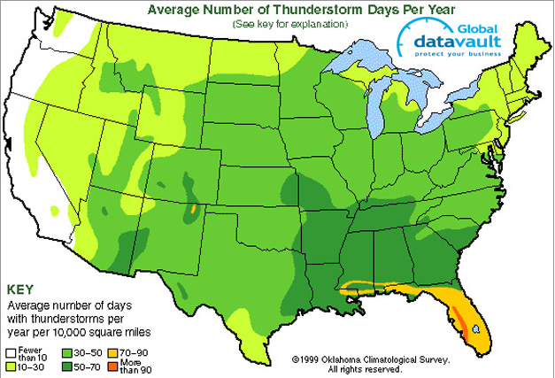
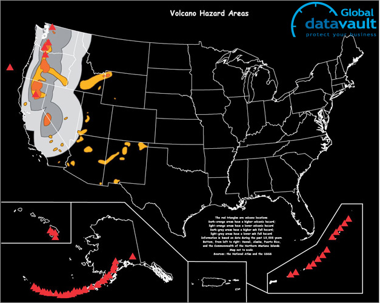
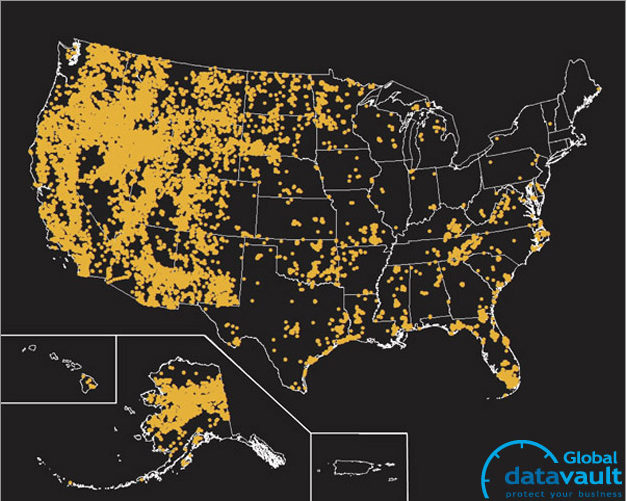
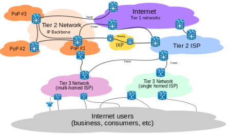

Now we'll review the geographic location requirements for datacenters.

## Geographic location requirements

For a large multinational corporation, there is a good chance that it already has a number of servers at each of its branch offices and would likely build traditional datacenters in the countries in which it is already established. The reason for having equipment closer to the users is for better application responsiveness, which (hopefully) yields higher productivity.

A company whose product is web based would need to build multiple datacenters around the world to provide better service to customers in a wide variety of geographic locations. A common example of this is web search—Google, Microsoft, and Yahoo all have large datacenters at many sites scattered around the globe. This variety in location provides faster search results to the user, which is a competitive advantage (as long as accuracy is maintained).

A third category of companies that require large datacenters is web hosting providers. They offer server(s) to host the websites for companies of various sizes. A small company might need to have its site hosted in only one location to serve local customers. A large company might have several different regional sites but would prefer to deal with one hosting company rather than a different one in each region.

An organization in any of the above categories would have similar goals when it comes to picking the location of a new datacenter. In order to satisfy the facility's needs, it is necessary to locate a datacenter where there are adequate electrical power suppliers. For the "green" conscious, one might look for an electricity supplier that uses hydroelectric, solar, wind, geothermal, or other renewable energy sources. Regardless of the source of the power, it is desirable to work with a utility company that is willing to negotiate bulk-purchasing agreements, which lock in a specific discounted price per kilowatt hour for several years.

In addition to power, if you want to take advantage of evaporative cooling techniques as we mentioned earlier, your datacenter should be located near an adequate water supply. There are also instances in which you can locate near a lake/reservoir that is naturally cold, use that water as your cold supply, and return it after tempering (lower the temperature by mixing again with cold water from the same source).

For a smaller-scale datacenter, another factor to consider is the cost of real estate and taxes. For a large deployment, however, the cost of the IT and facilities equipment is much higher than the cost of land, and monthly energy costs far outweigh any taxes.

There are also basic logistics that are desirable to have available to support the datacenter and its life cycle. A supply chain is needed to procure the goods and services—not just servers but all equipment and building materials. There also should be adequate ports/rails/highways to deliver standard shipping containers (40' × 8' × 8'6"; or 12.19 m × 2.43 m x 2.59 m) to your site. Small and medium-sized datacenters will typically buy servers from companies such as IBM, Dell, or HP. Big companies have custom servers, but none of these are manufactured on site and so have to be purchased and delivered. Containerized/modular solutions do more of the manufacturing off site so that installation is faster at the datacenter. Recycling of raw materials should occur at the end of the life span of the hardware or for failed components, such as hard drives, so recycling availability should also be considered.

## Weather

We already discussed economization, or the mixing of colder outside air with the hot air expelled from the IT equipment. In Figure 10, you will notice different colored bands. In regions of yellow or orange, you could use outside cooling during the colder seasons. In regions of green and blue, you could likely use outside cooling year round. Regions marked as red could still use outside cooling, but for only a few months of the year. For example, because of its cold average climate and renewable energy sources, Iceland has a growing datacenter industry.

_Figure 10: Global average temperature map_ ([Wikipedia, 2014](http://commons.wikimedia.org/wiki/file:annual_average_temperature_map.jpg))

As you will see in the section about power usage effectiveness (PUE) later in this module, the energy utilization will be higher during hot months and lower during cold months. This is due to the efficiency gains from "free cooling" (using either air economizers or naturally cold water).

The average amount of annual rainfall might be a factor if you are considering using rainwater storage/filtration as a water source for cooling your datacenter. However, the number of sunny days per year in a particular region might convince you to try solar.

Part of a risk assessment for a particular location includes the frequency of natural disasters in the region, such as floods, hurricanes or cyclones, tornadoes, tsunamis, and earthquakes. The following figures show that different regions have varying levels of susceptibility to a potentially damaging event.

_Figure 11: Earthquake risk map_

_Figure 12: Flood risk map_

_Figure 13: Hurricane risk map_

_Figure 14: Lightning risk map_

_Figure 15: Tornado risk map_

_Figure 16: Thunderstorm risk map_

_Figure 17: Volcano risk map_

_Figure 18: Wildfire risk map_

Natural disaster threat maps for regions in the United States are available online in the [Global datavault](http://www.globaldatavault.com/natural-disaster-threat-maps.htm). Click a map figure to see an enlarged view.

As a cloud user or cloud provider, you can benefit from having two (or more) geographically distinct datacenters for your services to mitigate risks of natural disaster—excluding large asteroid impacts, of course.

## Connectivity

As broadband adoption among consumers continues to grow, the effectiveness of cloud computing will increase. You can find trending graphs and current broadband adoption at [Akamai](http://www.akamai.com/html/technology/dataviz5.html).

The internet relies on fiber optics to send and receive data over long distances. Figure 19 shows the relationship between multiple tiers of the internet. Tier 1 providers own the actual fiber cables, the network equipment, and the buildings they are housed in. Tier 2 providers own large networks as well and peer with (have connections to) other tier 2 providers but also have to lease some connections from tier 1 providers in order to reach the whole internet. Tier 3 providers are only resellers, which provide connections to end users. A single corporate entity, such as Verizon in the United States, may provide services at all tiers.

_Figure 19: Internet connectivity_ ([Wikipedia, 2014](http://en.wikipedia.org/wiki/file:internet_connectivity_distribution_%26_core.svg))

In order to support a large amount of users, a cloud provider should choose a datacenter location that is in a city/region that has a tier 2 or tier 1 provider. This will also decrease the latency to global users due to fewer hops (each router is a hop) between the client and the server. A datacenter's requirement for uplink to the internet ranges from a few megabits per second to several hundred gigabits per second, and that much bandwidth simply is not yet available everywhere.

