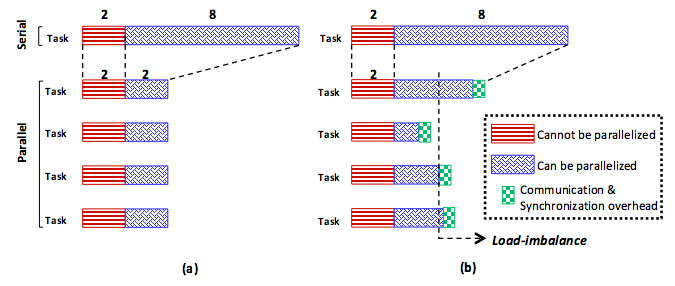

Designing and implementing a distributed program involves, as we have seen, choosing a programming model and addressing issues of synchrony, parallelism, and architecture. Beyond these matters, when developing cloud programs, a designer must also pay careful attention to several other challenges critical to cloud environments. We next discuss challenges associated with scalability, communication, heterogeneity, synchronization, fault tolerance, and scheduling.

## Scalability

A distributed program is considered to be scalable if it remains effective when the quantities of users, data, and resources increase significantly. To get a sense of the problem scope, consider the many popular applications and platforms currently offered to millions of users as internet-based services. Along the data dimension, in this time of big data and the "era of tera" (Intel's phrase),[1][^1] distributed programs typically cope with web-scale data on the order of hundreds or thousands of gigabytes, terabytes, or petabytes. Google, for example, processes 20 PB of data per day.[2][^2] Globally, in 2010, data sources generated approximately 1.2 ZB (1.2 million petabytes), and the 2020 predictions expect an increase of nearly 44 times that amount.[3][^3] Internet services, such as e-commerce and social networks, handle data volumes generated by millions of users daily.[2][^2] Regarding resources, cloud datacenters already host tens to hundreds of thousands of machines (e.g., according to estimates, Amazon EC2 hosts almost half a million machines).[5][^5] And projections anticipate yet another multifold scaling of machine counts. 

The reality of execution on _n_ nodes never meets the ideal of _n_-fold performance escalation. Several reasons intervene: 

- As shown in Figure 13, some program parts can never be parallelized (e.g., initialization).
- Load imbalance among tasks is highly likely, especially in distributed systems, such as clouds, in which heterogeneity is a major factor. As depicted in Figure 13(b), load imbalance usually delays programs so that a program becomes bound to its slowest task. Specifically, even if all tasks in a program finish, the program cannot commit before the last task finishes. 
- Other serious overheads, such as communication and synchronization overheads, can significantly impede scalability.

_Figure 13: Parallel speedup: (a) ideal case and (b) real case_

These issues are important in comparing the performance of distributed and sequential programs. A widely used expression that describes speedups and, additionally, accounts for various overheads, is Amdahl's law. To illustrate the calculation, we assume that a sequential version of a program, $T$, takes $T_{s}$ time units, while a parallel/distributed version takes $T_{p}$ time units using a cluster of $n$ nodes. In addition, we suppose that fraction $f$ of the program is not parallelizable, leaving the $(1 – f)$ portion parallelizable. According to Amdahl's law, the speedup of the parallel/distributed execution of $P$ versus the sequential one can be defined as follows: 

$$ Speedup_{p} = \frac{T_{s}}{T_{p}} = \frac{T_{s}}{T_{s} \times {f + T_{s}} \times \frac{1 - f}{n}} = \frac{1}{f + \frac{1 - f}{n}} $$

Although the formula is apparently simple, it exhibits a crucial implication: if we assume a cluster with an unlimited number of machines and a constant $s$, we can express the maximum achievable speedup by simply computing the speedup of $P$ with an infinite number of processors as follows: 

$$ \lim_{n\to\infty} Speedup_{p} = \lim_{n\to\infty} \frac{1}{f + \frac{1 - f}{n}} = \frac{1}{f} $$

To understand the essence of this analysis, let us assume a serial fraction $f$ of only 2%. Applying the formula with, say, an unlimited number of machines will result in a maximum speedup of only 50. Reducing $f$ to 0.5% would result in a maximum speedup of 200. Consequently, we observe that attaining scalability in distributed systems is extremely challenging because it requires $f$ to be almost 0, and this analysis ignores the effects of load imbalance, synchronization, and communication overheads. In practice, synchronization overheads (e.g., performing barrier synchronization and acquiring locks) increase with an increasing number of machines, often superlinearly.[4][^4] Communication overheads also grow dramatically in large-scale distributed systems because all machines cannot share short physical connections. Load imbalance becomes a big factor in heterogeneous environments, as we discuss shortly. Although this is truly challenging, we point out that with web-scale input data, the overheads of synchronization and communication can be greatly reduced if they contribute much less toward overall execution time than computation does. Fortunately, with many big-data applications, this latter situation is the case. 
 
***
### References

1. _S. Chen and S. W. Schlosser (2008). [MapReduce Meets Wider Varieties of Applications](https://pdfs.semanticscholar.org/b702/96efb830d11ea047484998a8b52c20cf836b.pdf) IRP-TR-08-05, Intel Research_
2. _J. Dean and S. Ghemawat (Dec. 2004). [MapReduce: Simplified Data Processing on Large Clusters](https://static.googleusercontent.com/media/research.google.com/en//archive/mapreduce-osdi04.pdf) OSDI_
3. _M. Zaharia, A. Konwinski, A. Joseph, R. Katz, and I. Stoica (2008). [Improving MapReduce Performance in Heterogeneous Environments](https://dl.acm.org/doi/10.5555/1855741.1855744) OSDI_
4. _Y. Solihin (2009). [Fundamentals of Parallel Computer Architecture](https://sites.google.com/site/solihinbooks/fundamentals-of-parallel-computer-architecture/slides) Solihin Books_
5. _[Amazon Elastic Compute Cloud](http://aws.amazon.com/ec2/)_

***

[^1]: <https://pdfs.semanticscholar.org/b702/96efb830d11ea047484998a8b52c20cf836b.pdf> "S. Chen and S. W. Schlosser (2008). *MapReduce Meets Wider Varieties of Applications* IRP-TR-08-05, Intel Research"
[^2]: <https://static.googleusercontent.com/media/research.google.com/en//archive/mapreduce-osdi04.pdf> "J. Dean and S. Ghemawat (Dec. 2004). *MapReduce: Simplified Data Processing on Large Clusters* OSDI"
[^3]: <https://dl.acm.org/doi/10.5555/1855741.1855744> "M. Zaharia, A. Konwinski, A. Joseph, R. Katz, and I. Stoica (2008). *Improving MapReduce Performance in Heterogeneous Environments* OSDI"
[^4]: <https://sites.google.com/site/solihinbooks/fundamentals-of-parallel-computer-architecture/slides> "Y. Solihin (2009). *Fundamentals of Parallel Computer Architecture* Solihin Books"
[^5]: <http://aws.amazon.com/ec2/> "Amazon Elastic Compute Cloud"
