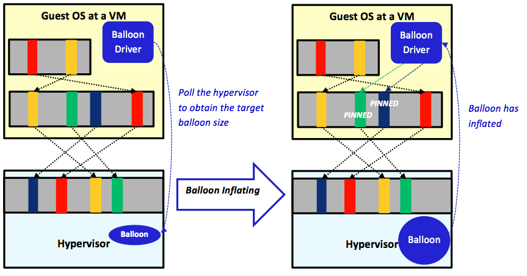

To maintain full isolation, guest OSs are kept unaware that they are running inside VMs. VMs are also kept unaware of the states of other VMs running on the same physical host. Furthermore, with multiple levels of page mapping, VMs remain oblivious of any physical memory shortage. Therefore, when the hypervisor runs multiple VMs at a physical host, and the physical memory turns stressed, none of the VMs can automatically help in freeing up memory. 

The hypervisor deals with the situation by applying a **reclamation technique**. As its name suggests, a reclamation technique attempts to reclaim inactive real memory pages at VMs and make them available for the hypervisor when experiencing a memory shortage. This video describes a couple of techniques that can be used to reclaim memory from guest OSs:
 

> [!VIDEO https://www.microsoft.com/videoplayer/embed/RE4pNdb]

One of the popular reclamation techniques is the **ballooning process** introduced in VMware ESX, which has been the basis for similar techniques in other hypervisors.

_Figure 4: The ballooning process in VMware ESX_

In VMware ESX, a balloon driver must be installed and enabled in each guest OS as a pseudo-device driver. The balloon driver regularly polls the hypervisor through a private channel to obtain a target balloon size. As illustrated in Figure 4, when the hypervisor experiences a memory shortage, it inflates the balloon by setting a proper target balloon size. The left side of Figure 4 shows four real memory pages mapped to four physical pages, of which only two pages are actually active (the red and the yellow ones). Without involving the ballooning process, the hypervisor is unaware of the other two inactive pages (the green and the dark-blue ones) because they are still mapped to physical pages. Consequently, the hypervisor will not be able to reclaim inactive pages unless it is informed by the guest OSs it is managing. <!-- SCG: Not sure I understand "unless getting informed" Do you mean "unless it is informed by the guest OSs it is managing." --> With memory ballooning, however, the hypervisor can set the balloon target size to an integer number (say 2 or 3). When recognized by the balloon driver at the guest OS, the driver checks out the pages, locates the two inactive pages, and pins them (see the right side of Figure 4). The pinning process is carried out by the guest OS via ensuring that the pinned pages cannot be read/written by any process during memory reclamation. After pinning the inactive pages, the balloon driver transmits to the hypervisor the addresses of the pinned pages. Subsequently, the hypervisor proceeds safely with reclaiming the respective physical pages and allocating them to VMs. Last, to unpin pinned pages, the hypervisor deflates the balloon by setting a smaller target balloon size and communicates that to the balloon driver. When the balloon driver receives the communication, it unpins the pinned pages so the guest OS can utilize them. More information about the ballooning process can be found in the VMware ESX documentation.
