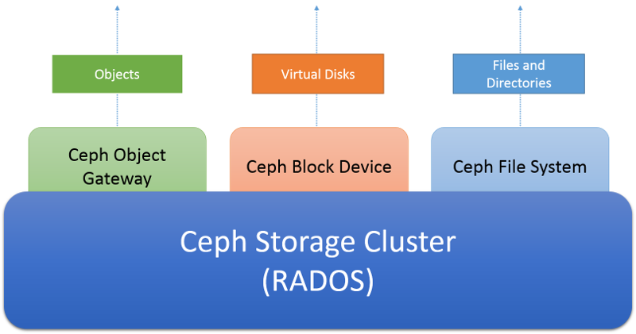
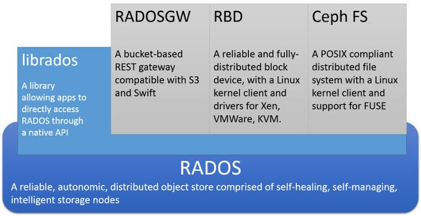
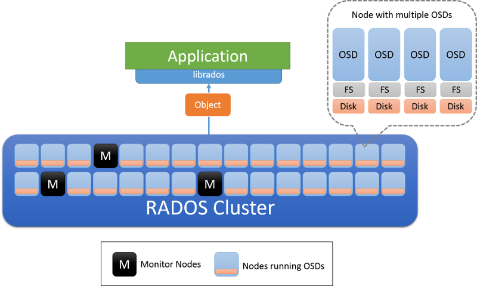
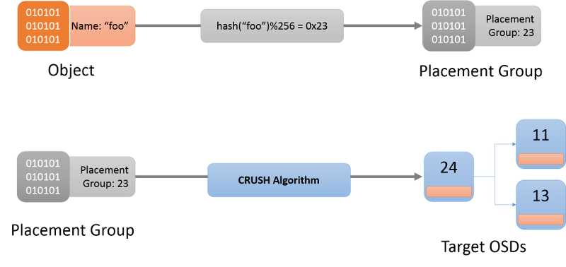
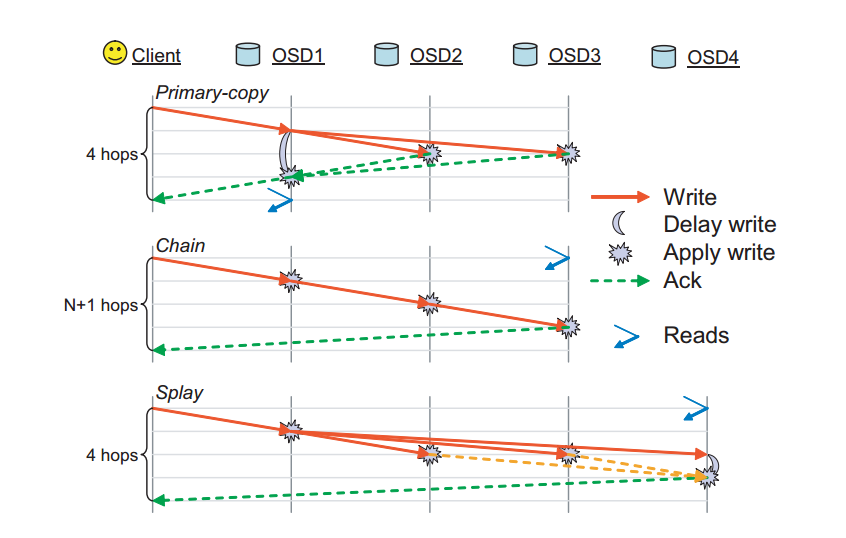
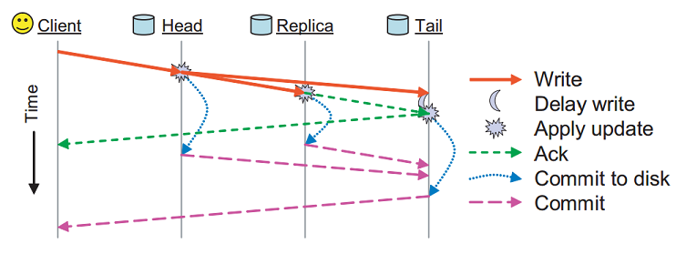
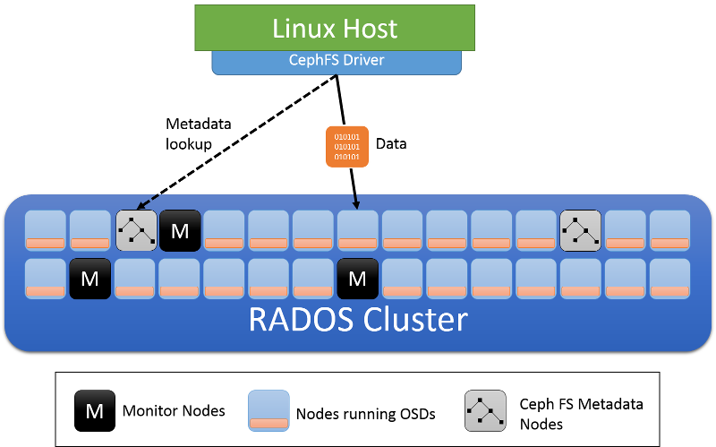
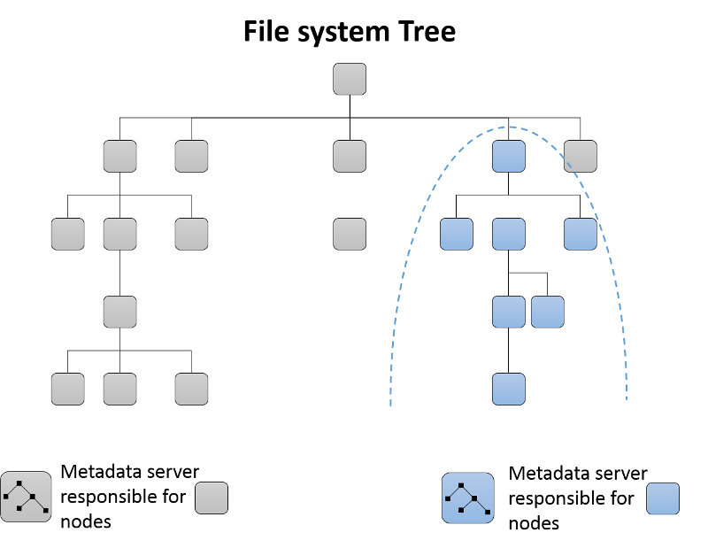

Ceph is a storage system that can be deployed on large clusters of servers with attached disks. The following video covers the basic concepts behind Ceph.
 

> [!VIDEO https://www.microsoft.com/videoplayer/embed/RE4pSFd]

The design goals for Ceph[2][^2] include the following:
- General-purpose storage cluster which is flexible to support a wide range of applications.
- An architecture that can seamlessly scale to hundreds of thousands of nodes and petabytes of storage.
- Highly reliable system without any single point of failure, that is self-managing and robust.
- The system must run on readily-available commodity hardware.
Ceph is designed to be accessible through 3 different abstractions, as shown in the following figure.

The **Ceph storage cluster** is a distributed object store. Layered on top of the storage cluster are different client-facing storage services. The **Ceph object gateway** service allows for clients to access a Ceph storage cluster using a REST-based HTTP interface that is currently compatible with Amazon's S3 and Openstack's Swift protocols. The **Ceph block device** service allows for clients to access the storage cluster as block devices, which can be formatted with a local file system and mounted in an operating system, or used as a virtual disk to operate virtual machines in Xen, KVM, VMWare or QEMU. Finally, the **Ceph file system** (Ceph FS) provides the file and directory abstraction over the entire storage cluster as a POSIX-compliant file system.

_Figure 6: Ceph ecosystem_

Taking a deeper look, the architecture of Ceph is illustrated below:

_Figure 7: Ceph architecture_

At the heart of Ceph is a distributed object storage system called **RADOS**. Clients can interact with RADOS directly using a low level API called **librados**, which is socket-based and supports a number of programming languages. Alternatively, clients can interact with the 3 higher level APIs that provide 3 separate abstractions into RADOS.

**RADOS Gateway** or **radosgw** allows for clients to access RADOS through a REST-based gateway over HTTP. This emulates the Amazon S3 object service and is compatible with applications that use the Amazon S3 API or the Openstack SWIFT API.

**RADOS Block Device** or RBD exposes the RADOS object store as a general-purpose distributed block device, much like a SAN. RBD allows for block devices to be carved out from RADOS and mounted on Linux systems using a kernel driver. RBDs can also be used as virtual disk images for popular virtualization systems such as Xen, VMWare, KVM and QEMU.

**Ceph FS** is a POSIX compliant distributed file system layered over RADOS which can be directly mounted within the file systems of Linux clients. Ceph FS will be discussed in detail later on this page.

## Ceph storage cluster architecture (RADOS)

At the heart of Ceph is the **Reliable, Autonomous, Distributed Object Store (RADOS)**. In RADOS, data is stored as objects distributed over a cluster of machines. Clients interact with a RADOS cluster by storing and retrieving objects. An object consists of an object name (which is the key used to identify an object), as well as the binary contents of the object (which is the value associated with a particular object key). The role of RADOS is to store objects in a distributed fashion across a cluster in a scalable, reliable and fault-tolerant manner. 

There are two types of nodes in a RADOS cluster: **object storage daemons (OSDs)** and **monitor nodes** (Figure 8). An OSD stores objects and responds to requests for objects. OSDs stores these objects on nodes using the local file system on each node, and keep a buffer cache to improve performance. Monitor nodes keep a watch on the status of the cluster to keep track of OSDs that are entering and leaving the cluster.

_Figure 8: RADOS Architecture. OSDs are responsible for data on a node (typically one OSD is deployed per physical disk). The nodes marked in M are the Monitor nodes._

### Cluster state and monitors in RADOS

The state of a RADOS cluster is encapsulated into an object known as the **cluster map**, which is shared by all the nodes in a cluster. The cluster map contains information about the state of a cluster at any given moment, including the number of OSDs that are currently present, a compact representation of how the data is distributed among the OSDs (which will be discussed in detail in the next section), and a logical timestamp denoting the time that this cluster map was built. Updates to the cluster map are done in a peer-to-peer, incremental fashion by the monitor nodes. This means that only the changes in the cluster map from one timestamp to another are communicated between the nodes in a cluster, to keep the amount of data transferred between nodes small.

The monitors in RADOS are collectively responsible for the management of the storage system by storing the master copy of the cluster map and sending out periodic updates in case there is a change in the state of the OSDs. The monitors are organized based on the paxos algorithm, and requires a majority of the monitors to read or update the cluster map. The monitors ensure that the map updates are serialized and consistent. A RADOS cluster is designed to have a small number of monitors (>3) and is typically an odd number to ensure that there are no ties to break when individual monitors have to come to a consensus. 

### Data placement in RADOS 

For a distributed object storage to work correctly, a client must be able to contact the correct OSD to interact with an object. First, a client contacts a Monitor to retrieve the cluster map for the given storage cluster. The information contained in the cluster map can be used to determine the exact OSD responsible for a particular object in the cluster.

The first step is to determine the **placement group** of a particular object (Figure 9). A placement group can be thought of as a bucket in which an object resides. This is done by using a hash function (the latest hash function to be used is always obtained from the cluster map). Once a placement group for the given object is determined, the client then needs to find the OSD that is responsible for that placement group.

_Figure 9: Locating an Object to a Placement Group and finally to an OSD using the CRUSH algorithm._

The algorithm used to assign placement groups to OSDs is known as the **Controlled Replication Under Scalable Hashing (CRUSH)**[1][^1] algorithm (Figure 9). CRUSH assigns placement groups across a cluster in a pseudo-random, but deterministic manner. CRUSH is more stable than a hash function, in the sense that when OSDs enter or leave the cluster, CRUSH ensures that most placement groups remain where they are and shifts only a small amount of data to maintain a balanced distribution. A simple hash function, on the other hand would require redistribution of a majority of keys when buckets are added or removed. The entire description of the CRUSH algorithm is beyond the scope of this discussion. Interested readers should refer to [CRUSH: Controlled, scalable, decentralized placement of replicated data][^1].

When an object name is hashed to a placement group, CRUSH produces a list of exactly **r** OSDs that are responsible for the placement group. Here, **r** is the number of replicas for a given object. Based on the information in the cluster map, the active OSDs that are in this mapping are identified, and then that OSD can be contacted to interact (operations such as create, read, update, delete) with the specified object.

### Replication in RADOS

In RADOS, an object is replicated among multiple OSDs that are associated with that object's placement group. This ensures that there are multiple copies of a particular object in case a certain OSD fails. RADOS has multiple available schemes in which the replication is actually performed; these are the **primary copy**, **chain**, and **splay** replication schemes (Figure 10). 

_Figure 10: The replication modes supported in RADOS._ (Source [2][^2])

**Primary Copy Replication**: In the primary copy replication scheme, a client interacts with the first available OSD (the primary replica OSD) to interact with an object. The primary replica OSD will process the request and respond back to the client. In case of a write, the primary replica OSD will forward the write request to **r-1** replicas which will then update their local copies of the object and respond to the master. The write operation on the master is delayed until all the writes are committed by the other OSDs for that object. The master will then acknowledge the write to the client. The write is not complete until all the replicas have responded to the primary copy OSD. The same process applies for reads, the primary copy will respond to a read only after all replicas have been contacted and the object value is the same across all replicas.

**Chain Replication**: Requests for an object are forwarded down the chain until the **rth** (final) replica is found. If the operation is a write, it will be committed to each of the replicas on the way to the last replica. The final OSD containing the final replica will finally acknowledge the write to the client. Any read operation will be directed straight to the tail, in order to reduce the number of hops that are required to read the data from a cluster.

**Splay Replication**: Splay replication combines elements of both primary copy replication and chain replication. Read requests are directed to the last OSD in the replica chain, while writes are first sent to the head. Unlike chain, the updates to the middle OSDs are done in parallel, similar to the primary copy replication scheme.

In addition to these replication schemes, persistence in RADOS is handled by utilizing two separate acknowledgment messages (Figure 11). Each OSD has a buffer cache of the data served by it. Updates are written to the buffer cache and acknowledged back immediately through an **ack** message. This buffer cache is periodically flushed to disk, and when the last replica has committed the data to disk, a **commit** message is sent to the client, indicating that the data has been persisted. 

_Figure 11: Ack versus commit messages in RADOS_ (Source [2][^2])

### Consistency model in RADOS

Every message in RADOS (both from the client as well as peer-to-peer messages among nodes) are tagged with the timestamp to ensure that the messages are ordered and applied in a consistent fashion. If OSDs detect a wrong message due to an out-of-date cluster map from the message requester, it will send the incremental map updates to bring the message requester up to date. 

There are corner cases in which strict consistency guarantees offered by RADOS must be carefully handled. If the placement group mappings for a particular OSD changes (in the event of a change in the cluster map), then the system must ensure that the hand-off of the placement groups between the old OSDs and the new OSDs should be done in a seamless and consistent manner. During a placement group change, new OSDs are required to contact the old OSDs for the state handover, during which the old OSDs will learn of the change and stop responding to queries for those particular placement groups. 

Another case where strict consistency guarantees may be difficult to achieve is in the event of a network failure that causes a network partition. In this case some clients that have an old cluster map may continue to perform read operations on that OSD while an updated map may change the OSD responsible for that placement group. Recall that this is a failure scenario that was previously highlighted in our discussion of the CAP theorem. This inconsistency window will always exist in this case. RADOS seeks to mitigate the effect of this scenario by requiring all OSDs to heartbeat with other replicas at a default interval of 2 seconds. If a particular OSD cannot reach the other replica groups in a certain threshold, it will block its reads. In addition, OSDs that are assigned to be the new primary for a particular placement group should either receive an acknowledgment of the handover from the old placement group primary or wait for the heartbeat interval to assume that the old placement group primary is down. This way, the potential inconsistency window in a RADOS cluster in the presence of network partitions is reduced.

### Failure detection and fault tolerance in RADOS

Node failures in RADOS are detected during a failure of communication between OSDs assigned to a placement group or between OSDs and monitor nodes. If a node fails to respond within a limited number of reconnect attempts, it is declared as dead. OSDs that are part of a placement group will exchange heartbeat messages to ensure that failures are detected. This results in the monitor nodes taking the lead in updating the cluster map and notifying all nodes through an incremental map update message. Following an update of the cluster map, OSDs will exchange objects between themselves to ensure that the desired number of replicas are maintained for each placement group. If an OSD discovers through a message that it has been declared dead, it will simply sync its buffer to disk and kill itself to ensure that the behavior is consistent. 

## Ceph file system

As indicated in the previous figure, the Ceph FS is a layer of abstraction over the RADOS storage system. RADOS does not have any notion of metadata for an object apart from object name. The Ceph file system allows for file metadata to be layered on top of individual file objects stored in RADOS. The following video explains the concept of CephFS.
 

> [!VIDEO https://www.microsoft.com/videoplayer/embed/RE4pXRl]

In addition to the cluster node roles of OSDs and Monitors, Ceph FS introduces **metadata (MDS)** servers (Figure 12). These servers store the file system metadata (the directory tree, as well as the access control lists and permissions, mode, ownership information, and timestamps for each file). 

_Figure 12: Metadata servers in the Ceph file system_

The metadata used by Ceph FS differs from the metadata used by local file system in a number of ways. Recall that in a local file system a file is described by an inode, which contains a list of pointers pointing to the data blocks of a file. Directories in a local file system are simply special files which have links to other inodes which may be other directories or files. In Ceph FS, a directory object in the metadata server contains all the inodes embedded inside it.

### Dynamic subtree partitioning 

Initially a single metadata server will be responsible for the entire metadata for the cluster. As metadata servers are added to the cluster, the directory tree of the file system is partitioned and assigned to the resulting group of metadata servers (Figure 13). Each MDS measures the popularity of metadata within its directory hierarchy using counters. A weighted scheme[3][^3] is used to not only update the counter of a specific leaf node in the directory, but also for the ancestors of that directory element up to the root. Thus each MDS is able to keep a list of hotspots in the metadata that can be moved off to a new MDS when it's added to the cluster.

_Figure 13: Dynamic subtree partitioning in the Ceph file system_

### Caching and fault tolerance in metadata servers

Metadata servers in Ceph FS typically cache metadata information in memory and serve most requests out of memory. In addition, MDS servers use a form of **journaling** wherein updates are sent downstream to RADOS as journal objects, and these are written out per metadata server. In the event of a failure of a metadata server, the journal can be replayed to rebuild the failed MDS server's portion of the tree on a new MDS or an existing MDS.
 
***
### References

1. _Weil, S. A., Brandt, S. A., Miller, E. L., & Maltzahn, C. (2006). [CRUSH: Controlled, scalable, decentralized placement of replicated data](https://ceph.com/wp-content/uploads/2016/08/weil-crush-sc06.pdf) In Proceedings of the 2006 ACM/IEEE conference on Supercomputing 122_
2. _Weil, S. A., Brandt, S. A., Miller, E. L., & Maltzahn, C. (2006). Ceph: [A scalable, high-performance distributed file system](https://www.ssrc.ucsc.edu/Papers/weil-osdi06.pdf) Proceedings of the 7th symposium on Operating systems design and implementation (OSDI) 307-320_
3. _Weil, S. A., Pollack, K. T., Brandt, S. A., & Miller, E. L. (2004). [Dynamic metadata management for petabyte-scale file systems](https://ceph.io/wp-content/uploads/2016/08/weil-mds-sc04.pdf) In Proceedings of the 2004 ACM/IEEE conference on Supercomputing 4_

***

[^1]: <https://ceph.com/wp-content/uploads/2016/08/weil-crush-sc06.pdf> "Weil, S. A., Brandt, S. A., Miller, E. L., & Maltzahn, C. (2006) *CRUSH: Controlled, scalable, decentralized placement of replicated data* In Proceedings of the 2006 ACM/IEEE conference on Supercomputing 122"
[^2]: <https://www.ssrc.ucsc.edu/Papers/weil-osdi06.pdf> "Weil, S. A., Brandt, S. A., Miller, E. L., & Maltzahn, C. (2006). Ceph: *A scalable, high-performance distributed file system* In Proceedings of the 7th symposium on Operating systems design and implementation (OSDI) 307-320"
[^3]: <https://ceph.io/wp-content/uploads/2016/08/weil-mds-sc04.pdf> "Weil, S. A., Pollack, K. T., Brandt, S. A., & Miller, E. L. (2004). *Dynamic metadata management for petabyte-scale file systems* In Proceedings of the 2004 ACM/IEEE conference on Supercomputing 4"
