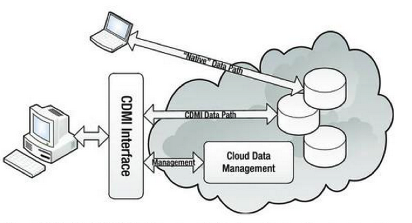
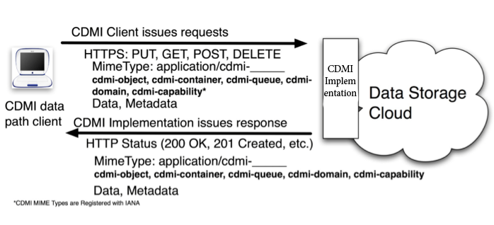
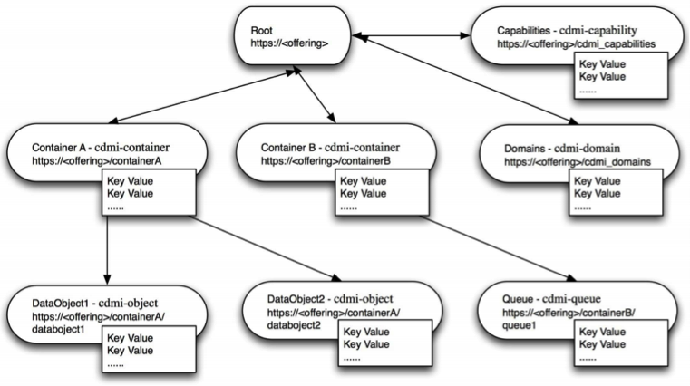

Now we'll look at a special class of storage systems that are designed as a cloud service that is provided over the internet. In the context of our discussion on cloud storage thus far, object storage in clouds can be considered to be a special case of key-value stores provided as a service over the internet.

Providing storage as a service to clients over the internet requires abstracting the underlying storage implementation details and providing a simple and clean interface that can be used in applications. Cloud adopters are increasingly choosing the cloud object model for storage on the cloud. 

With the concept of objects, object-based storage systems abstract the existing file system approach at a higher level. Object-based storage systems are typically layered over existing file systems. There is no notion of hierarchies in object-based storage systems, which instead use a flat data environment. 

An **object** can be considered as a generic container that can store any arbitrary type of information. Designing interfaces for such arbitrary data may be difficult, but in storage parlance, a basic set of operations can be easily defined for any arbitrary object. These operations are create, read, update, and delete (CRUD), which are typically made available through some kind of API that can be accessed through HTTP or other network protocols using REST- or SOAP-style calls. 

## REST

**Representational state transfer** (REST) relies on a stateless, client-server, cacheable communications protocol and is typically implemented over HTTP. A stateless protocol treats each request as an independent operation, and each communication between a client and server is treated as an independent pair of requests and responses. The following video discusses HTTP and RESTful interfaces:
<br>

> [!VIDEO https://www.microsoft.com/videoplayer/embed/RE4pSF5]

REST is an **architectural style** for designing networked applications and does not refer to a single protocol. REST is a design strategy for communications among various entities in a networked application. The idea is to use a simple mechanism instead of CORBA, WSDL, or RPC to connect and transfer information between machines over a network. Any interface that uses REST principles is called a **RESTful** interface. 

A RESTful interface uses HTTP requests to post (create and/or update), read (make queries and get information), and delete data. Thus, a RESTful interface can be used for CRUD operations. 

A RESTful interface consists of the following components:

- A uniform resource identifier (URI), such as an HTTP URL through which the service can be accessed. 
- An internet media type for the data supported by the service (typically XML or JSON). 
- A set of operations that is supported by the web service using HTTP methods (GET, PUT, POST, and DELETE). 
- An HTTP-driven API.

Thus, a program that needs to connect to a service with a RESTful interface can use standard HTTP GET, PUT, POST, and DELETE requests. An example of a REST request is covered shortly. 

The major advantages of REST are that it is:

- A platform-independent approach that is ideally suited for the internet. 
- A language-independent interface because all instructions are passed over HTTP so that, for example, a C# client can talk to a Python server. 
-  A standards-based communication because it runs on top of HTTP.
- Operational in the presence of firewalls as long as HTTP or HTTPS traffic is not filtered.

## Object storage systems

The following video covers the basics ideas behind object storage systems:

> [!VIDEO https://www.microsoft.com/videoplayer/embed/RE4q0qD]

An example of object-based storage on the cloud is Azure's Blob Storage. Blob Storage allows users to store **objects** in **containers**. Each object can be created, read, and deleted. Note that in the Blob Storage model, although no native update-object method exists, an entire object can be deleted and re-created, similar to a file overwrite.

Here is an example of a RESTful HTTP call to Azure Blob Storage to create a container named `mycontainer`. The HTTP call includes authorization information for the client to access the bucket. 

``` text
PUT https://myaccount.blob.core.windows.net/mycontainer?restype=container HTTP/1.1  
  
Request Headers:  
x-ms-version: 2011-08-18  
x-ms-date: Sun, 25 Sep 2011 22:50:32 GMT  
x-ms-meta-Name: StorageSample  
Authorization: SharedKey myaccount:Z5043vY9MesKNh0PNtksNc9nbXSSqGHueE00JdjidOQ=
```

Blob Storage can process the request and will send back an HTTP response similar to the following:

``` text
Response Status:  
HTTP/1.1 201 Created  
  
Response Headers:  
Transfer-Encoding: chunked  
Date: Sun, 25 Sep 2011 23:00:12 GMT  
ETag: "0x8CB14C3E29B7E82"  
Last-Modified: Sun, 25 Sep 2011 23:00:06 GMT  
x-ms-version: 2011-08-18  
Server: Windows-Azure-Blob/1.0 Microsoft-HTTPAPI/2.0
```

In the response, Azure has acknowledged the request, indicated that the request was successful (with a "201 Created" message), and returned some information regarding the request.

## Cloud object storage standards: CDMI

The lack of a common standard for object storage is an issue plaguing cloud object storage.

The Storage Networking Industry Association (SNIA) is promoting an open standard for cloud objects, called **Cloud Data Management Interface (CDMI)**.



_Figure 22: CDMI_

CDMI defines data objects and data containers with tagged metadata (as key-value pairs) and uses RESTful interfaces, with JSON as the data exchange format. CDMI can be used for accessing and managing data on a storage cloud (Figure 22). An example of a client interaction with a storage cloud using CDMI is shown in Figure 23.



_Figure 23: A CDMI client interacting with a CDMI storage cloud_

The CDMI client can issue requests over HTTPS. The **MimeType** indicates the type of CDMI resource with which the client is interacting (an object, a container) and returns standard HTTP status codes, indicating the status of the request. 

The CDMI model is illustrated in Figure 24. A CDMI resource exists on a root location, indicated by the root URI: `https://<offering>`. The example contains two containers, A and B, that contain one object each. Note that each CDMI entity can support metadata, as indicated with the key-value tags associated with every entity.



_Figure 24: The CDMI data model_

In addition, CDMI supports the following resource types: 
- **cdmi-capability:** A special entity that describes the capabilities of this particular cloud store. This entity is important and can be used to discover the capabilities of a cloud (e.g., backup and replication).
- **cdmi-domain:** Allows for the creation of domains (e.g., groups of users with object access permissions).
- **cdmi-queue:** Allows for the creation of queues of objects that operate in first in, first out (FIFO) order. Applications can use such queues to implement notification or messaging systems.

The advantages of CDMI include the following:

- Its vendor-neutral specification of a cloud object storage system allows for simpler data migration from one cloud to another.
- It enables **cloud peering** for storage, which is a concept wherein resources from different clouds can be connected to enable seamless data sharing between clouds. 
- It adheres to existing standards, such as RESTful interfaces for data access, and can work with multiple underlying storage abstractions, such as shared and networked file systems.
- It is a mature standard, which has a reference implementation and ISO standardization.

The disadvantage of CDMI is that its adoption is yet to be seen. The CDMI standard is backed by many storage companies, but it is not yet officially supported by most vendors, and the standard's success remains unclear.
