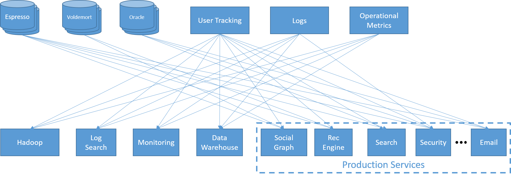
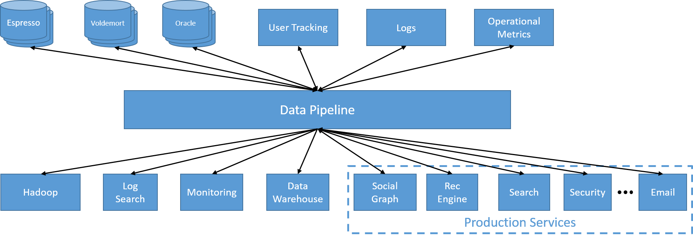
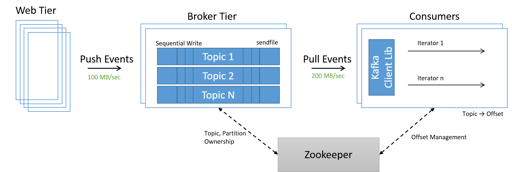
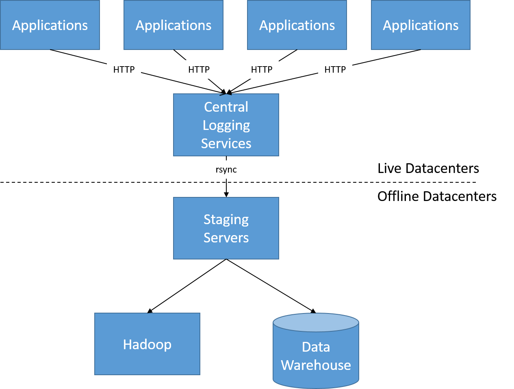
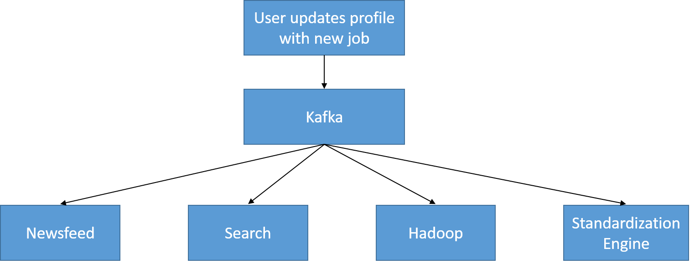

Many web-scale enterprises have now begun to use message queues and stream processing frameworks within their applications. This is primarily because these companies have begun to gain significant value from the use of fresh data. Now that we have covered the basic concepts of message queues, stream processing, and Lambda architectures, it may be interesting to look at a real-world example of how a low-latency data-intensive architecture provides value to a large company. Specifically, we will illustrate how incorporating Kafka and Samza allowed LinkedIn to feed many different real-time systems.

## Incorporating Kafka and Samza at LinkedIn

As a young technology company, LinkedIn often found itself building and adopting a large number of disruptive technologies, each to solve a specific requirement. Its services ran on a custom back end that used LinkedIn's own low-latency distributed key-value store (Voldemort), a distributed document store (Espresso), and an Oracle RDBMS. Front-end web services, analytics, emails, and notifications were driven by tasks of different complexity. These included batch jobs using Hadoop, queries on a large data warehouse, and a separate infrastructure for searches, all supported by a layer of logging, monitoring, and user and metric tracking. 

_Figure 19: Data integration disaster at LinkedIn_

A few years ago, engineers at LinkedIn realized that their system had grown too complicated. Communications between services, front ends, and back ends were all-to-all, since each component had its own latency and throughput requirements. The addition of a single service required connections to a large number of components, which in turn led to very fragile endpoints. This also led to siloes, as individual service owners were less likely to share their data. 

The first change at LinkedIn was a move toward using a centralized Kafka-driven data pipeline. This allowed each service to produce data and emit it using a specific topic. Accessing data from another service now became as simple as subscribing to that particular topic. Since the pipeline was internally run on a distributed cluster, it was expected to be inherently scalable. 

_Figure 20: A single, distributed, asynchronous data pipeline_

Another service was now needed to manage membership of nodes within a datacenter. Since scaling up and down was now simply a matter of adding and removing nodes from the system, a new service called ZooKeeper was used to manage membership within the cluster, distribute ownership of partitions and topics within the broker tier, and correctly handle offsets on the consumer tier. 

_Figure 21: High-velocity data processing using Kafka topics_

The changes in LinkedIn's architecture were also driven by a move toward more reactive systems. In its original architecture (around 2010), all user activity logs were scraped by a batch process every few hours, and this was used to generate new graphs and dashboards on the front end. This architecture allowed LinkedIn to have hourly or daily updates of view counts, user recommendations, and trending topics. 

_Figure 22: Before offline processing of user activity logs_

However, latencies of a few hours were no longer acceptable; neither to the end users who wanted to know page view statistics and trends from the last five minutes, nor to advertisers and data analytics folks who needed to be able to display the most relevant information in real time. Advertisements are no longer driven solely by offline analysis of clickstreams in data warehouses, but in fact, are increasingly impacted by real-time models that are updated online. 

_Figure 23: Left: Traditional ad serving. Right: Model ad serving._

This is what stateful streaming using Samza enables. Traditionally, the source of truth would always arrive from one of the central data stores. However, databases cannot serve such a large number of simultaneous requests, to match the complex real-time queries of recommendation and complex analytics systems. This also placed a great demand on the bisection bandwidth of the datacenter. Instead, LinkedIn's approach was to use the same stream of data to update multiple back ends. Thus, as each consumer node had a local embedded database, a single update event would simply trigger all the relevant updates in real time on this local database. 

A simple example of an update event for a user profile is shown below. As the profile is updated, it writes to a specific UserProfileUpdate topic, which is consumed by the newsfeed (to show in real time that the user has moved to a new company) and the search data store (so that it doesn't return stale data), and also consumed to be used for offline processing (e.g., to capture trends in the number of software engineers joining a particular company per day). 

_Figure 24: A UserProfileUpdate topic is consumed at LinkedIn_

When you are running large web-scale distributed systems like many big tech companies, there is a paradox in design choices. Tech companies have created a large number of specialized systems, such as data stores, networking interconnects, batch, interactive, and stream processing frameworks, and so on. This is because the one-size-fits-all solutions of the past no longer meet specific hard requirements of today's users. However, the downside of this approach is a significant amount of "reinventing the wheel," building custom solutions to problems like failure detection and recovery and cluster management. The move toward such systems is primarily driven by needs of agility, ease of management, and scalability.

In short, we see here the benefits accrued by LinkedIn in moving toward a log-oriented system. This made it easier to be schemaless, allowing easier data integration. By making scalable log message passing a first-class citizen within its datacenter, LinkedIn built a highly modular and flexible system.
