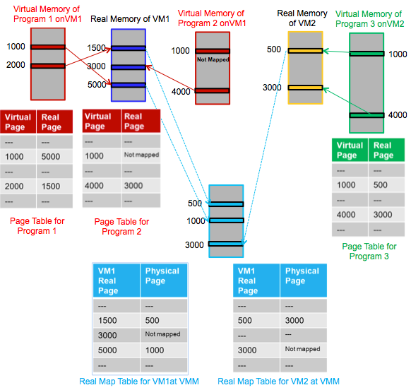

Contrary to OSs in traditional systems, with system virtualization, the hypervisor allocates a contiguous addressable memory space for each created VM (not process). This memory space, allocated per VM, is called **real memory**. In return, each guest OS running in a VM allocates a contiguous, addressable memory space for each process in its real memory. This memory space, allocated per process, is called virtual memory (the same name as in traditional systems). Each guest OS maps the virtual memories of its processes to the real memory of the underlying VM, while the hypervisor maps the real memories of its VMs to the system physical memory. Clearly, in contrast to traditional OSs, this entails two levels of mappings between <!-- SCG: How do you want to differentiate between an OS that uses multi-level page tables and this two-level page mapping. Without some mention of this I think it could be confusing. --> three types of addresses: virtual, real, and physical. In fact, these virtual-to-real and real-to-physical mappings define system memory virtualization. This basic idea of memory virtualization via two-level page mapping is summarized in the following video:
 

> [!VIDEO https://www.microsoft.com/videoplayer/embed/RE4q0eu]

_Figure 2: Memory virtualization in a native system VM_

Similar to any general-purpose OS, a guest OS would still own its set of page tables. In addition, the hypervisor would own another set of page tables for mapping real-to-physical addresses. The page tables in the hypervisor are called real map tables. Figure 2 demonstrates system memory virtualization in a native system VM. It shows page tables maintained by guest VMs and real map tables maintained by the hypervisor. Each entry in a page table maps a virtual page of a program to a real page in the respective VM. Likewise, each entry in a real map table maps a real page in a VM to a physical page in the physical memory. When a guest OS attempts to establish a valid mapping entry in its page table, it traps to the hypervisor. Subsequently, the hypervisor establishes a corresponding mapping in the relevant VM's real map table. 
