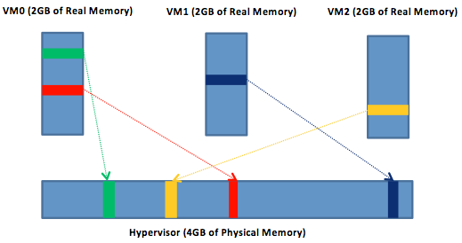

In memory virtualization, the combined total size of real memories can grow beyond the actual size of physical memory. This concept is typically called memory overcommitment. Memory overcommitment ensures that physical memory is highly utilized by active, real memories (assuming multiple VMs are running simultaneously). Indeed, without memory overcommitment, the hypervisor can run only VMs with a total size of real memories less than that of the physical memory. For instance, Figure 3 shows a hypervisor with 4 GB of physical memory and three VMs, each with 2 GB of real memory. Without memory overcommitment, the hypervisor can run only one VM because it doesn't have enough physical memory to assign to two VMs at once. Although each VM would require only 2 GB of memory, whereas the hypervisor has 4 GB of physical memory, this memory cannot be afforded because hypervisors generally require overhead memories (e.g., to maintain various virtualization data structures).

_Figure 3: A hypervisor with 4 GB of physical memory, enabling three VMs at once with a total of 6 GB of real memory_

To this end, in practical situations, some VMs might be lightly loaded, while others might be heavily loaded. Lightly loaded VMs can cause some pages to sit idle, while heavily loaded VMs can result in memory page thrashing. To deal with such a situation, the hypervisor can take (or steal) the inactive physical memory pages away from idle VMs and provide them to heavily loaded VMs. As a side effect, hypervisors usually write zeros to the stolen/reclaimed, inactive physical memory pages in order to avert information leaking among VMs. 
