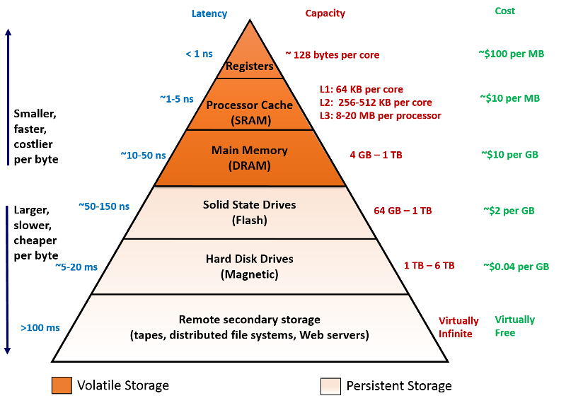
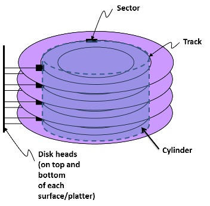
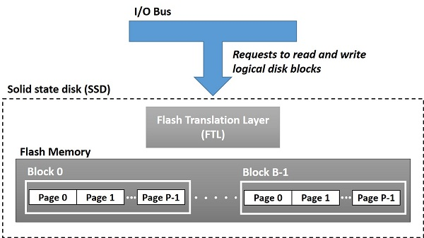

<!-- Original file: C:\Users\Mark\Desktop\CMU-source\v_5_3\content\_u04_cloud_storage\_u04_m01_cloud_storage\x-oli-workbook_page\_u04_m01_3_1_filesystems.xml -->
We shall now dive into the actual devices used to store and persist data in Video 4.2. This video should serve to be a refresher on various types of storage technologies that are available, with their relative cost-performance tradeoffs. 

> [!VIDEO https://youtube.com/embed/LljF0TatEGk]

##  Memory Hierarchy
As a quick recap, the memory hierarchy is illustrated in Figure 4.3 below. The fastest (and most expensive) storage space in a modern computer is the on-chip registers, which consist of about sixteen 8 byte registers per core. These can be accessed within a single clock cycle (<1 nanosecond). Next, we have static RAM (SRAM), which the storage technology uses in cache memory, which can be accessed between 0.5 to 2.5 nanoseconds, but costs ~$10-50 per megabyte. Modern processors have a few megabytes of this type of memory located within the various levels (L1-L3) cache on the processor die. Each level differs in terms of capacity, access time, bandwidth and organization.

_Figure 4.3: Memory Hierarchy_

From here, there is a significant leap in terms of capacity and access time when going to main memory (DRAM). Current DRAM technology allows for access latencies of 50-70 nanoseconds, and consists of multiple gigabytes. DRAM costs about ~$10-30 per GB, allowing for a few gigabytes of storage in personal computers, and up to a terabyte in servers. Recall that all of the memories described thus far are all volatile memories. The data stored in these memories exist as long as they are powered ON. When switched OFF, they lose all information.

The next order of magnitude difference is observed in disks, which can take anywhere between 10s of nanoseconds to 100s of milliseconds to fetch a given item, depending on the type of storage device used. Finally, there is the network, which can connect machines that are in the same rack or can go across countries. The access latencies here can vary significantly, depending on the technologies used and the distance. Disks are non-volatile and persist data even when switched off.

##  Types of Storage Devices
###  Magnetic Disks
Magnetic disks have been the most cost-effective and popular storage systems for many decades now, but are slowly ceding their dominant position to solid state drives. Magnetic disks consist of one or more spinning magnetic platters and a movable read/write head that floats above the platters. Magnetic disks are extremely dense and cheap. At the time of writing, 6 Terabyte drives are available in the 3.5" desktop form factor for about $270, which translates to about 4 cents per gigabyte. This makes magnetic disks one of the cheapest on-line storage technologies available (as opposed to offline/removable technologies such as tapes and optical discs).

However, Magnetic disks are among the slowest storage technologies. Typical access latencies on modern disks range betweek 5-20 milliseconds. The main reason for the performance of magnetic disks is the fact that there are moving parts involved during reading and writing of data. As illustrated in Figure 4.4, magnetic disks are organized as a collection of sectors, tracks, and cylinders. In particular, a surface on a typical disk drive is divided into a number of concentric tracks. Each track is divided into a number of equal-sized sectors. The data stored at sectors are read and written using a set of read and write heads, with one head per surface. The set of tracks selected by the disk heads at any one time is called a _cylinder_. The data at sectors are accessed by moving disk heads to the appropriate cylinder (the time required for this task is called <!-- the referred to as [I inserted "the time required for this task" to clarify the meaning of seek time ~CL] --> _seek time_) and then waiting for the disk to rotate until the desired disk sector is under one of the heads (called the _rotational time_). The time required to access a sector (i.e., seek time + rotational time) depends on the distance of the current position of the disk heads from the desired sector.
_Figure 4.4: Architecture of a magnetic hard disk drive_

As a result, magnetic storage disks are slow, particularly for random reads and writes, as the head must keep moving to different areas on the disk to read information, increasing the overall access time. However, they are cheap, and they are the main storage technology used in large-scale storage systems. Magnetic storage tends to be the main storage device located at the end of the spectrum, responsible for persisting large amounts of data in a cost effective manner.

###  Solid State Disks (SSDs)
The emergence of the NAND flash technology has brought increased performance and reduced prices to solid state storage in the past decade or so. Solid state drives, unlike magnetic disks, do not have any moving parts, and are nearly an order of magnitude faster than magnetic disks for random reads and writes. SSDs have access latencies that are an order of magnitude better than magnetic disks (70-150 nanoseconds for sequential operations), but cost significantly more (~$2 - $5 per GB). 

_Figure 4.5: Architecture of a solid state hard drive._

Solid state disks, however, have their own performance and reliability issues. Due to the nature of NAND flash technology, writes to SSDs require an expensive erase cycle that erases an entire page of data (Figure 4.5), which takes time and wears out the flash medium over time. SSDs internally contain logic to level the wear of the medium by spreading out the writes over multiple pages and blocks on the disk. As discussed in Unit 2, there are multiple SSD technologies available in the market, where the primary tradeoff is cost vs. performance and disk life. 

As a result, SSDs have different performance characteristics than rotating disks. Sequential reads and writes (where the CPU accesses logical disk blocks in sequential order) have comparable performance, with sequential reading somewhat faster than sequential writing. However, when logical blocks are accessed in random order, writing is an order of magnitude slower than reading, mainly due to the nature of the erase logic in SSDs.

###  DRAM as a Storage Device
The constant expansion of DRAM sizes, coupled with the drop in price per gigabyte has led to the emergence of in-memory storage systems. In memory storage systems offer an order of magnitude faster performance than traditional disk-based storage systems, but with one big caveat - durability. In memory storage systems typically have fairly complex schemes that stream data down to durable storage in order to persist the data for recovery and fault tolerance purposes. We will explore these types of systems in detail later in this module. 

###  Storage Class Memories / Non-Volatile Memories
A number of technologies are emerging that aim to bridge the performance gap between the volatile DRAM and the non-volatile SSD/Magnetic disks. Dubbed _storage class memories_, these devices are aiming for access latencies that are within an order of magnitued of DRAM, allowing for the rapid movement of data, while retaining persistence properties of SSDs/magnetic disks, and having much higher storage densities than DRAM. Along with improved versions of NAND Flash memory, technologies such as _memristors_, _phase change memory_ and others are competing gain a foothold in this space. SCM/NVM class memories are an ongoing developement which we expect to become part of the memory hierarchy soon.