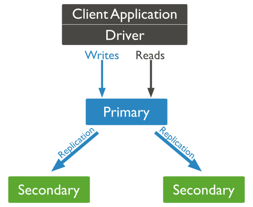

<!-- Original file: C:\Users\Mark\Desktop\CMU-source\v_5_3\content\_u04_cloud_storage\_u04_m03_NoSQL_databases_case_studies\x-oli-workbook_page\_u04_m03_3_mongoDB.xml -->
MongoDB is a document-oriented database. MongoDB eschews the relational model in favor of a "schema-less" model, which is designed to be more flexible and mimics the way data is modeled in modern object-oriented programming languages. MongoDB is also designed to be scalable from the ground up, it can automatically split up data among multiple servers and balance load across servers in a cluster. MongoDB also allows for complex queries such as those that involve MapReduce-style aggregations and geo-spatial queries, making MongoDB popular as a data store for mapping-related applications. Video 4.42 covers MongoDB

> [!VIDEO](https://youtube.com/embed/fN8zgNq-pdE)

##  MongoDB Data Model
A _document_ is the basic unit of data for MongoDB, roughly equivalent to a row in a relational database management system. A document is an ordered set of keys and their associated values. An example of a document is illustrated below:

``` java
{
     item: "ABC1",
     details: {
        model: "14Q3",
        manufacturer: "XYZ Company"
     },
     stock: [ { size: "S", qty: 25 }, { size: "M", qty: 50 } ],
     category: "clothing"
   }
```

MongoDB stores documents in groups known as a _collection_. MongoDB does not impose any restriction on the documents that are part of a collection. They can contain any number or type of keys and do not have to be related. The only restriction is that every document in a collection has a key called `_id`, which should have a unique value for every document in a collection. MongoDB can automatically generate the _id key for each document inserted into a collection.

A collection is identified by a UTF-8 string known as the _name_ of the collection. Many developers choose to group collections together using a naming convention, like using the `.` character to denote two types of blog collections: `blog.posts` and `blog.authors`. This is purely for organization, and MongoDB treats them as separate, unrelated collections.

Finally, a group of collections make a MongoDB _database_. Just like collections, a MongoDB database is identified by a UTF-8 string name. 

MongoDB supports a rich array of data types, including 32/64 bit integers, 64-bit floats, boolean values, dates, strings, regexes, javascript code, arrays and more. Documents can also be nested, i.e. a document can contain other documents within it, making MongoDB's data model fully nested. 

Internally, documents are stored in MongoDB using a format called BSON (Binary JSON). The size of an individual document in MongoDB is restricted to 4MB. 

##  Operations in MongoDB
The main operations in MongoDB to manipulated data are as follows: _insert_, _remove_ and _updates_. MongoDB allows batch inserts, which lets an application insert multiple documents in a single request. The only restriction in MongoDB is the message size, which is 16MB. MongoDB also allows for a special kind of operation, known as an _upsert_. This operation will update an existing document or will insert a new document if it does not exist. 

Data is queried in MongoDB using the _find_ command. Using the find command with a set of conditions can be used to return documents which match a set of conditions. A subtle limitation in MongoDB is that the conditions used in the find command must be a constant value specified in the query itself. This means that you cannot write a query in MongoDB that finds documents in which a certain value matches another value from the collection.

Apart from simple queries, MongoDB provides a set of aggregation tools that can be applied on the set of resulting documents in a query. Aggregations range from simple counts to MapReduce functions to further distill and analyze the data returned from a query.

As with most database systems, MongoDB allows for the creation of _indices_ on specific keys to be created for a collection. This can be used to reduce the time taken to execute certain types of queries. A salient feature of MongoDB is the ability to create indices on _geospatial data keys_, such as latitude and longitude. MongoDB can handle range queries on geo-spatial data efficiently. 

MongoDB also allows administrators to ask the system to _explain_ queries, similar to the capabilities afforded by popular RDBMSes. This allows administrators to analyze and optimize query execution in MongoDB. 

##  MongoDB Architecture
MongoDB manages collections and documents as files on a local file system. If an index is created on a particular key, then MongoDB uses a B-Tree structure to store the index information. MongoDB essentially works on these files on disk in a memory-mapped fashion, leaving it to the OS and file system to manage the in-memory buffer for the files containing the data.

For small installations, MongoDB is deployed as as a single-node system. In order to scale MongoDB to multiple nodes, MongoDB support two scale-out modes: _replication_ and _sharding_. In replication, multiple copies of the same data are maintained over multiple servers, allowing for MongoDB to tolerate node failures in case a node goes down. A set of mongodb nodes that has the same data is known as a _replica set_. One node in a replica-set is known as the _primary_, the remaining nodes are known as _secondaries_. By default, only the primary node responds to requests from clients for both reads and writes. The primary node sends out messages to update the replicas whenever there is an operation that writes data. In this mode, MongoDB guarantees strict consistency as all requests for data are processed only by the primary node. 


_Figure 4.43: Replication in MongoDB_

A MongoDB replica-set is designed for automatic failover. If a node fails to respond for more than 10 seconds, it is presumed to be dead and the remaining nodes vote on which node should be the new primary node.

In order to distribute data, MongoDB allows for data to be _sharded_ across multiple nodes. Each shard is an independent database, and collectively, the shards make up a single logical database. The architecture of a sharded MongoDB cluster is illustrated below:


_Figure 4.44: Sharding in MongoDB_

 _Shards_ store the data. To provide high availability and data consistency, in a production sharded cluster, each shard is a replica set. 

 _Query Routers_ interface with client applications and direct operations to the appropriate shard or shards. The query router processes and targets operations to shards and then returns results to the clients. A sharded cluster can contain more than one query router to divide the client request load. A client sends requests to one query router. Most sharded clusters have many query routers. 

 _Config servers_ store the cluster’s metadata. This data contains a mapping of the cluster’s data set to the shards. The query router uses this metadata to target operations to specific shards. 

Data is distributed across multiple nodes using a specific key known as the _shard key_. MongoDB divides the shard key values into _chunks_ and distributes the chunks evenly across the nodes in the cluster. The shard keys can either be _hash-based_ or _range based_. In hash-based sharding the hash-value of a shard key is used to assign a document to a specific chunk. In range-based sharding, each chunk is assigned to a specific range of values of the shard key, and documents can then be assigned to a specific chunk. 

MongoDB allows administrators to direct the balancing policy using _tag aware sharding_. Administrators create and associate tags with ranges of the shard key, and then assign those tags to the shards. Then, the balancer migrates tagged data to the appropriate shards and ensures that the cluster always enforces the distribution of data that the tags describe.

##  MongoDB Use Cases
MongoDB can be used to meet specific challenges for certain types of applications:

 _Large, rapidly evolving data set_: MongoDB supports large amounts of data and has a very flexible schema-less design. For applications that evolve rapidly and require ever-changing schema, MongoDB may be a good choice.

 _Location-based data_: MongoDB is unique in its ability to store and index geo-spatial data in an efficient manner. For this reason, MongoDB is used quite extensively for applications that use geo-spatial or map data. (Examples include booking applications, location-based services, etc)

 _Applications with a high write load_: MongoDB has built-in support for bulk inserts and supports a high-insert rate, while having relaxed transaction safety when compared to RDBMSes.

 _High availability in an unreliable environment_: MongoDB's architecture allows for near-instant, automatic recovery from the failure of a Node when replication is configured. This is especially useful in unreliable environments. 