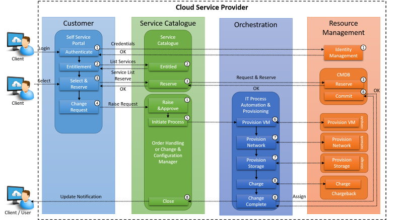

<!-- Original file: C:\Users\Mark\Desktop\CMU-source\v_5_3\content\_u02_data_centers\_u02_m03_software_stack\x-oli-workbook_page\_u02_m03_2_provisioning.xml -->
The most basic role of a Cloud Service Provider is to package and isolate virtual parts of a physical data center and provide access for cloud users to provision resources on the cloud. Provisioning is the process of mapping abstract resource requests by cloud users to physical resources on servers within a data center. 

In IAAS, this mainly involves launching virtual machines on top of hypervisors (these are special software applications that enable isolation of virtual machines on top of a physical machine- we will read more about them soon), as well as mounting storage volumes from a storage pool and creating a private network overlay for the user’s resources. 

The techniques behind virtualizing compute, storage or networking resources are dealt with in future modules. Here, we focus on understanding some of the high level steps that a CSP must take to create and allocate a publicly accessible virtual machine with a fixed set of resources to an end user. 

##  Components of a Resource Provisioning System
A resource provisioning system on the cloud generally has the following sub-parts: 
1. Access to a physical pool of resources- generally thousands or millions of servers, interconnected by a network (generally using a fat-tree topology as discussed in a previous module) and also a large pool of disks.
1. An identity management subsystem that maintains and validates the end user’s credentials for accessing many different types of resources; it can also support role based access control. 
1. A metering and monitoring system to detect utilization of physical resources 
1. A billing and charge management system to map the metered resources to physical costs and take appropriate actions based on the user’s allowed privileges. 
1. A resource manager that works with a hypervisor to map physical resources to virtual abstractions. 
1. Often, the provisioning system will have a web front-end or an API. 

##  Cloud End-to-End Service Provisioning Flow
Figure 2.23 below shows the typical end-to-end steps for a customer provisioning a virtual machine from a Cloud Service Provider (CSP):

_Figure 2.23: Typical End-to-End IaaS provisioning steps_

The steps illustrated in Figure 2.23 are explained as follows: 
1. The customer logs on to the portal and is authenticated by the identity management system. 
1. Based on the customer’s entitlement, the portal extracts a subset of services that the user can order from the service catalogue and constructs a ‘request catalog’. 
1. The customer selects a service, e.g. a virtual server of a particular size. Each service has a set of technical requirements (e.g., the amount of vRAM, vCPU, etc.) and business requirements (e.g., high availability or SLA requirements) associated with it. 
1. The orchestration tool extracts the technical service information from the service catalog and decomposes the service into individual parts, such as compute resource configuration, network configuration, and so on. 
1. The provisioning process is initiated. 
1. The virtual machine running on the server is provisioned using the server/compute domain manager. 
1. The network, including firewalls and load balancers, as well the storage is provisioned by the network, network services and storage domain managers. 
1. Charging is initiated for billing/chargeback and the change management case is closed and the customer is notified accordingly. 