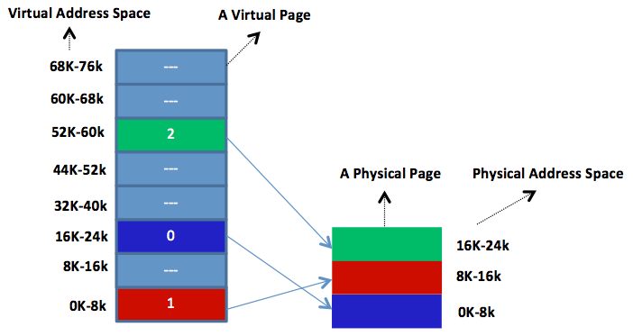

<!-- Original file: C:\Users\Mark\Desktop\CMU-source\v_5_3\content\_u03_virtualizing_resources_for_cloud\_u03_m04_resource_virtualization_memory\x-oli-workbook_page\_u03_m04_2_one-level_page_mapping.xml -->
##  Virtual Memory and One-Level Page Mapping
Virtual memory is a well-known virtualization technique supported in most general-purpose OSs. The basic idea of virtual memory is that each process is provided with its own virtual address space, broken up into chunks called virtual pages. A page is a contiguous range of addresses. As shown in Figure 3.24, virtual memory maps virtual pages to physical pages in what is called a page table. We call this _one-level page mapping_ between two types of addresses: the virtual and the physical. Each process in the OS has its own page table. A main observation pertaining to page tables is that not all virtual pages of a process need to be mapped to respective physical pages in order for the process to execute. When a process references a page that exists in the physical memory (i.e., there is a mapping between the requested virtual page and the corresponding physical page), a page hit is attained. On a page hit, the hardware obtains the required virtual to physical mapping with no further actions. In contrary, when a process references a page that does not exist in the physical memory, a page miss is incurred. On a page miss, the OS is alerted to handle the miss. Subsequently, the OS fetches the missed page from disk storage and updates the relevant entry in the page table. 

_Figure 3.24: Mapping a process' virtual address space to physical address space. This is captured in what is called a page table. Each process has its own page table._