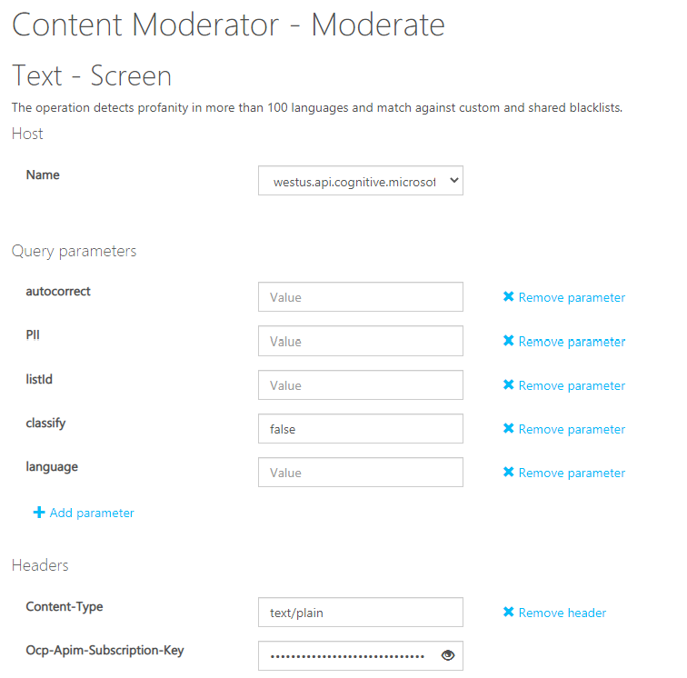

Now that you have a resource available in Azure for content moderation, and you have a subscription key for that resource, let's run some tests by using the API web-based testing console.

1. Go to the [Content Moderator API Reference page](https://westus.dev.cognitive.microsoft.com/docs/services/57cf753a3f9b070c105bd2c1/operations/57cf753a3f9b070868a1f66f). This page is available in a number of regions for testing in the API console.
1. For the geographic region closest to you, select the appropriate location button to open the console.
1. Note the query parameters that you can select for your test. For the first test run, ensure that the classify option is set to false. Leave the remaining values at their default.
1. Paste your subscription key into the **Ocp-Apim-Subscription-Key** box.

    

1. Leave the sample text in place, and then click **Send**.

## Evaluate the response

- Scroll down the page and evaluate the response from the testing console.

You will see the that the email, IP address, phone, and address values are under a JSON array value of PII.  You did not have to set the PII value to true for this result.

## Run additional tests

1. To run the second test, scroll to the top of the page and set the `classify` parameter to `true`.

1. Select **Send**.

   Note that there is now a new JSON array section title **Classification**.  It indicates that a review is recommended and displays three categories with score values.  The categories are pertaining to the text content that may be undesirable. 
   - Category 1 - content could be sexually explicit or adult related
   - Category 2 - language may be considered sexually suggestive or mature in certain situations
   - Category 3 - potentially offensive language

1. To run additional tests, enter some of your own text values from an existing document and run the tests again to see the results returned.

1. Study the JSON response and the Request URL syntax to see how your custom applications can call this API.

> [!TIP]
> To test this API by using a C# application, see [Quickstart: Analyze text content for objectionable material in C#](https://docs.microsoft.com/azure/cognitive-services/content-moderator/text-moderation-quickstart-dotnet).
