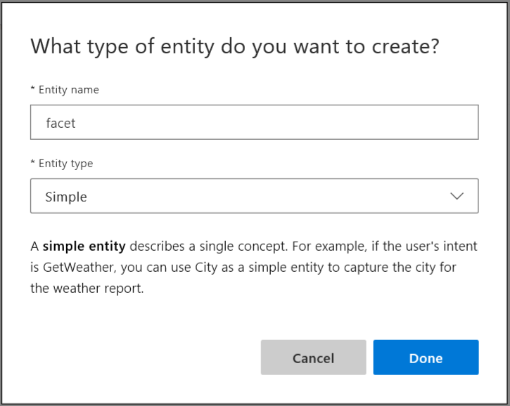
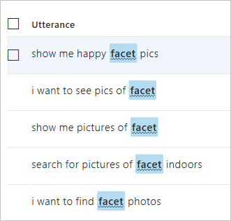

We want our bot to understand how to:

- Search/find pictures
- Share pictures on social media
- Order prints of pictures
- Greet the user (although this can also be done other ways, as we'll see later)

Let’s create intents for the user requesting each of these.

> [!NOTE]
> There is one intent already present called "None". Random utterances that don’t map to any of your intents may be mapped to this intent.

1. Click **Create new intent**.
1. Name the first intent "Greeting" and click **Done**.

    Because our scenario for this application is to integrate with a Bot, provide examples of things that users might say when greeting the Bot initially

1. Type a greeting, such as "hello" and press Enter
1. Repeat the previous step to create values for each of the following, "hi", "hola", "yo", "hey", "greetings"

    > [!NOTE]
    > You should always provide at least five examples.
    
1. Your utterances should reflect similar to this

    

## Create entities

Next, let's create the entities we need. In this case, we'll create an entity that can capture a specific ask by a user, for example, when the user requests to search the pictures, they may specify what they are looking for.

1. Click on **Entities** in the left-hand column and then click **Create new entity**.
1. Give it an entity name "facet" and entity type **Simple**. Then click **Done**.

    

1. Create a new Intent called "SearchPics". Use the same steps as above.
1. Add the following values as utterances for the SearchPics intent:
    - Find outdoor pics
    - Are there pictures of a train?
    - Find pictures of food.
    - Search for photos of boys playing
    - Give me pics of business women
    - Show me beach pics
    - I want to find dog photos
    - Search for pictures of men indoors
    - Show me pictures of men wearing glasses
    - I want to see pics of sad boys
    - Show me happy baby pics

## Selecting the facet entity

Once we have some utterances, we have to teach LUIS how to pick out the search topic as the "facet" entity. Whatever the "facet" entity picks up is what will be searched.

1. Hover and click the key word, or click consecutive words to select a group of words, and then select the "facet" entity.

> [!TIP]
> Using multiple words, such as business women is a bit tricky.
>
> Click the first word, move the cursor to the second word and click again, then move the cursor into the facet selection pop-up, without going out of the borders, or you will lose the selection.

1. Your progress should look similar to this.

    

1. Add two more Intents with related utterances according to this list:
    - SharePic - "Share this pic", "Can you tweet that?", "post to Twitter"
    - OrderPic - "Print this picture", "I would like to order prints", "Can I get an 8x10 of that one?", "Order wallets"

1. To finish out the Intents and entities exercise, add some utterances to the existing None intent, that don't match the context of this LUIS app. Examples are:
    - "I'm hungry for pizza"
    - "Search videos"
    - "Show me how to drive a car"
