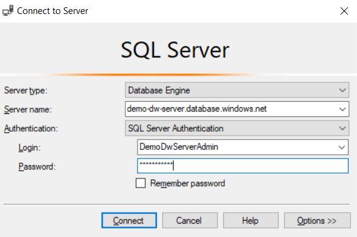
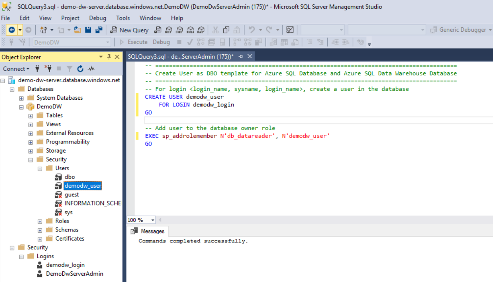

Besides being a fundamental part of IT administration, data warehouse security is an essential and required component of many compliance certifications. Azure SQL Data Warehouse service enables security controls through various layers, namely platform security, infrastructure security, network security, and data security. Data security controls are available for both data at rest and data in transit.

Authentication and authorization controls provide infrastructure security. In the context of the data warehouse, Authentication is a way to verify a user's identity. Authorization is a way to control access to data and objects in the data warehouse. Authorization checks are performed after the authentication checks.

## Create a sample data warehouse

To demonstrate security capabilities of Azure SQL Data Warehouse, we will create an instance of Azure SQL Data Warehouse with a sample database that Azure provides. Create the server and database from Azure portal with the following options.


## Set Azure Data Warehouse firewall access rules using the portal

Azure SQL Data Warehouse provides controls to restrict access to the data warehouse infrastructure via firewall rules. Firewall rules are the first level of defense against unauthorized access to the data warehouse assets. The firewall rules specify which IPs or IP ranges can access the data warehouse assets and reject any connections coming in from IPs other than the allowed list or range. The firewall rules are enforced at server-level granularity. To specify firewall rules:

- Navigate to Azure portal from your browser
- Select SQL databases in the left pane
- Select the data warehouse you created according to in the previous section
- Select **Server name** in the right blade


- Select **Show firewall settings**
- Select a name for **RULE NAME** field and **START IP** and **END IP**


## Create an Azure Data Warehouse login using SQL Server Management Studio

Azure SQL Data Warehouse supports two types of authentication to verify the identity of users connecting to it: SQL authentication and Azure Active Directory (AAD) authentication.
With SQL authentication, users connect to the data warehouse with a username and password combination. Azure portal does not provide the ability to configure SQL authentication. To configure SQL authentication:

- Open SQL Server Management Studio that you installed as a prerequisite and connect to the data warehouse. Get the server name from Azure portal by navigating to the data warehouse you previously created and use the username and password you specified when you created the data warehouse.



- Select **Connect**, which logs you into the SQL data warehouse
- Right-click **Logins** under **Security** in the left pane and select **New Login…**


After the query pane appears with commands to create a login, change the username and password as desired and select **Execute**.


- Right-click **Logins** under **Security** in the left pane and select Refresh
- The newly created login appears under Logins in the left pane


Azure Active Directory is a central location to manage identities for all of Microsoft online and cloud services. AAD authentication beyond the scope of this lesson; it broadly involves for steps:

- creating and populating an Azure Active Directory for your organization,
- associate the newly created AAD with your Azure subscription,
- creating an AAD administrator for your SQL Data Warehouse, and
- mapping database users to AAD identities

## Create a new Azure Data Warehouse user using SQL Server Management Studio

Creating a login provides access to the data warehouse server but not its databases or objects within it. In order to provide access to logins to specific databases and database objects, a user needs to be created and assigned a role. Roles allow various levels of access to users to a database – this approach to security is called role-based security. You can either use the several built-in roles or create custom roles to control users' access to the databases in the data warehouse. In this example, we will assign the built-in `db_datareader` role to the user we create.

- Open SQL Server Management Studio that you installed as a prerequisite and connect to the data warehouse. Get the server name from Azure portal by navigating to the data warehouse you previously created and use the username and password you specified when you created the data warehouse.


- Select **Connect**, which logs you into the SQL data warehouse
- Expand Databases in the left pane and expand DemoDW that you created in the prerequisites
- Expand **Security** and expand **Users**
- Right-click **Users** and select **New User…**


- After the query pane appears with commands to create a user
    - change the username parameter to a unique username
    - change the login you created in the previous section as the login parameter
    - to the second command in the query pane, type "`db_datareader`" as the first parameter and the database user you selected in the first step as the second parameter
    - Select **Execute**
- Right-click **Users** under **Security** in the left pane and select **Refresh**
- The newly created user appears under Logins in the left pane



## Enable data encryption on an Azure Data Warehouse using the portal

### Encrypting data at rest

Data encryption at rest protects data in your data warehouse and satisfies a critical compliance requirement. Azure SQL Data Warehouse provides transparent data-at-rest encryption capabilities without impacting the client applications that connect to it. To configure transparent data-at-rest encryption, use the following steps.

- Navigate to the database you created in Azure portal
- Under **Security** in the options pane, select **Transparent data encryption**
- Select **ON**
- Select **Save**


### Encrypt data in transit in your application

Data in transit is a method to prevent man-in-the-middle attacks. To encrypt data in transit, specify **Encrypt=true** in the connection string in your client applications as follows. This ensures that all data sent between your client application and SQL data warehouse is encrypted with SSL.

```sql
String connectionURL =   
    "jdbc:sqlserver://<your_azure_sql_datawarehouse_fqdn>:1433;" +  
     "databaseName=DemoDW;username=your_username;password=your_password " +  
     "encrypt=true ";
```

## Restrict data access with granular security controls using SQL Server Management Studio

In specific scenarios, granular security controls are essential for privacy and compliance reasons. For instance, in an employee data warehouse that hosts data for all employees in a company, you would want to provide access to restrict access to individual columns or rows in data warehouse tables to specific groups of management, depending on their role and function. Azure SQL Data Warehouse provides fine-grained security controls via column-level security and row-level security. In this section, we will walk through how to enforce these controls on your data stored in Azure SQL Data Warehouse.

### Grant read access to data using column-level security

Use the following steps to grant access to specific users to only certain columns of a table.

- Open SQL Server Management Studio that you installed as a prerequisite and connect to the data warehouse. Get the server name from Azure portal by navigating to the data warehouse you previously created and use the username and password you specified when you created the data warehouse.


- Select **Connect**, which logs you into the SQL data warehouse
- Navigate to the DemoDW database and expand Tables node. You will see dbo.DimEmployee table, which is the table we will be limiting access to the user we previously created, namely **demodw_user**.


- From **File** menu, select **New** and then **Query with Current Connection** menu option


- In the query pane, type the following command and execute the query by clicking on the Execute button

```sql
GRANT SELECT ON dbo.DimEmployee (FirstName, MiddleName, LastName, Title) TO demodw_user;
```


- The **user demodw_user** can now only access the four columns in the table for which it has been granted access, and no other columns are visible to that user.

### Restrict access to data using row-level security

Azure SQL Data Warehouse provides predicate-based row-level security. The rows on a table that don't satisfy the predicates are silently excluded from queries. Enforcing row-level security in Azure SQL Data Warehouse is a two-step process, namely:

1. creation of a table-valued function to define the access criteria, and
2. the creation of a security policy that adds filter predicates created in the previous step to any tables for which row-level access needs to be restricted

Follow the steps below to enforce row-level security for the table `dbo.DimEmployee` in the `DemoDW` database.

- Open SQL Server Management Studio that you installed as a prerequisite and connect to the data warehouse. Get the server name from Azure portal by navigating to the data warehouse you previously created and use the username and password you specified when you created the data warehouse.


- Select **Connect**, which logs you into the SQL data warehouse
- Navigate to DemoDW database and expand Tables node. You will see `dbo.DimEmployee` table, which is the table we will be limiting access to the user we previously created, namely **demodw_user**.


- From **File** menu, select **New** and then **Query with Current Connection** menu option


- In the query pane, type the following command and execute the query by clicking on the Execute button

```sql
CREATE SCHEMA Security
GO 
  
CREATE FUNCTION Security.fn_rowlevel_predicate(@EmployeeLoginId AS sysname)  
    RETURNS TABLE  
WITH SCHEMABINDING  
AS  
    RETURN SELECT 1 AS fn_rowlevel_predicate_result
WHERE @EmployeeLoginId = 'demodw_user'
GO

CREATE SECURITY POLICY EmployeeFilter
ADD FILTER PREDICATE Security.fn_rowlevel_predicate(LoginId)
ON dbo.DimEmployee
WITH (STATE = ON)
GO
```

- The rows in table `DimEmployee` can now only be accessed by **demodw_user**.

