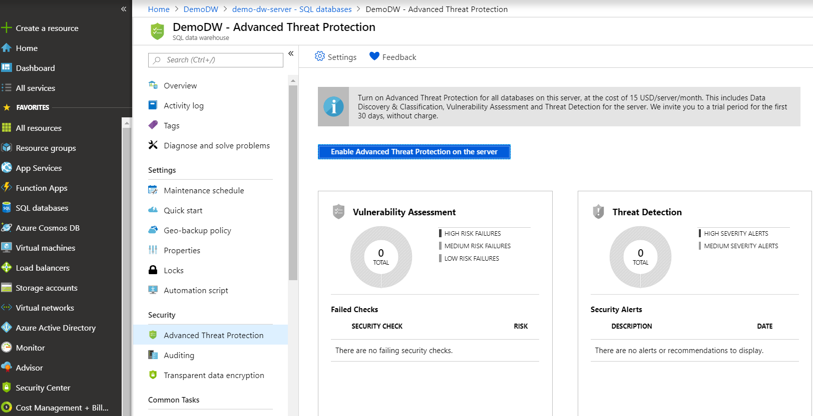
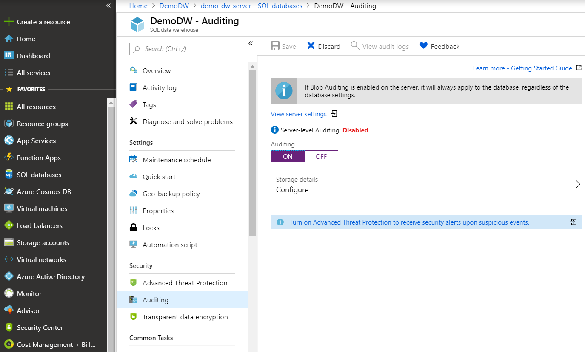

Azure SQL Data Warehouse provides built-in threat monitoring capabilities. Off by default, it can be configured as follows.

1. Navigate to the database you created in Azure portal
1. Under **Security** in the options pane, select **Advanced Threat Protection**
1. Select **Enable Advanced Threat Protection on the server**

    

A storage account can be set up to persist assessment logs for later vulnerability analysis

## Enable database auditing in the portal

Auditing tracks all database activity and helps maintain and satisfy compliance requirements. Audit trails can be defined for a data warehouse or a specific database. A server-wide policy applies to all databases it hosts and all newly created databases within it. Audit logs can be written to an Azure storage account for further analysis. To enable database-level auditing:

1. Navigate to the database you created in Azure portal
1. Under **Security** in the options pane, select **Auditing**
1. Select **ON** to turn the feature on.

    

1. Select **Storage details** and fill in the details for the destination storage account for audit logs

    

1. Select **OK**
1. Select **OK** again after the storage account is provisioned
