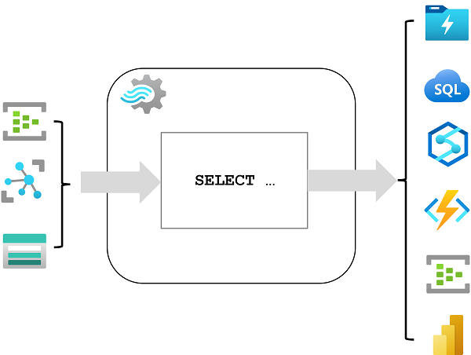

Azure Stream Analytics is a service for complex event processing and analysis of streaming data. Stream Analytics is used to:

- Ingest data from an *input*, such as an Azure event hub, Azure IoT Hub, or Azure Storage blob container.
- Process the data by using a *query* to select, project, and aggregate data values.
- Write the results to an *output*, such as Azure Data Lake Gen 2, Azure SQL Database, Azure Synapse Analytics, Azure Functions, Azure event hub, Microsoft Power BI, or others.



Once started, a Stream Analytics query will run perpetually, processing new data as it arrives in the input and storing results in the output.

Stream Analytics guarantees *exactly once* event processing and *at-least-once* event delivery, so events are never lost. It has built-in recovery capabilities in case the delivery of an event fails. Also, Stream Analytics provides built-in checkpointing to maintain the state of your job and produces repeatable results. Because Azure Stream Analytics is a platform-as-a-service (PaaS) solution, it's fully managed and highly reliable. Its built-in integration with various sources and destinations and provides a flexible programmability model. The Stream Analytics engine enables in-memory compute, so it offers high performance.

## Azure Stream Analytics jobs and clusters

The easiest way to use Azure Stream Analytics is to create a Stream Analytics *job* in an Azure subscription, configure its input(s) and output(s), and define the query that the job will use to process the data. The query is expressed using structured query language (SQL) syntax, and can incorporate static reference data from multiple data sources to supply lookup values that can be combined with the streaming data ingested from an input.

If your stream process requirements are complex or resource-intensive, you can create a Stream Analysis *cluster*, which uses the same underlying processing engine as a Stream Analytics job, but in a dedicated tenant (so your processing is not affected by other customers) and with configurable scalability that enables you to define the right balance of throughput and cost for your specific scenario.

## Inputs

Azure Stream Analytics can ingest data from the following kinds of input:

- Azure Event Hubs
- Azure IoT Hub
- Azure Blob storage
- Azure Data Lake Storage Gen2

Inputs are generally used to reference a source of streaming data, which is processed as new event records are added. Additionally, you can define *reference* inputs that are used to ingest static data to augment the real-time event stream data. For example, you could ingest a stream of real-time weather observation data that includes a unique ID for each weather station, and augment that data with a static reference input that matches the weather station ID to a more meaningful name.

## Outputs

Outputs are destinations to which the results of stream processing are sent. Azure Stream Analytics supports a wide range of outputs, which can be used to:

- Persist the results of stream processing for further analysis; for example by loading them into a data lake or data warehouse.
- Display a real-time visualization of the data stream; for example by appending data to a dataset in Microsoft Power BI.
- Generate filtered or summarized events for downstream processing; for example by writing the results of stream processing to an event hub.

## Queries

The stream processing logic is encapsulated in a query. Queries are defined using SQL statements that *SELECT* data fields *FROM* one or more inputs, filter or aggregate the data, and write the results *INTO* an output. For example, the following query filters the events from the **weather-events** input to include only data from events with a **temperature** value less than 0, and writes the results to the **cold-temps** output:

```sql
SELECT event_time, weather_station, temperature
INTO cold-temps
FROM weather-events TIMESTAMP BY event_time
WHERE temperature < 0
```

When using an event hub or IoT Hub as an input, a field is automatically created to define the arrival time of the event in the queue. You can use this field to determine the timestamp of the event, or you can explicitly specify another DateTime field by using the *TIMESTAMP BY* clause, as shown in this example. The field used as a timestamp is important when aggregating data over temporal windows, which is discussed next.