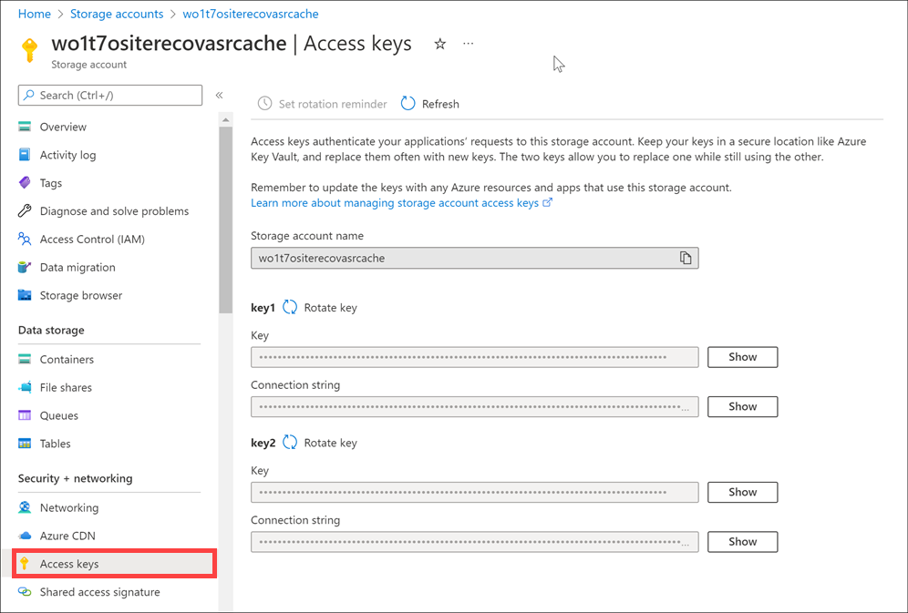

Much of the data Contoso works with is generated or consumed by custom applications written in a variety of languages. As mentioned, Azure Storage accounts can create authorized apps in Active Directory to control access to the data in blobs and queues. This authentication approach is the best solution if the app is using Blob or Queue storage.

For other storage models, clients can use a different approach: a _shared key_ or shared secret. This authentication option supports blobs, files, queues, and tables. It's one of the more straightforward approaches to use: the client embeds the shared key in the HTTP `Authorization` header of every request, and the Storage account validates it.

As an example, an application could issue a `GET` request against a blob resource:

```
GET http://myaccount.blob.core.windows.net/?restype=service&comp=stats
```

with the following HTTP headers that control the version of the REST API, the date, and the encoded shared key.

```
x-ms-version: 2018-03-28  
Date: Wed, 23 Oct 2018 21:00:44 GMT  
Authorization: SharedKey myaccount:CY1OP3O3jGFpYFbTCBimLn0Xov0vt0khH/E5Gy0fXvg=
```

## Storage Account Keys

Shared keys in Azure Storage accounts are called "Storage Account Keys". Azure creates two of these keys (primary and secondary) for each storage account you create and they give access to _everything_ in the account. You can view the created storage keys in the Azure portal view of the storage account under **Settings** > **Access keys** as shown below. 



### Protecting shared keys

Because there are only two keys, and they provide full access to the account, it's recommended to only use these keys with _trusted in-house applications_ that you have complete control over. If the keys are compromised, you can change the key values in the Azure portal. There are several other reasons to regenerate your storage account keys.

- You might regenerate them on a regular basis for security reasons.
- You must regenerate your storage account keys if someone managed to hack into an application and retrieve the key that was hardcoded or saved in a configuration file, giving them full access to your storage account.
- Another case for key regeneration is if your team is using a Storage Explorer application that retains the storage account key, and one of the team members leaves. The application would continue to work, giving them access to your storage account after they're gone.

The process to refresh keys is simple:

1. Change each trusted app to use the _secondary_ key.
1. Refresh the primary key in the Azure portal. You can consider it the new "secondary" key value.

> [!IMPORTANT]
> Any client attempting to use the old key value will be refused. You must make sure to identify all clients using the shared key and update them to keep them operational.