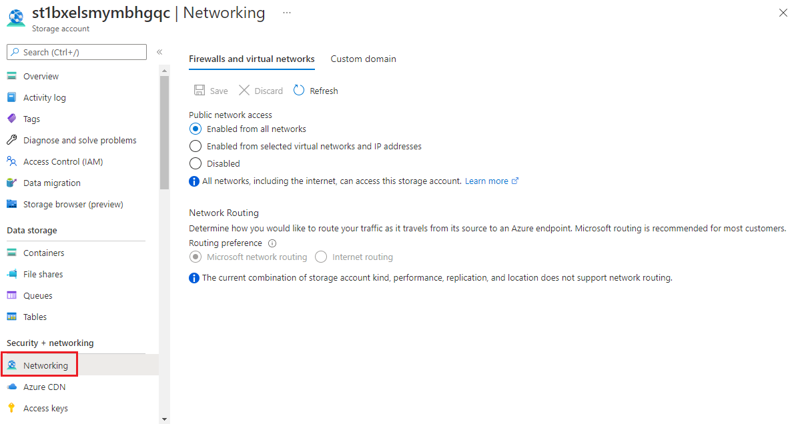

By default, storage accounts accept connections from clients on any network. To limit access to selected networks, you must first change the default action. You can restrict access to specific IP addresses, ranges, or virtual networks.

> [!IMPORTANT]
> Making changes to network rules can impact your applications' ability to connect to Azure Storage. Setting the default network rule to **deny** blocks all access to the data unless specific network rules to **grant** access are also applied. Be sure to grant access to any allowed networks using network rules before you change the default rule to deny access.

## Managing default network access rules

You can manage default network access rules for storage accounts through the Azure portal, PowerShell, or Azure CLI.

### Azure portal

To perform this action in the Azure portal.

1. Navigate to the storage account you want to secure.
1. Select **Firewalls and virtual networks**.
1. Choose to allow access from **Selected networks** to restrict traffic. To allow traffic from all networks, choose to allow access from **All networks**.
1. Click **Save** to apply your changes.

