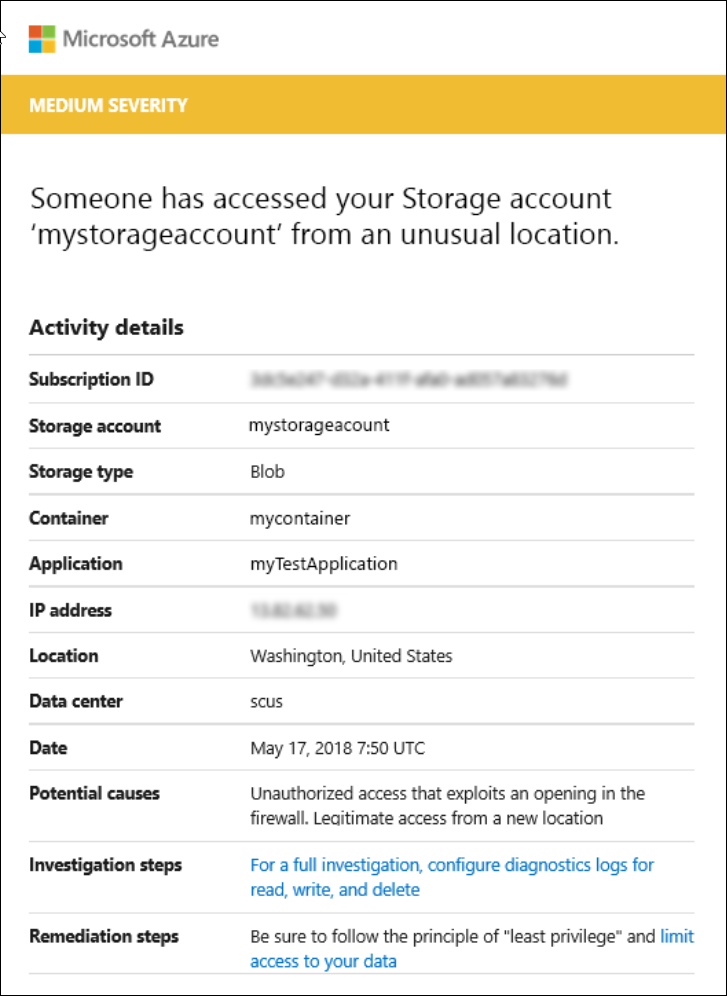

Azure Defender for Storage provides an additional layer of security intelligence that detects unusual and potentially harmful attempts to access or exploit storage accounts. This layer of protection allows you to address threats without being a security expert or managing security monitoring systems.

Security alerts are triggered when anomalies in activity occur. These security alerts are integrated with Azure Security Center, and are also sent via email to subscription administrators, with details of suspicious activity and recommendations on how to investigate and remediate threats.

Azure Defender for Storage is currently available for Blob storage, Azure Files, and Azure Data Lake Storage Gen2. Account types that support Azure Defender include general-purpose v2, block blob, and Blob storage accounts. Azure Defender for Storage is available in all public clouds and US government clouds, but not in other sovereign or Azure Government cloud regions.

Accounts with hierarchical namespaces enabled for Data Lake Storage support transactions using both the Azure Blob storage APIs and the Data Lake Storage APIs. Azure file shares support transactions over SMB.

You can turn on Azure Defender for Storage in the Azure portal through the configuration page of the Azure Storage account, or in the advanced security section of the Azure portal:

1. Launch the Azure portal.

1. Navigate to your storage account. Under Settings, select Advanced security.

1. Select Enable Azure Defender for Storage.

    

## Explore security anomalies

When storage activity anomalies occur, you receive an email notification with information about the suspicious security event. Details of the event include:

- The nature of the anomaly
- The storage account name
- The event time
- The storage type
- The potential causes
- The investigation steps
- The remediation steps
- The email also includes details on possible causes and recommended actions to investigate and mitigate the potential threat.

    

You can review and manage your current security alerts from Azure Security Center's Security alerts tile. Clicking on a specific alert provides details and actions for investigating the current threat and addressing future threats.

