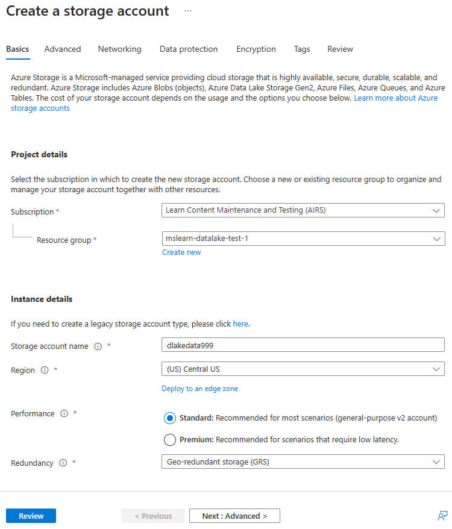

Before uploading or transferring data into a data lake, you need to create one. Using the Azure portal, you are able to provision an Azure Data Lake Storage Gen2 within minutes.

> [!NOTE]
> If you don't have an Azure account, or prefer not to do the exercise in your account, you can read through the following instructions to understand the steps involved in creating an Azure Data Lake Store.

## Create a new Resource Group

First, create a new resource group to hold the data lake storage. A resource group will let you administer related services and applications together. It also makes it easier to clean up resources when you are done with this module. To create a resource group in the Azure portal, follow these steps:

1. Sign in to the [Azure portal](https://portal.azure.com?azure-portal=true) using your account.
1. Select **Create a resource** from the left sidebar.
1. In the search box, type "**Resource**" and select **Resource group** from the results.
1. Click the **Create** button to add a new resource group.
1. In the **Basics** tab, select the appropriate subscription you want to work in.
1. Set the name of the resource group to **"mslearn-datalake-test"** without the quotes.
1. Choose the region (location) for the resource group - you typically want to choose a location close to you or to the data you are going to work with.

    

1. Click the **Review + Create** button and then **Create** on the review screen.

Resource group creation is fast, you can pin the resource group to your dashboard to make it easy to find later if you like.

## Create a Data Lake Storage Account Gen2

Creating an Azure Data Lake Storage Account Gen2 is the same as creating an Azure Blob Store, there's just one setting that is different. To create the data lake, perform the following steps:

1. In the Azure portal, choose **Create a resource** from the left sidebar.
1. Select **Storage**, and choose **Storage account**.
1. Select your **Subscription** and the **Resource group** you created earlier (**mslearn-datalake-test**).
1. Enter a unique name for your storage account. It must be unique across all of Azure, so for example use the prefix "dlakedata" with some numbers. You might have to try a few variations to find a unique name. The portal will display a green checkmark next to the name when you have a valid entry.
1. Select the location to **Central US**
1. Make sure the Account kind is **StorageV2 (general-purpose V2)**. The rest of the values can be left as their defaults.

    

1. Select **Next: Advanced >**
1. In the **Data Lake Storage Gen2 (preview)** section set **Hierarchical namespace** to **Enabled**.
1. Click **Review + Create** to create the storage account.

    

1. Once the creation details have been validated, click the **Create** button to start deployment.

Wait for a few moments for the deployment to complete, once you receive the message "Your deployment is complete", click **Go to resource** to confirm the deployment.
