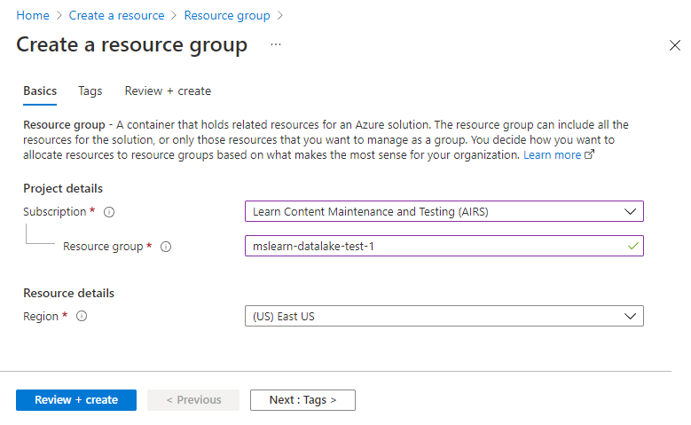
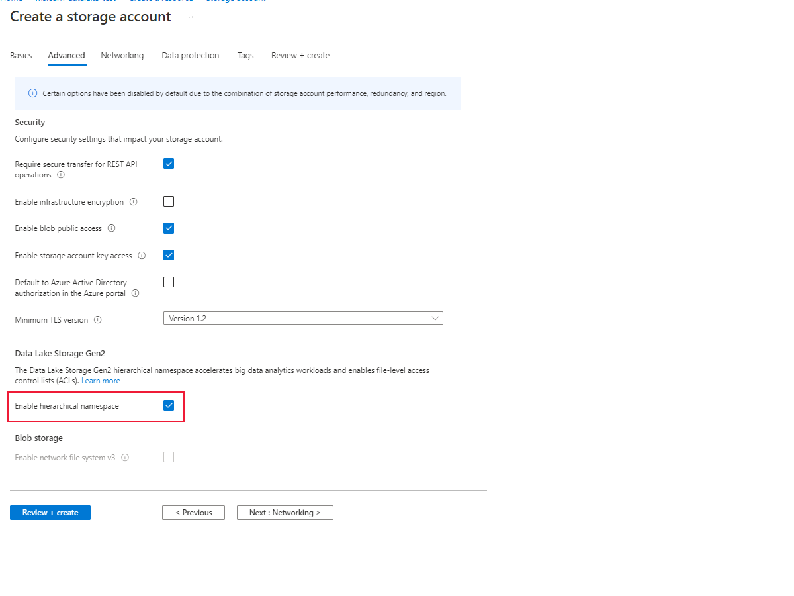

Before we can upload or transfer data into a data lake, we need to create one. In Azure, we need to create two things: a resource group, and an Azure Storage account to hold our data. In addition, we'll create a text file to use as some sample data.

> [!NOTE]
> This exercise is optional. If you don't have an Azure account, or prefer not to do the exercise in your account, you can read through the instructions to understand the steps involved in creating an Azure Data Lake Store and uploading sample data into it with the Azure portal.

## Create a new resource group using the Azure portal

Let's start by creating a new resource group to hold our resources. This will let us administer related things together, and more importantly, make it easy to cleanup resources when you are done with this module. To create a resource group in the Azure portal, follow these steps:

1. Sign in to the [Azure portal](https://portal.azure.com?azure-portal=true) using your account.
1. Select **Create a resource** from the left sidebar.
1. In the search box, type "**Resource**" and select **Resource group** from the results.
1. Click the **Create** button to add a new resource group.
1. In the **Basics** tab, select the appropriate subscription you want to work in.
1. Set the name of the resource group to "mslearn-datalake-test".
1. Choose the region (location) for the resource group - you typically want to choose a location close to you or to the data you are going to work with.

    

1. Click the **Review + Create** button and then **Create** on the review screen.

Resource group creation is very fast, you can pin the resource group to your dashboard to make it easy to find later if you like.

## Create an Azure Storage account

Next, we need to create an Azure Storage account to hold the data for our data lake.

1. In the Azure portal, choose **Create a resource** from the left sidebar.
1. Select **Storage**, and choose **Storage account**.
1. Select your **Subscription** and the **Resource group** you created earlier (**mslearndatalaketest**).
1. Enter a unique name for your storage account. It must be unique across all of Azure, so for example use the prefix "dlakedata" with some numbers. You might have to try a few variations to find a unique name. The portal will display a green checkmark next to the name when you have a valid entry.
1. Select a location - you typically want to select a region near where the data consumption will occur. Since this is an example, just select a location near you.
1. Make sure the Account kind is **StorageV2 (general-purpose V2)**. The rest of the values can be left as their defaults.

    

1. Select **Next: Advanced >**
1. In the **Data Lake Storage Gen2 (preview)** section set **Hierarchical namespace** to **Enabled**.
1. Click **Review + Create** to create the storage account.

    

1. Once the creation details have been validated, click the **Create** button to start deployment.

Wait for a few moments for the deployment to complete, once you receive the message "Your deployment is complete", click **Go to resource** and go to the next step.

## Create a file system within the data lake store

1. In the Azure portal, in the Overview screen, click **Data Lake Gen2 file systems**.
1. In the File systems window, Click **+ File Systems** to show the **Add File systems** dialog box.
1. In the Add File systems dialog box, type in a name for the file system called **"salesdata"**. 
1. Click on **OK** to create the file system.

## Create a sample text file

To provide some sample data to work with, create a local text file on your computer named "sales.txt" and paste the following into the file.

```text
#salaries Details
#Company Information
#Fields : Date company employee Salaries
01-01-2019  c1   e1 1000
01-01-2019  c2   e2 2000
01-01-2019  c1   e3 4000
01-01-2019  c2   e4 2000
01-01-2019  c1   e5 5000
01-01-2019  c3   e6 7000
```

We'll upload this data file in various ways. Keep in mind that this is a _very simple_ example - you would typically be populating your data lake with much larger data samples from a variety of sources.