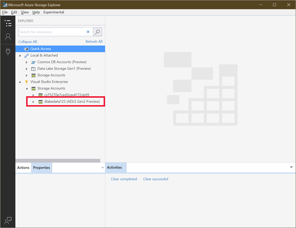
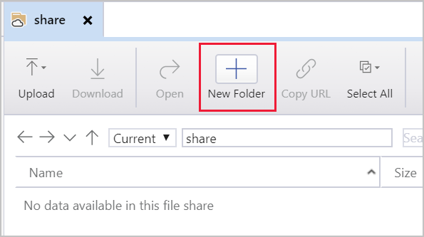
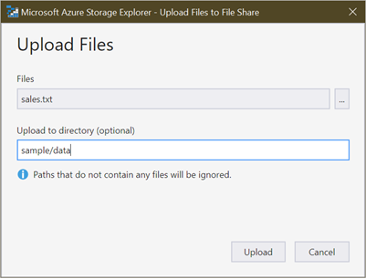

If you need to perform ad-hoc data transfers into an Azure Data Lake Store, you can use the **Azure Storage Explorer** to upload your files.

Azure Storage Explorer is a free application available for Windows, macOS, and Linux. The app is designed to manage unstructured data in Azure such as tables, blobs, queues, and files. It also supports data in Azure Cosmos DB and Azure Data Lake Storage, which is what we'll use it for here.

> [!NOTE]
> If you don't have an Azure account, or prefer not to do the exercise in your account, you can read through the instructions to understand the steps involved to install and use the Azure Storage Explorer tool.

## Download and Install Azure Storage Explorer

Start by installing the [Azure Storage Explorer](<https://azure.microsoft.com/features/storage-explorer>). 

## Using Azure Storage Explorer

Once installed, you can use Azure Storage Explorer to perform several operations against data in your Azure Storage account including your data lake. Here are some features of the tool.

- You can upload files or folders from your local computer into Azure Storage.
- You can download cloud-based data to your local computer.
- You can copy or move files and folders around in the storage account.
- You can delete data from the storage account.

Let's look at some of these capabilities.

## Connect the Azure Storage Explorer to your Azure account

Start by adding your Azure account.

1. Click on the Account button icon in the left sidebar.

    

1. There are multiple options for connecting to your storage account. 
    - Sign in with your Azure account to provide access to all your subscriptions.
    - Use a connection string to access a specific Azure Storage account.
    - Use a storage account name and access key.

    

1. Once you sign in, you can select the subscriptions you want to work with. Make sure to select the one you created the Azure Storage account in.

The app then shows a tree of storage areas you can work with from your  subscriptions. You should see your Azure Storage account in the list.



## Create a filesystem using Azure Storage explorer

Blobs are always uploaded into folders. This allows you to organize groups of blobs much like you organize files on your computer. 

When working with Azure Data Lake, you start by creating a _filesystem_. This defines the specific container in Blob storage that will hold your data lake. You can then create folders and files within this dedicated area.

1. In Azure Storage Explorer, expand your subscription, and then expand storage accounts.

1. Expand the storage account that you have created in the previous unit, and click on **Blob Containers**.

1. Right-click **Blob Containers** and click **Create Blob Container**.

1. In the text box that appears below **Blob Containers**, type **salesdata**.

1. Once created, click on **salesdata**.

## Create a folder in Storage Container using Azure Storage Explorer

Adding a folder provides a hierarchical structure for managing your data. You can create multiple levels in the account. However, you must ensure that parent folders exist before you create children.

1. Select the **New Folder** button from the menu running across the top.

    

1. For the folder name, enter **"sample"** without the quotes, and then select **OK** to create the directory.
   > You may get a message box in Azure Storage Explorer that states. "Your view may be out of date. Do you want to refresh?". If so, click **Yes**.

1. Double-click on the new folder in the UI - this will traverse into the folder, which should be empty.

1. Create another folder named **"data"**.

## Create a sample text file

To provide some sample data to work with, create a local text file on your computer named "sales.txt" and paste the following text into the file.

```text
#salaries Details
#Company Information
#Fields : Date company employee Salaries
01-01-2019  c1   e1 1000
01-01-2019  c2   e2 2000
01-01-2019  c1   e3 4000
01-01-2019  c2   e4 2000
01-01-2019  c1   e5 5000
01-01-2019  c3   e6 7000
```

We'll upload this data file in various ways. Keep in mind that this is a _simple_ example - you would typically be populating your data lake with much larger data samples from a variety of sources. 
## Upload a file

You can upload files and folders from your local machine to directories in your file share right from the tool.

1. In Azure Storage Explorer, double-click the folder named **data**.
1. In the top menu, select **Upload**. This gives you the option to upload a folder or a file.
1. Select **Upload Files**.
1. Select the "sales.txt" file you created earlier as the file to upload
1. In **Upload to a directory** dialog box, ensure the Destination directory states **"sample/data"**, and then select **Upload**.

    

When you are finished, the file appears in the list.

## Download a file

To download a copy of a file from your file share, right-click the file, and then select **Download**. Choose where you want to put the file on your local machine, and then select **Save**. The progress of the download appears in the **Activities** pane at the bottom of the window.
