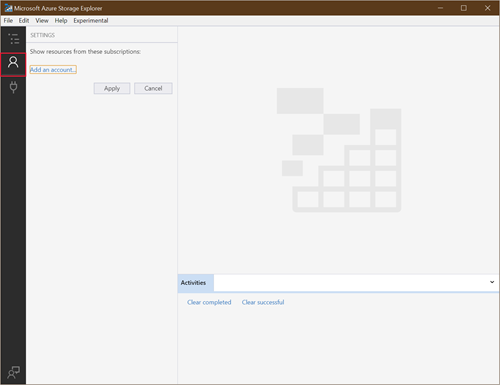

If you need to perform ad-hoc data transfers into an Azure Data Lake Store, you can use the **Azure Storage Explorer** to upload your files.

Azure Storage Explorer is a free desktop application available for Windows, macOS, and Linux designed to manage unstructured data in Azure. You connect to your subscription and manipulate your tables, blobs, queues, and files. In addition, you can manipulate both Azure Cosmos DB and Azure Data Lake Storage with a user-friendly GUI.

> [!NOTE]
> This exercise is optional. If you don't have an Azure account, or prefer not to do the exercise in your account, you can read through the instructions to understand the steps involved to install and use the Azure Storage Explorer tool.

## Download and Install Azure Storage Explorer

You can download Azure Storage Explorer from <https://azure.microsoft.com/features/storage-explorer>. Once it's installed, you can launch the tool to manage your cloud-based data. 

## Using Azure Storage Explorer

Once installed, you can use Azure Storage Explorer to perform several operations against your data lake.

- You can upload files or folders from your local computer into Azure Storage.
- You can download cloud-based data to your local computer.
- You can copy or move files and folders around in the storage account.
- You can delete data from the storage account.

Let's look at some of these capabilities.

## Connect the Azure Storage Explorer to your Azure account

Start by adding your Azure account.

1. Click on the Account button icon in the left sidebar.

    

1. There are multiple options for connecting to your storage account. You can connect by signing in with your Azure account credentials which gives you access to all your subscriptions, using a connection string, using storage account name and key, etc.

    

1. Once you sign in, you can select the subscriptions you want to work with. Make sure to select the one you created the Azure Storage account in.

The app then shows a tree of storage areas you can work with from your local environment and the selected subscriptions. You should see your Azure Storage account in the list.

## Confirm that the data lake store file system appears in Azure Storage explorer

After creating the file system for your data lake store, you can view the file system in Azure Storage Explorer: 

1. Expand the storage account that you created.
1. Expand the **Blob Containers** to view the the file system named **salesdata**.
1. Click **salesdata**

## Create a folder in Azure Storage using Azure Storage Explorer

Adding a folder provides a hierarchical structure for managing your data. You can create multiple levels in the account. However, you must ensure that parent folders exist before you create children.

1. Select the **New Folder** button from the menu running across the top.

    

1. For the folder name, enter "sample", and then select **OK** to create the directory.

1. Double-click on the new folder in the UI - this will traverse into the folder which should be empty.

1. Create another folder named **"data"**.

## Upload a file

You can upload files and folders from your local machine to directories in your file share right from the tool.

1. In Azure Storage Explorer, double click the folder named **data**.
1. In the top menu, select **Upload**. This gives you the option to upload a folder or a file.
1. Select **Upload Files**.
1. Select the "sales.txt" file you created earlier as the file to upload
1. In **Upload to a directory**, enter "sample/data", and then select **Upload**.

    

When you are finished, the file appears in the list.

## Download a file

To download a copy of a file from your file share, right-click the file, and then select **Download**. Choose where you want to put the file on your local machine, and then select **Save**. The progress of the download appears in the **Activities** pane at the bottom of the window.
