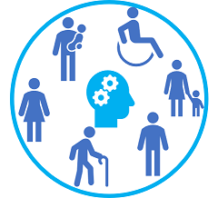

Machine learning models are increasingly used to inform decisions that affect peoples lives. For example, prediction made by a machine learning model might influence:

- Approval for a loan, insurance, or other financial service.
- Acceptance into a school or college course.
- Eligibility for a medical trial or experimental treatment.
- Inclusion in a marketing promotion.
- Selection for employment or promotion.

With such critical decisions in the balance, it's important to have confidence that the machine learning models we relay on predict fairly, and don't discriminate for or against subsets of the population based on ethnicity, gender, age, or other factors.

## Learning objectives

In this module, you will learn how to:

- Evaluate machine learning models for fairness.
- Mitigate predictive disparity in a machine learning model.
