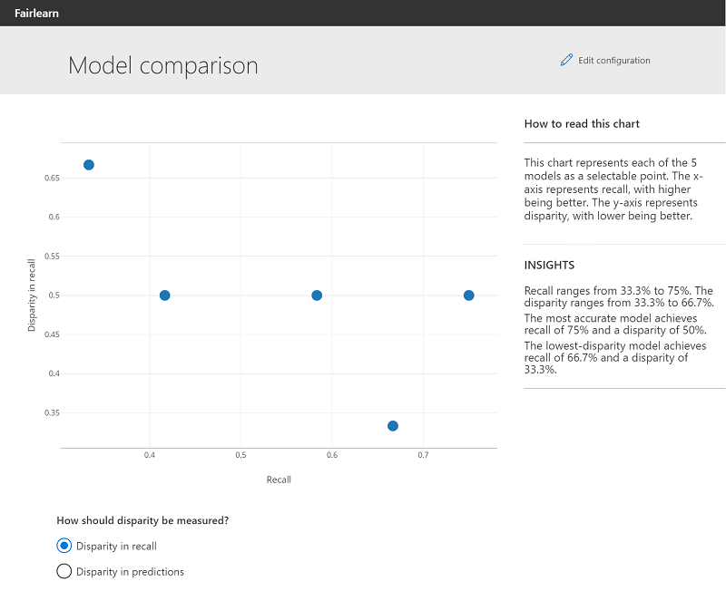

In addition to enabling you to analyze disparity in selection rates and predictive performance across sensitive features, Fairlearn provides support for mitigating unfairness in models.

## Mitigation algorithms and parity constraints

The mitigation support in Fairlearn is based on the use of algorithms to create alternative models that apply *parity constraints*  to produce comparable metrics across sensitive feature groups. Fairlearn supports the following mitigation techniques.

| Technique | Description | Model Type Support |
| --------- | ----------- | ------------------ |
| **Exponentiated Gradient** | A *reduction* technique that applies a cost-minimization approach to learning the optimal trade-off of overall predictive performance and fairness disparity | Binary classification and regression |
| **Grid Search** | A simplified version of the Exponentiated Gradient algorithm that works efficiently with small numbers of constraints | Binary classification and regression |
| **Threshold Optimizer** | A *post-processing* technique that applies a constraint to an existing classifier, transforming the prediction as appropriate | Binary classification |

The choice of parity constraint depends on the technique being used and the specific fairness criteria you want to apply. Constraints in Fairlearn include:

- **Demographic parity**: Use this constraint with any of the mitigation algorithms to minimize disparity in the selection rate across sensitive feature groups. For example, in a binary classification scenario, this constraint tries to ensure that an equal number of positive predictions are made in each group.
- **True positive rate parity**: Use this constraint with any of the mitigation algorithms to minimize disparity in *true positive rate* across sensitive feature groups. For example, in a binary classification scenario, this constraint tries to ensure that each group contains a comparable ratio of true positive predictions.
- **False positive rate parity**: Use this constraint with any of the mitigation algorithms to minimize disparity in *false positive rate* across sensitive feature groups. For example, in a binary classification scenario, this constraint tries to ensure that each group contains a comparable ratio of false positive predictions.
- **Equalized odds**: Use this constraint with any of the mitigation algorithms to minimize disparity in combined *true positive rate* and *false positive rate* across sensitive feature groups. For example, in a binary classification scenario, this constraint tries to ensure that each group contains a comparable ratio of true positive and false positive predictions.
- **Error rate parity**: Use this constraint with any of the reduction-based mitigation algorithms (**Exponentiated Gradient** and **Grid Search**) to ensure that the error for each sensitive feature group does not deviate from the overall error rate by more than a specified amount.
- **Bounded group loss**: Use this constraint with the **Threshold Optimizer** mitigation algorithm to restrict the loss for each sensitive feature group in a regression model.

## Training and evaluating mitigated models

A common approach to mitigation is to use one of the algorithms and constraints to train multiple models, and then compare their performance, selection rate, and disparity metrics to find the optimal model for your needs. Often, the choice of model involves a trade-off between raw predictive performance and fairness - based on your definition of fairness for a given scenario. Generally, fairness is measured by reduction in disparity of feature selection (for example, ensuring that an equal proportion of members from each gender group is approved for a bank loan) or by a reduction in disparity of performance metric (for example, ensuring that a model is equally accurate at identifying repayers and defaulters in each age group).

Fairlearn enables you to train mitigated models and visualize them using the dashboard, like this.

You can select an individual model in the scatterplot to see its details, enabling you to explore the options and select the best model for your fairness requirements.

## Integration with Azure Machine Learning

Just as when analyzing an individual model, you can register all of the models found during your mitigation testing and upload the dashboard metrics to Azure Machine Learning.
